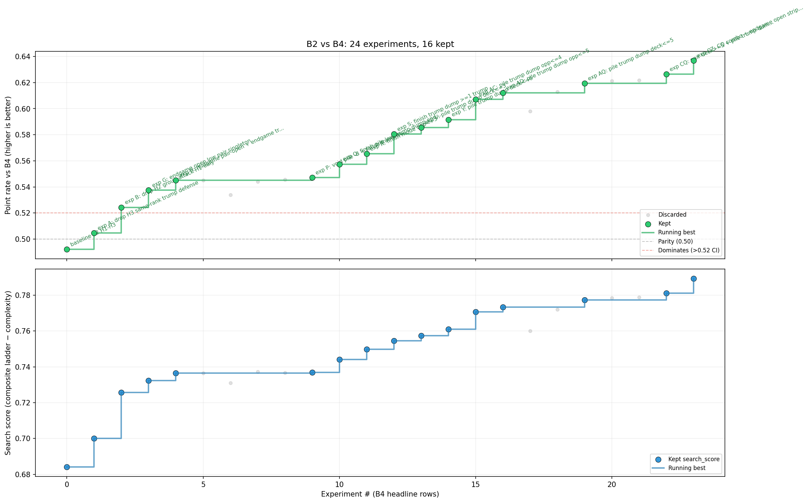
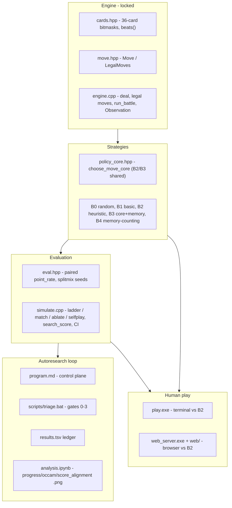

# autoresearch: local heuristics vs memory in Durak

An autonomous-research lab built around one question in an imperfect-information card game:
**can a memoryless local heuristic compete with a memory-counting opponent in two-player
Durak?** An LLM agent searches the space of small heuristic rules for the challenger
strategy (B2), and a fixed harness measures it against a ladder of baselines — including an
independent memory-counting baseline (B4) — under a locked rules engine. This README is the
written form of that whole system: engine, strategies, metric, simulator, the autoresearch
loop, the analysis charts, and a front-end for playing the agent yourself.



*`progress_ladder.png` is a curated ladder chart kept as the hero image; the live charts
(`progress.png`, `occam.png`, `score_alignment.png`) are regenerated by `analysis.ipynb`.*

## Contents

- [The research question](#the-research-question)
- [Authority model](#authority-model)
- [System architecture](#system-architecture)
- [Durak rules (locked)](#durak-rules-locked)
- [The baseline ladder](#the-baseline-ladder)
- [The current best heuristic](#the-current-best-heuristic)
- [The metric](#the-metric)
- [Repository layout](#repository-layout)
- [Building and running](#building-and-running)
- [The autoresearch loop](#the-autoresearch-loop)
- [Results](#results)
- [Legacy LLM experiment](#legacy-llm-experiment)
- [License](#license)

## The research question

What this is: a controlled test of how far simple, memoryless play goes in two-player Durak.

### What are we testing?

Can a **memoryless** local heuristic policy compete with a fixed **memory-counting**
baseline in two-player *podkidnoy* Durak? The challenger (B2) may look only at its own hand
and the cards currently on the table — it is forbidden from remembering the discard pile or
any history. The benchmark opponent (B4) tracks what has left play and what the opponent is
known to hold.

### Why is it interesting?

It isolates how much of the strength in two-player Durak comes from **local hand/table
structure** (which suit to break, when to take, which trump to spend) versus **belief-state
inference over hidden cards**. This is not an attempt to solve Durak; it measures whether a
memoryless local policy can approach or beat fixed memory-based baselines under a locked
rules engine, with simplicity (few rules) as a tie-breaker.

## Authority model

Three sources of truth, in order of authority when they disagree:

- **`program.md`** — the research contract: locked rules, the metric, keep/revert
  thresholds, and the current-best record. The autonomous loop runs from it.
- **`durak/` source** — implementation truth: the engine, the baselines, and the heuristic.
- **This README** — the canonical prose description of the system, kept in sync with both.

If the README ever disagrees with the source or `program.md`, those are authoritative.

## System architecture

The system is a stack: a locked rules **engine** hands an `Observation` to a **strategy**,
which returns a `Move`; an **evaluation** layer scores strategies in paired Monte-Carlo
matches; an **autoresearch loop** edits the challenger and gates keeps; an **analysis**
notebook charts progress; and a **human-play** front-end lets you play against the agent.

A single game flows like this (see `durak/src/engine.cpp`): `new_game(seed)` shuffles 36
cards, deals 6+6, and fixes the trump as the bottom card (`deck[0]`); `first_attacker` is
whoever holds the lowest trump. Each battle, `run_battle` builds an `Observation` — your
hand, the table, the trump, and the deck and opponent-hand *counts*, but never the opponent's
actual cards or the deck order — plus the `LegalMoves`, then asks the seat's `StrategyFn`
for a `Move` and validates it. A successful defense sends the table to the discard (bito) and
passes the attack; a take gives the table to the defender. Both then `draw_to_six` (attacker
first). When the deck is empty, the player still holding cards is the *durak* (loser). Deals
use a splitmix64 RNG seeded separately from the strategy RNG, so a deck seed always
reproduces the same deal.



- **`cards.hpp` / `move.hpp` / `engine.cpp`** — card bitmasks and `beats()`, the move
  vocabulary, and the state machine (deal, legal-move generation, battle loop, `Observation`).
- **`policy_core.hpp` + `strategy_*.cpp`** — the five strategies; B2 and B3 share one core.
- **`eval.hpp` / `simulate.cpp`** — paired scoring and the `ladder`/`match`/`ablate`/`selfplay` runner.
- **`program.md` + `scripts/` + `analysis.ipynb`** — the loop control plane, triage gates, and charts.
- **`play.cpp` / `web_server.cpp` + `web/`** — terminal and browser play against B2.

## Durak rules (locked)

The rules are fixed and enforced by the engine; `durak/src/engine.cpp` is authoritative.

Two-player *podkidnoy*, no transfer (perevod). 36 cards (6–A), 6-card hands, trump is the
bottom card. The holder of the lowest trump attacks first. Throw-ins must match a rank
already on the table (attack *or* defense card); total attack cards per battle are capped at
`min(6, defender's hand size at battle start)`. A successful defense sends the table to the
discard and passes the attack to the defender; taking keeps the attacker and the defender
skips its attack. After each battle both draw to six, attacker first. The player left
holding cards once the deck is empty is the loser; simultaneous empty hands is a draw.

## The baseline ladder

The ladder is a fixed set of opponents that bracket the challenger from a random floor up to
a memory-counting baseline, giving the search a smooth gradient. Strategy sources live in
`durak/src/strategy_*.cpp`; names resolve via `strategy_by_name` in `durak/src/strategies.cpp`.

| Level | Strategy | Role |
|-------|----------|------|
| B0 | random legal (`strategy_random_legal.cpp`) | sanity floor |
| B1 | basic no-memory (`strategy_basic_nomem.cpp`) | "are the heuristics doing anything?" |
| B2 | heuristic no-memory (`strategy_heuristic.cpp`) | the agent-edited challenger |
| B3 | B2's core + memory features (`strategy_heuristic_mem.cpp`) | memory ablation (fixed wrapper) |
| B4 | independent memory-counting baseline (`strategy_mem.cpp`) | reporting opponent |

**Shared core / honest ablation.** B2 and B3 call the *same* function `choose_move_core`
(`durak/include/policy_core.hpp`): B2 with `memory == nullptr`, B3 with a populated
`MemoryFeatures*`. Memory is used only as a small tie-break prior
(`-0.001 * unknown_rank_count`), never as a separate set of rules, so the only difference
between B2 and B3 is access to memory — the ablation stays honest however the agent rewrites
the core. B4 is an independent implementation, not built on the shared core.

**Hidden information.** Every strategy receives an `Observation` with its own hand, the
table, the trump, and the deck/opponent-hand counts — but never the opponent's card
identities or the deck order. Memory baselines reconstruct only what is publicly known (the
discard pile and cards seen entering the opponent's hand).

## The current best heuristic

> **Snapshot, not authoritative.** This is a prose summary of the currently accepted B2
> stack (commit `8487eb7`, jun25 keep QA), checked against source on 2026-06-25.
> `durak/src/strategy_heuristic.cpp` and `program.md` remain authoritative — re-summarize
> this section after any future keep.

B2 is a single declared heuristic (`H1 min_non_trump_play`) with **zero parameters**,
`complexity_score` 100, in ~205 lines. The core (`choose_move_core`) works as follows.

**Dispatch.** If any `DefendPlay`/`DefendTake` move is legal it is defending, otherwise
attacking; whether `AttackDone` is legal distinguishes the initial open from a
throw-in/pile-on.

**Scoring primitives (lower is better).** An attack card scores its rank, `+100` if it is a
trump (so non-trumps are dumped first), and `-5` (open) / `-8` (pile) if the opponent is
likely void in that non-trump suit — inferred from a non-trump attack already beaten by a
trump on the table. A defense card scores its rank, `+50` if trump. With memory (B3 only) a
tiny `-0.001 * unknown_rank_count` prior nudges toward still-unseen ranks.

**Initial open, in order:**

1. *Midgame pair-open* (`deck >= 5`): open the lowest non-trump rank in `[mnt, mnt+2]` that
   has a pair, where `mnt` is the lowest non-trump rank in hand.
2. *Endgame pair-open* (`deck <= 2`, lowest non-trump is a singleton): if `deck != 2` or
   `total <= 16` (where `total = deck + hand + opp + table`), open a higher non-trump pair
   instead of wasting the singleton.
3. *Trump-strip* (`deck == 0`, `opp <= 2`, at least one trump): open the lowest trump.
4. Otherwise: the lowest non-trump at the chosen rank.

**Throw-in / pile-on.** Dump the lowest non-trump. If only trumps remain, pile the lowest
trump as a finishing move when `deck <= 3`, `opp <= 5`, `hand >= opp`, and you hold a trump;
otherwise stop (`AttackDone`).

**Defense (minimal).** Take immediately if any uncovered attack cannot be beaten; otherwise
play the cheapest beater (non-trump preferred), with one trump-conservation rule:

1. *Conserve high trumps* — if the cheapest beater is a high trump (rank `>= 8`) and the deck
   is still deep (`deck >= 5`), **take instead** of burning it, regardless of how many cards
   are on the table (a memoryless mirror of B4's own belief-based take).

Earlier keeps (jun25 ZN) added two defense tie-breaks — *keep non-trump pairs* and *reuse
table ranks*. The jun25 batch-3 ablation found that once the conservation take fires broadly
those biases become **net-harmful** (they change which card is "cheapest" and mis-route the
take), so they were **removed**: simpler and stronger. With them gone the cheapest beater is
unambiguous, and the wired memory prior (B3) now changes *no* move at all (`B3 vs B2 = 0.5`
exactly, identical play).

**Load-bearing parts** (`search_score` drop when removed — see [The metric](#the-metric)).
Attack (jun22 WR map): `hand >= opp` gate (-0.0018), trump-strip `opp <= 2` (-0.014),
`deck <= 2` pair (-0.012), pile-trump `deck <= 3` (-0.020); `total <= 16` is optimal. Defense
(jun25): the **high-trump-conservation take is the whole story** — it lifts B2 from below the
WR ladder to *winning the majority* of deals vs B4 (+0.044 B4 / +0.030 search across the ZN→ZW→
QA keeps). Kept cell is a corner: rank ≥ 8 (rank ≥ 7 raises losses), deck ≥ 5 (deck ≥ 4
over-takes, -0.024), no pile cap. The pair-keep/rank-reuse tie-breaks are *anti*-load-bearing
here (removing them is +0.004 B4).

## The metric

The harness reports **paired** scores over deal seeds; `durak/include/eval.hpp` and
`durak/src/simulate.cpp` are authoritative.

For each seed the challenger plays **both seats** against the opponent on the same deck;
per-game scoring is win=1, draw=0.5, loss=0, and `pair_score` is the mean challenger points
across the two games. The headline number is `point_rate = mean(pair_score)`.

- **Reporting / final claim:** `point_rate(B2 vs B4)` — ~0.50 is parity, `lower_ci > 0.52`
  is a real edge over B4.
- **Complexity / Occam:** `complexity_score = 100 * heuristics + 10 * parameters`; among
  near-equal strategies the simpler one wins.
- **Memory value:** measured separately as B3 vs B2 (the same core with memory on vs off);
  0.50 means memory changes nothing.
- **Confidence interval:** 95% normal approximation (`mean ± 1.96 * se`) by default, or a
  percentile bootstrap with `--ci bootstrap`.

The search objective combines the three ladder rungs minus the complexity penalty:

```text
search_score = 0.50 * point_rate(B2 vs B4)
             + 0.30 * point_rate(B2 vs B1)
             + 0.20 * point_rate(B2 vs B0)
             - complexity_score / 10000
```

## Repository layout

```text
durak/
  include/        cards.hpp, move.hpp, engine.hpp, eval.hpp, policy_core.hpp, strategies.hpp,
                  play_session.hpp, play_ui.hpp
  src/            engine.cpp, strategies.cpp, simulate.cpp,
                  strategy_random_legal.cpp (B0), strategy_basic_nomem.cpp (B1),
                  strategy_heuristic.cpp (B2), strategy_heuristic_mem.cpp (B3),
                  strategy_mem.cpp (B4),
                  play.cpp (CLI), play_session.cpp, play_ui.cpp, web_server.cpp
  web/            index.html, app.js, styles.css        browser UI
  third_party/    httplib.h                             bundled HTTP server
  tests/          engine_tests.cpp, simulation_tests.cpp, test_util.hpp
  cmake/          check_forbidden.cmake                 no static/IO/clock/thread/random in B2
  CMakeLists.txt
  build.bat       Windows build helper (full / fast / test)
scripts/
  triage.bat            staged ladder gates 0-3 (+ delta-gated full)
  triage_ladder.ps1     parallel B4/B1/B0 match evals
  post_keep.bat         post-keep: tests + ablation + analysis
  run_analysis.bat      refresh charts after a keep
  play_web.bat          launch the browser UI
  sweep_atk_trump.py    example parameter sweep (quick B4 only)
  rebuild_results.py, rebuild_durak_results.py          rebuild results.tsv history
  run_batch*.py         batch automation scripts
program.md        agent control plane and the experiment loop
analysis.ipynb    charts from results.tsv (progress.png, occam.png, score_alignment.png)
results.tsv       experiment log (untracked)
```

## Building and running

The normal flow is build -> test -> evaluate, with optional human play. On Windows the
bundled Visual Studio toolchain is driven by `durak\build.bat`.

### Prerequisites

A C++23 compiler and CMake. Python with Jupyter is only needed to refresh the analysis
charts.

### Build

```bat
:: Full configure + build of ALL targets (simulate, play, web_server, tests)
durak\build.bat

:: Incremental rebuild of the simulate target only (the experiment loop's hot path)
durak\build.bat fast

:: Incremental rebuild of the web_server target only (what play_web.bat uses)
durak\build.bat web

:: Configure + build + run the test suite
durak\build.bat test
```

`durak\build.bat fast` rebuilds **only** `simulate` and `durak\build.bat web` rebuilds
**only** `web_server`; the full `durak\build.bat` builds everything (`simulate`, `play`,
`web_server`, tests). Generic CMake works on any platform:

```bash
cmake -S durak -B durak/build -DCMAKE_BUILD_TYPE=Release
cmake --build durak/build            # builds simulate, play, web_server, tests
ctest --test-dir durak/build --output-on-failure
```

### Test

```bat
durak\build.bat test
```

This runs three CTest targets: `engine_tests` (rules: beats, throw-in ranks, attack cap,
first attacker, take/bito, terminals, deterministic replay), `simulation_tests` (paired-eval
sanity: selfplay ~0.5, B1 > B0, B2 > B1, manifest invariant), and `forbidden_check`, which
fails if `strategy_heuristic.cpp` uses static/global state, I/O, clocks, threads, or
randomness.

### Evaluate

`simulate` runs paired Monte-Carlo matches. Modes: `ladder` (B2 vs B4/B1/B0 + `search_score`),
`match --challenger X --opponent Y`, `ablate` (B3 vs B2), `selfplay --strategy X`. Sizes:
`--eval quick` (100k seeds) or `--eval full` (5M seeds); override with `--seeds N`. Progress
prints every `--batch` seeds (default 5000; `--batch 0` to silence). Other flags:
`--seed-base`, `--ci normal|bootstrap`.

```bat
:: Quick ladder triage (100k seeds x 3 opponents)
durak\build\simulate.exe --mode ladder --eval quick

:: Full ladder eval (5M seeds; redirect to a log)
durak\build\simulate.exe --mode ladder --eval full --batch 500000 > durak\run.log 2>&1

:: Head-to-head vs B4 only
durak\build\simulate.exe --mode match --opponent B4 --eval quick

:: Memory ablation (B3 vs B2)
durak\build\simulate.exe --mode ablate --eval full

:: Self-play sanity (expect ~0.5)
durak\build\simulate.exe --mode selfplay --strategy B2 --eval quick
```

### Play against the agent

Play the accepted challenger (B2) yourself, in the terminal or the browser. The terminal
`play.exe` comes from the **full** `durak\build.bat` (`build.bat fast` only builds `simulate`);
`scripts\play_web.bat` builds the web server itself, so no manual build is needed for the browser.

```bat
:: Terminal UI (--seat 0|1 chooses your seat; --seed N for a fixed deal)
durak\build\play.exe --seat 0

:: Browser UI at http://localhost:8080
scripts\play_web.bat
:: or directly:
durak\build\web_server.exe --port 8080
```

`scripts\play_web.bat` builds the `web_server` target for you (via `durak\build.bat web`) and
exits with a clear message if the binary can't be produced — most often because an instance is
already running and locking the `.exe`. In that case stop it (`taskkill /IM web_server.exe /F`)
and re-run.

### Common mistakes

- **`build.bat fast` builds only `simulate`** — build the `play`/`web_server` binaries with the
  full `durak\build.bat` (or `durak\build.bat web` for just the web server; `scripts\play_web.bat`
  does this for you).
- **`--eval quick` (100k) is a screen, not the keep eval** — keeps are decided on
  `--eval full` (5M).
- **`results.tsv` is untracked** — it is the live ledger, not committed to git.
- **B3 memory is only a tie-break prior**, not a separate policy.
- **`Observation` hides the opponent's hand identity and the deck order** — only counts are
  visible.

## The autoresearch loop

One autonomous agent runs the repo in two modes — an inner **experiment** loop that searches
for a better memoryless heuristic, and an outer **meta** loop that improves the search
itself. `program.md` is the durable control plane and the source of truth for the loop.

### Operating model

- **Experiment mode** edits only `durak/src/strategy_heuristic.cpp`.
- **Meta mode** edits the search policy: `program.md` durable sections, `analysis.ipynb`
  diagnostics, and `scripts/` helpers.
- Experiment keeps are committed with an `exp:` prefix; loop improvements with `meta:`.

### Locked vs mutable

| Locked (contract) | Mutable (search policy) |
|-------------------|-------------------------|
| README rules, Durak engine, RNG | heuristic strategy (`strategy_heuristic.cpp`) |
| baselines B0/B1/B3/B4 | `program.md` directions / loop notes / current best |
| metric formula, Occam penalty | analysis diagnostics (`analysis.ipynb`) |
| keep/revert thresholds, full-eval seed counts | helper scripts (`scripts/`) |
| tests, forbidden checks | |

### Setting up a new run

1. Pick a run tag from today's date, e.g. `jun22` (suffix `jun22b` if it already exists).
2. `git checkout -b autoresearch/<tag>` from master.
3. Read the in-scope files: `README.md`, `durak/include/policy_core.hpp`,
   `durak/src/strategy_heuristic.cpp`, `program.md`, `analysis.ipynb`.
4. `durak\build.bat test`.
5. Initialize `results.tsv` if missing, then start the loop.

### Triage gates and thresholds

`scripts\triage.bat` runs staged gates so cheap screens reject most probes before any full
eval:

- **Gate 0** — smoke (`match` vs B4, 5k seeds): crash / illegal-move check.
- **Gate 1** — B4 quick (100k).
- **Gate 2** — parallel ladder quick/medium/dual -> composite `search_score`.
- **Gate 3** — parallel ladder full (5M); keep/discard is decided **only** here.

```bat
set BEST_SEARCH=0.79506
set BEST_B4=0.64489
scripts\triage.bat quick
scripts\triage.bat full
:: FORCE_FULL=1 forces gate 3 despite a low delta
```

Quick deltas escalate as: both `< 0.003` -> discard; either `0.003-0.006` -> re-check at
`medium`/`dual`; `Δsearch >= 0.006` or `ΔB4 >= 0.005` -> run full. A keep requires, on full
eval, `search_score >= best + 0.005` AND `lower_ci >= best_lower_ci` (ties broken by lower
complexity).

### `results.tsv` schema

Tab-separated, untracked:

```text
commit  opponent  point_rate  search_score  lower_ci  games  complexity  status  description
```

`games = 2 * seeds` (10M for full, 200k for a quick probe); `status` is one of
`keep`/`discard`/`crash`/`timeout`.

### Meta-review cadence and search modes

A meta-review runs when any trigger fires: a **counter** (5 attempts), a **keep**, a
**plateau** (3 batches with no keeps and no full evals), a **maybe-cluster** (2+ probes
`>= +0.002` on one axis), or an **axis closed** (rejected 3+ times). It sets the next
**search mode**: `EXPLORE` (one change), `COMBO` (two orthogonal), `SWEEP` (5-variant grid),
`ABLATE` (disable one mechanism), `PIVOT` (a qualitatively new mechanism), or `EXPLOIT`
(refine a kept change). See `program.md` for the full cadence.

### Refreshing the charts

After a keep, regenerate the charts:

```bat
scripts\run_analysis.bat
```

This executes `analysis.ipynb` and writes `progress.png`, `occam.png`, and
`score_alignment.png`. (The hero `progress_ladder.png` is a separately curated chart, not a
notebook output.)

### The Cursor prompts

To kick off the loop, paste:

```text
@README.md @program.md @analysis.ipynb

Run the Durak autoresearch meta-loop.

Use program.md as the control plane. Start setup if needed, then run experiment batches per `## Search mode`, perform meta-review when any trigger fires (keep, plateau, maybe-cluster, or ~5 attempts), update durable sections including Search mode, commit kept experiment changes with `exp:` and safe loop improvements with `meta:`, then continue without asking me.
```

The recurrent day-to-day prompt:

```text
@README.md @program.md @analysis.ipynb
Continue the Durak autoresearch meta-loop from the durable state in program.md and results.tsv.
```

## Results

Current best is **QA** (`8487eb7`, jun25). Numbers verified against `program.md`
`## Current best`.

| Metric | QA (`8487eb7`) | ZW (`310bc72`) | WR (`f5bb135`) | Notes |
|--------|----------------|----------------|----------------|-------|
| B2 vs B4 `point_rate` | **0.68903** | 0.68494 | 0.64489 | full 5M seeds; lower CI **0.68877** |
| `search_score` | **0.82464** | 0.82176 | 0.79506 | composite ladder vs B0/B1/B4 |
| B2 vs B1 | **0.97519** | 0.97260 | 0.96080 | conservation take lifts B1 (win 0.961) |
| B2 vs B0 | **0.98782** | 0.98757 | 0.97144 | and B0 (win 0.979) |
| B3 vs B2 (memory ablation) | **0.50000** | 0.49915 | 0.50000 | identical play — memory fully inert |
| Complexity | 100 | 100 | 100 | ~200 lines, 1 heuristic, 0 parameters |

The memoryless challenger **beats B1/B0 overwhelmingly and clearly beats B4**: `point_rate(B2
vs B4) = 0.689` with lower CI `0.689` ≫ the `0.52` real-edge bar. Against B4, B2 **wins the
majority of deals** (win 0.531, split 0.362, loss 0.107). The wired memory prior changes *no*
move on the accepted policy — `B3 vs B2 = 0.5` exactly — so this edge is purely memoryless.

The **jun22 run** (113+ batches, keeps CZ → WR) saturated the *attack* path and was declared
plateaued. The **jun25 run** reopened it on the *defense* half and kept three times: batch 1
(ZN) added shape-aware defense to break the plateau; batch 2 (ZW) **widened the high-trump
conservation take** (any 9+ trump, any pile) for a larger break; batch 3 (QA) then **ablated
the shape tie-breaks back out** — the broad take had made them harmful — for a third, Occam
simplification keep (+0.004 B4, fewer lines). The take is now the load-bearing defense idea,
and the search continues on genuinely new mechanisms.

## Legacy LLM experiment

This repo began as a single-GPU LLM training autoresearch loop. Those files (`train.py`,
`prepare.py`, `pyproject.toml`) remain for reference but are not part of the Durak
experiment. `analysis.ipynb` was adapted for the Durak `results.tsv` schema.

## License

MIT
