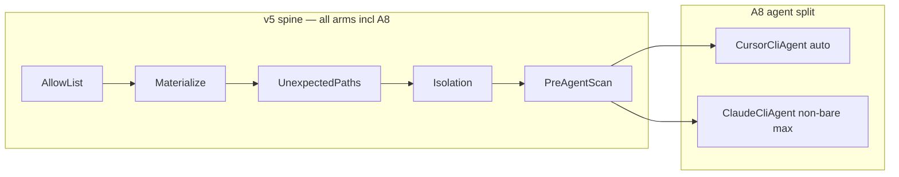

# A8: A6 with Claude CLI meta-agent (revised v3)

## Goal

| | A6 (baseline) | A8 (new) |
|---|---|---|
| Inner agent | `cursor_cli`, model `auto` | same |
| Meta agent (every 5 rounds) | same `cursor_cli` | `claude_cli`, model **`claude-opus-4-8`** (pinned), effort **`max`** |
| Everything else | feature shadow descriptors, score_child_prop, 20 rounds | identical |

A8 isolates whether a stronger meta-model improves mechanism self-modification without changing the inner search agent. **`effort: max`** is pinned on A8 itself (no separate A8m stress arm in the default batch).

**Methodology caveat (non-bare):**

> A8 differs from A6 by meta backend **plus** Claude Code non-bare runtime context (`claude -p` loads ambient session config from `~/.claude`, hooks, plugins, MCP, auto memory). Label separately on overlay/analysis.

---

## Leakage & context isolation

> **Leakage prevention is an initialization and context-isolation property; marker scanning is only a backstop, never the proof.**

A8 inherits the full [v5 lean ladder spine](zero_ladder_leakage_02ec1ecf.plan.md). This section states how that spine applies to A8 and what A8 adds on top.

### Primary defense: source isolation (do not materialize)

```text
Agent cannot copy what does not exist on disk and never entered its context.
```

A8 worktree init uses the **same audited path** as all arms ([`ladder_lib.init_worktree`](scripts/ladder_lib.py)):

- `git archive f5c7c26 --` with paths from [`ladder_allowed_paths.txt`](scripts/ladder_allowed_paths.txt) only (argv list, no shell interpolation)
- **Never materialize**: `evolve/sweep/`, `knowledge/`, `results_full.tsv`, `progress*.png`, jun22 sweep scripts, template candidate snapshots, run dirs inside wt
- Not "delete later" — **do not create initially**
- `purge_forbidden_paths()` = fallback only, not first-line defense

### Fail on unexpected paths (not blacklist alone)

After materialize + scratch overlay, stage-aware invariant ([`unexpected_paths()`](scripts/ladder_lib.py)):

```text
∀ file f in wt: f must match ALLOWED_PATHS ∪ stage extras
else fail-closed
```

Stages: `post_materialize`, `post_scratch`, `post_commit_init`. Catches **any** surprise file, not just known-bad paths.

### Git / worktree / control-plane isolation

Must-have (already in v5 verify; A8 must pass same checks):

```text
.git is directory inside wt (not linked worktree pointer)
git-dir / git-common-dir resolve inside wt/.git
git rev-parse --show-toplevel == wt
run_dir NOT under wt
manifest NOT under wt
agent cwd = wt root only
```

Especially critical for A8: non-bare Claude must not reach main-repo ladder history via shared git state.

### Gate before scorer (mandatory ordering)

Inner candidate flow ([`evolver/loop.py`](evolver/loop.py)) — **already implemented in v5**:

```text
agent finishes
→ collect stdout + strategy snapshot
→ leak gate (marker hashes + regex on stdout + snapshot)
→ if hit: invalid, RETURN — scorer NOT invoked
→ scorer runs only after clean gate
→ promote only if snapshot_hash_at_gate unchanged
```

**Forbidden:** score first → then invalidate (contaminates `results.tsv`, `archive.json`, triage logs).

Meta sessions get the **same ordering** for mechanism edits:

```text
meta agent finishes
→ collect meta stdout + mechanism target file text
→ leak gate on those surfaces
→ post-meta diff gate (scope outside evolve/mechanism/** → reject)
→ if hit: no commit, no attribution advance
→ only then commit mechanism change
```

### Scorer temp isolation + no rows on leak

Per v5 S6/S7 (already in plan spine):

- Scorer cwd = throwaway temp / isolated copy where applicable
- Leak-invalid: **no** `results.tsv` row, **no** `archive.json` append
- Atomic/locked append only after accepted result

### Detection: high-specificity markers only

Per [`evolver/leak_gate.py`](evolver/leak_gate.py) + v5 D1:

- `LEAK_MARKER_HASHES: frozenset[str]` — hashes only in repo, raw strings never committed
- Gate surfaces: **stdout** + **allowlist file snapshot** (inner) / **mechanism file** (meta)
- No rolling n-grams, MOSS, fuzzy fingerprints
- Tests use synthetic fixtures, not real template body

### Snapshot hash at promote

Already in loop:

```python
snapshot_hash_at_gate = snapshot_digest(snapshot_text)  # post gate pass
# before promote:
assert snapshot_digest(snapshot_text) == snapshot_hash_at_gate
```

If scorer/post-processing mutates allowlist file → fail closed, no promote.

### Quarantine contaminated history

Before clean ladder / A8 launch:

- A1/A2/A4/A5 batch `150224` → `RUN_ROOT/_quarantine/`
- Never use for overlay, A3 parent, or comparison
- Fresh `force-init` on all arms including A8

### A8-specific: non-bare Claude ambient context

A8 is **higher risk** than Cursor-only arms because `claude -p` non-bare may load ambient Claude context outside the worktree. Mitigations:

```text
1. cwd strictly = A8 isolated worktree root
2. no forbidden files in wt (v5 init + unexpected-path invariant)
3. no CLAUDE.md / project memory files in wt containing template hints
4. --permission-mode dontAsk
5. path-scoped allowedTools (narrow Read, not repo-wide)
6. post-meta diff gate before commit
7. no --continue / no --resume
8. --no-session-persistence
9. audit ~/.claude impact documented; not proof of cleanliness
```

**Narrower `allowedTools`** (vs wide `Read`):

```bash
--allowedTools "Read(/evolve/mechanism/**),Read(/evolver/**),Read(/README.md),Edit(/evolve/mechanism/evolve_skill.md),Bash(git diff *),Bash(git status *)"
```

Preflight for A8 init: assert wt contains **no** `CLAUDE.md`, `progress*.png`, `knowledge/`, `evolve/sweep/`.

### Honest guarantees

**This plan guarantees:**

```text
disk-init clean (allowlist materialization + unexpected-path invariant)
template absent from wt
gate-before-scorer hygiene (inner + meta)
control-plane outside wt
no contaminated result rows on leak hit
quarantine separation for known bad batches
```

**This plan does NOT guarantee:**

```text
read-sandbox clean
proof against silent structural reuse
proof against adversarial evasion
proof that ambient Claude memory (~/.claude) is clean
meta diff-scope gate blocks *where* meta writes, not *what* it writes in evolve_skill.md
  — that file is an open text channel into every inner session (Φ + skill contract)
  — Goodhart / metric-gaming resistance is holdout + full keep rule, not constitution prose
```

Threat model: **honest-but-contaminated agent**, not evasive adversary ([v5 lean plan](zero_ladder_leakage_02ec1ecf.plan.md)).

---

## Current gap (agent plumbing)

Today there is **one** agent kind per run; [`Loop`](evolver/loop.py) falls back to inner agent for meta. No `ClaudeCliAgent` exists yet.



---

## Auth: do NOT use `--bare`

With local Claude Code subscription/session login, `claude --bare -p` is wrong (skips OAuth/keychain; needs `ANTHROPIC_API_KEY`). A8 uses **`claude -p`** (non-bare). See [headless](https://code.claude.com/docs/en/headless) / [auth](https://code.claude.com/docs/en/authentication) docs.

---

## Implementation

### 1. Config: split meta agent settings

Extend [`evolver/config.py`](evolver/config.py):

- `meta_agent_kind`, `meta_session` (with `effort`, `max_budget_usd`, `allowed_tools`, optional `append_system_prompt_file`)
- Pin model: **`claude-opus-4-8`**

```json
"meta": {
  "every": 5,
  "target": "evolve/mechanism/evolve_skill.md",
  "agent": "claude_cli",
  "session": {
    "model": "claude-opus-4-8",
    "effort": "max",
    "max_turns": 12,
    "max_budget_usd": 1.50,
    "wall_timeout_s": 900.0,
    "allowed_tools": [
      "Read(/evolve/mechanism/**)",
      "Read(/evolver/**)",
      "Read(/README.md)",
      "Edit(/evolve/mechanism/evolve_skill.md)",
      "Bash(git diff *)",
      "Bash(git status *)"
    ]
  }
}
```

### 2. `ClaudeCliAgent` in [`evolver/agents.py`](evolver/agents.py)

**Canonical invocation:**

```bash
claude -p \
  --model claude-opus-4-8 \
  --effort max \
  --max-turns 12 \
  --max-budget-usd 1.50 \
  --no-session-persistence \
  --output-format stream-json \
  --verbose \
  --permission-mode dontAsk \
  --allowedTools "Read(/evolve/mechanism/**),Read(/evolver/**),Read(/README.md),Edit(/evolve/mechanism/evolve_skill.md),Bash(git diff *),Bash(git status *)"
```

- No `--bare`; no `--continue` / `--resume`
- `cwd=ctx.repo_root` (worktree root only)
- Status: `COMPLETED` | `TIMEOUT` | `ERROR` | **`TURN_LIMIT`**
- Cost: fail-soft parse from stream-json; never silent `0.0`
- Audit: `run_dir/meta_tools.jsonl`

### 3. Meta safety: defense in depth

1. Leak gate on meta stdout + mechanism file **before** commit
2. Post-meta diff gate: reject if diff outside `META_ALLOWLIST`
3. Existing: `reset_all_but_allowlist(best_commit)` discards strategy edits

### 4. Wire harness

[`evolver/cli.py`](evolver/cli.py) + [`evolver/loop.py`](evolver/loop.py): `meta_agent_factory`, meta cost accounting, `TURN_LIMIT` → no commit.

### 5. A8 ladder config + init

- [`scripts/ladder_configs/A8.json`](scripts/ladder_configs/A8.json) — A6 + meta block (`effort: max`)
- Init via [`init_worktree('A8', ...)`](scripts/ladder_lib.py) — same v5 path as other arms
- [`evolve/mechanism/a8_meta_constitution.md`](evolve/mechanism/a8_meta_constitution.md) — invariants only, no template references

### 6. Ladder batch

```python
PHASE1_ARMS = ('A0', 'A1', 'A2', 'A4', 'A5', 'A6', 'A7', 'A8')
```

Overlay color `'A8': '#7c3aed'`. Quarantine contaminated runs before spawn.

### 7. Launch preflight

- `claude` on PATH
- Smoke: `claude -p` production flags (see preflight)
- `cursor-agent` logged into Cursor Desktop / CLI on this machine (session auth; no env token)

### 8. Tests

- Config / factory / command build (no `--bare`, path-scoped tools)
- `TURN_LIMIT`, cost parse fixtures
- Meta leak gate ordering (gate before commit)
- Post-meta diff gate
- Snapshot hash promote block (reuse [`test_ladder_leak.py`](evolver/tests/test_ladder_leak.py))

---

## Launch commands

```bash
python scripts/verify_ladder_launch.py --init-only --arms A8 --force-init
python scripts/launch_ladder_parallel.py --arms A6 A8 --replicates 3 --max-concurrent 2
python scripts/launch_ladder_parallel.py --arms A8 --replicates 1 --max-concurrent 1  # smoke only
```

---

## Statistical power (ablation honesty)

One run per arm (20 rounds, K=2, ~3–4 meta commits) is **underpowered**: the A8−A6 contrast rides on a handful of `evolve_skill.md` edits inside one high-variance evolutionary trajectory. Without replicates, report as **anecdote**, not ablation.

**Harness RNG** (parent selection, sweep order) is controlled by `rng_seed` in [`evolve/config.json`](evolve/config.json) / ladder arm JSON — **not** hardcoded in [`Loop`](evolver/loop.py). Replicates share the same base seed per index (`base + replicate`) so A6 and A8 differ only by meta backend + agent stochasticity.

**Minimum for ablation:** `--replicates 3` (prefer ≥5) via [`launch_ladder_parallel.py --replicates N`](scripts/launch_ladder_parallel.py). Run dirs: `{arm}_{batch}_r0`, `_r1`, … Manifest keys: `A6@r0`, … Aggregate holdout/full deltas across replicates before claiming A8 beats A6.

Agent sessions (Cursor / Claude) remain independently stochastic even with matched harness seeds.

---

## Prerequisites

- `cursor-agent` installed + session login on host (inner; `preflight_cursor_cli`)
- `claude` CLI + subscription/session login; smoke check passes
- Claude Code v2.1.154+ for Opus 4.8
- Contaminated A1/A2/A4/A5 runs quarantined; fresh init before comparison

---

## Risk notes

- **Cost**: `max` effort + `--max-budget-usd 1.50`; `$5 cost_cap` may bite early
- **Runtime context**: non-bare Claude ambient context — labeled caveat, not read-sandbox proof
- **Comparison**: A8 vs A6 = meta backend ablation; leakage posture identical via shared v5 init
- **Power**: single replicate = anecdote; need ≥3 matched `rng_seed` replicates for ablation claims
