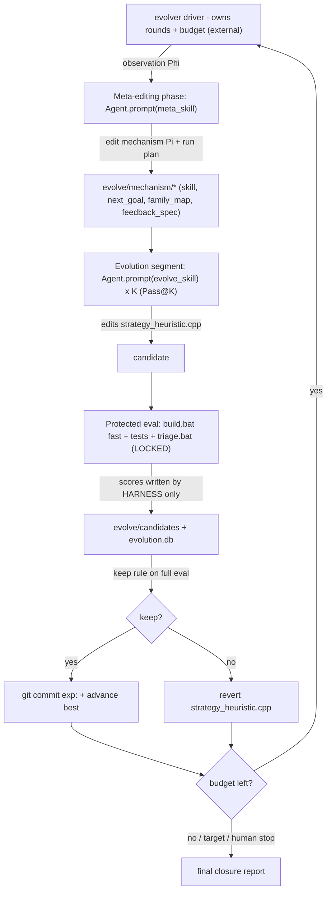

# Harness the Durak autoresearch loop, AEvo-style

## The problem, precisely

Today the loop is *agent-prose-driven*: a human pastes a Cursor prompt, and **one agent** runs experiments, does meta-reviews, *and decides when to stop*. [program.md](program.md) literally says `NEVER STOP`, and `## Search mode` is now `CLOSURE / PLATEAU` — the agent exercised stop authority it shouldn't have. This is exactly AEvo's critique: "an agent's internal stopping decision can conflict with the external evolution budget."

The fix (AEvo): put the agent **inside an explicit harness** where *rounds, candidate records, and evaluation feedback live outside the agent's local decision loop*. An external driver owns the budget; the agent only proposes candidates and edits the mechanism — it cannot end the run.

## What already maps (keep) vs what's missing (build)

- Already AEvo-like: protected/locked evaluator ([scripts/triage.bat](scripts/triage.bat) -> `durak/build/simulate.exe`), candidate ledger ([results.tsv](results.tsv)), durable process memory ([program.md](program.md)), meta-review cadence, search modes, and a no-reward-hacking guard (`forbidden_check`).
- Missing: (1) an external process that owns rounds + budget so the agent can't stop; (2) a structural split between a meta-editing phase and an evolution segment; (3) true *mechanism* editing (Pass@K, de-anchoring, restructured feedback), not just re-pointing the next heuristic axis; (4) harness-owned scoring (today the agent writes its own scores into [results.tsv](results.tsv) — a reward-hacking surface AEvo protects).

## Architecture

The agent appears only inside the two `Agent.prompt(...)` boxes. The loop, budget, scoring, and keep/revert are all in the driver.

## Workspace layout (new)

A new Python package `evolver/` plus a contained workspace dir `evolve/`:

- `evolver/` (PEP8, pathlib, single-quotes): `cli.py` (`init|run|status|continue|stop`), `loop.py` (the two-phase loop + budget), `evaluate.py` (protected eval + candidate store), `observe.py` (the Phi summary), `agents.py` (Cursor SDK wrapper), `config.py`.
- `evolve/config.json` — budget: `max_rounds` (e.g. 100, mirroring AEvo open-ended), `segment_size` K (e.g. 4), optional cost cap, `target`, model ids for inner vs meta agent.
- `evolve/state.json` — process-level state: round index, best pointer, budget remaining, plateau counter.
- `evolve/mechanism/` — this is Pi, what the meta-agent edits and commits with `meta:`: `evolve_skill.md` (inner-agent skill), `next_goal.md` (run plan + this segment's hypotheses), `family_map.md` (mechanism families tried/closed, for de-anchoring), `feedback_spec.md` (what evidence the inner agent sees).
- `evolve/meta_skill.md` — meta-agent skill (read -> attribute -> edit Pi -> set run plan; explicit forbidden list).
- `evolve/candidates/candidate_NNNN/` — artifact copy of `strategy_heuristic.cpp`, `meta.json` (round, parent, family, cost, provenance), `triage_output.txt`, `scores.json` (**written by harness only**).
- `evolve/evolution.db` (SQLite searchable history), `evolve/observations/round_NNN.md`, `evolve/evolve.log`.

Git: `evolve/mechanism/*` and `meta_skill.md` are tracked (the evolving Pi); `evolve/candidates/`, `evolution.db`, logs, `state.json` are untracked like [results.tsv](results.tsv).

## The two-phase loop (driver-owned)

Per round, until the **external** budget is exhausted (the agent never decides this):

1. **Observe**: `observe.py` writes `evolve/observations/round_NNN.md` = compact Phi over the store + [program.md](program.md): best-so-far curve, last-segment outcomes, plateau length, families tried/closed, rejected directions, cost, and the localized B4 residual (deck-empty initiative, from the loop notes / `--mode features`).
2. **Meta-editing phase**: `Agent.prompt(meta_skill + observation)` (local, `cwd=repo`). The meta-agent edits `evolve/mechanism/*` and writes a run plan (segment size, family to explore, `de_anchor` flag, stop conditions). It is forbidden from editing `strategy_heuristic.cpp`, `candidates/`, or any `scores.json`.
3. **Evolution segment (Pass@K)**: K times, `Agent.prompt(evolve_skill + next_goal + feedback)` -> the inner agent makes **one** candidate edit to [durak/src/strategy_heuristic.cpp](durak/src/strategy_heuristic.cpp) (and its manifest). Each variant starts from the current best.
4. **Protected evaluation (harness, not agent)**: `build.bat fast` -> `forbidden_check` + tests (reject contract-violating candidates) -> `triage.bat quick` -> escalate by the **locked** delta gates -> `full` when warranted; parse scores; write `candidate_NNNN` + `scores.json`.
5. **Keep/discard (harness applies the locked keep rule on full eval)**: best segment candidate -> if keep, apply + `git commit` with `exp:` + advance best; else revert. Update `state.json`, plateau counter, decrement budget, print console progress, loop.

**Anti-stop**: each inner session is one-shot and bounded; even if it declares "saturated/done", the driver ignores that and starts the next segment after a meta-edit. `evolve_skill.md` encodes AEvo's rule: *"While budget remains you do not get to exit; if you feel done, name the specific structural reason it is stuck and submit a candidate from a different family."*

## Memoryless guardrails (per your choice)

The contract is unchanged: `forbidden_check` stays, `evolve_skill.md` forbids memory/state/IO/clock/random, and the meta-agent's de-anchoring switches families **within** the memoryless space (attack-open / pile / strip / defense-take / phase-window / tie-break). Mechanism editing here means: Pass@K diverse sampling, de-anchor prompts when plateaued, and surfacing the per-deal B4 diagnostic ([scripts/diagnose_b4_features.py](scripts/diagnose_b4_features.py)) to the inner agent instead of only scalar scores.

## Integration with the existing contract

- Locked column of [program.md](program.md) is untouched; the harness only *calls* the locked evaluator/build and *reads* locked thresholds + rejected directions.
- The harness auto-regenerates [results.tsv](results.tsv) from the candidate store so [analysis.ipynb](analysis.ipynb) keeps working; the agent no longer writes scores.
- Add `cursor-sdk` to [pyproject.toml](pyproject.toml); requires `CURSOR_API_KEY` in the environment.
- Driver prints round/candidate/budget progress to console (your "show progress" rule) and uses the existing macro `point_rate`/`search_score`.

## Honest expectation

You chose to stay memoryless, where the space is already well-mapped, so the score upside is likely small or zero. The primary, reliable win is structural: the agent can no longer stop early, scoring is reward-hack-proof, and "closure" becomes an *evidence-backed* outcome of a spent external budget across many de-anchored families — not the agent's subjective "I feel done." If any residual is extractable memorylessly, Pass@K + de-anchoring + diagnostic-feedback is the most likely route to it.

## Validation

End-to-end dry run with a tiny budget (`max_rounds=1`, `K=2`, quick-only gate) to confirm: agents spawn via SDK, candidates are scored by the harness, keep/revert + commit work, and the loop continues past an inner "we're done" without stopping.