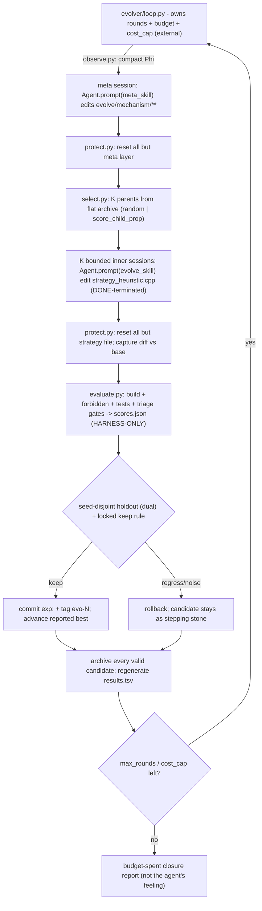

# AEvo harness for the Durak autoresearch loop (implementation-grade)

## Problem

The loop is agent-prose-driven: a human pastes a Cursor prompt and **one agent** runs experiments, scores them, *and decides when to stop*. `program.md:416` says `NEVER STOP`, yet `## Search mode` is `CLOSURE / PLATEAU` — the agent exercised stop authority the prompt tried to forbid. This is AEvo's exact critique: the agent's internal stopping decision conflicts with the external budget. The fix is structural, not a stronger prompt: move rounds, candidate records, and evaluation outside the agent's decision loop.

## Current system in AEvo terms

- **Candidate** = an edit to `durak/src/strategy_heuristic.cpp` (the only agent-edited file; complexity manifest at `strategy_heuristic.cpp:26-28`). *Today it lives in the working tree, not a record.*
- **Evaluator** = `durak/build/simulate.exe` (pure C++/CPU, no LLM) invoked through `scripts/triage.bat` (gates smoke/b4/quick/medium/dual/full); build `durak/build.bat fast`; contract guard `durak/cmake/check_forbidden.cmake`; tests via ctest. *Locked by policy only.*
- **Archive / ledger** = `results.tsv` (untracked; schema at `program.md:294-311`). *Append-only, and the agent writes it.*
- **Mutation mechanism** = prose search modes EXPLORE/PIVOT/ABLATE/EXPLOIT/COMBO/SWEEP in `program.md`. *The agent picks the mode and edits the file by hand.*
- **Feedback signal** = `durak/triage.log` summary lines + `results.tsv` + `--mode features` diagnostics (`scripts/diagnose_b4_features.py`).
- **External budget owner** = **none.** `LOOP FOREVER` + `NEVER STOP` are prose; nothing enforces rounds.
- **Agent-local stopping point** = the agent's CLOSURE/PLATEAU verdict (it declared the memoryless space saturated at ~0.689 vs B4 and halted).

## The gap (exact)

- **Still controlled by the agent:** the round loop; the stop decision; which mutation to make; **writing official scores** into `results.tsv` (e.g. `scripts/run_batch114.py:51-59`); applying the keep rule; committing.
- **Controlled externally (but only by policy, not mechanically):** the simulator, metric formula, gate seeds, keep thresholds, `forbidden_check`, tests (`program.md:157-166` says "you may NOT edit" — but the agent has filesystem write access to all of it).
- **Where early stopping still happens:** the agent ends the run by declaring closure; `NEVER STOP` cannot prevent it because it is a prompt.
- **Where reward hacking / self-scoring happens:** the agent appends its own numbers to `results.tsv` and could write any value; nothing stops it editing the evaluator/metric/thresholds since "locked" is policy, not a write barrier.

## Smallest change that makes early stopping impossible

One external Python process (`evolver/`) that owns the loop and reduces the agent to a bounded, stateless candidate generator:

1. **The driver owns rounds + budget.** `evolver/loop.py` runs the round loop; the agent is never asked to loop. Termination is `max_rounds`/`cost_cap` only.
2. **The agent only receives bounded tasks.** `evolver/agents.py` calls `Agent.prompt(...)` once per candidate ("edit `strategy_heuristic.cpp` to try X"), bounded by `max_turns`, DONE-terminated, no evaluator/git tools.
3. **Candidates are recorded outside the agent.** `evolver/protect.py` captures each as a git diff vs base into `evolve/candidates/`; the agent never owns the ledger.
4. **Evaluation is run by the harness.** `evolver/evaluate.py` runs build + `forbidden_check` + tests + `triage.bat` and writes `scores.json` itself; `results.tsv` is regenerated, never agent-written.
5. **The agent cannot declare the run finished.** There is no stop sentinel the agent can emit; an inner "we're done" just ends that one bounded session and the driver starts the next round.

Everything else (QD, curator, sweeps, FTS, convergence) is deferred — it does not make stopping impossible, so it is not in the core.

## Architecture (Phase-1 core)



The agent appears only inside the two `Agent.prompt(...)` boxes; `protect.py` resets everything outside its manifest layer immediately after. The loop, budget, scoring, gate, and termination live in the driver.

## Phase 1 — minimal core (components)

Each component lists the **file(s)**, the **failure mode it closes**, **how to test it**, and the **new risk it introduces**.

- **C1 External driver** — `evolver/loop.py`, `evolver/cli.py` (run|status|continue|stop), `evolver/config.py`.
  - Closes: agent-owned looping/stopping (the CLOSURE/PLATEAU early stop; `program.md:416` is prose-only).
  - Test: dry run `max_rounds=2` runs exactly 2 rounds; an inner session that says "saturated/done" does **not** end the run; `continue` resumes from `state.json` after a kill.
  - Risk: runaway compute/cost -> hard `max_rounds` + `cost_cap` + console progress.
- **C2 Bounded agent sessions** — `evolver/agents.py` (Cursor SDK `Agent.prompt`, local, cwd=repo).
  - Closes: agent-controlled session scope; one bounded task per call; `max_turns`/`thinking_level`/`disabled_tools`; DONE + bare-text nudge.
  - Test: a session that errors/times out/returns malformed -> candidate marked **invalid**, loop continues; agent has no evaluator/git tool available.
  - Risk: SDK/API instability or token spikes -> failure capture (never crash) + per-candidate cost logging + cap.
- **C3 Allowlist git-reset protection** — `evolver/protect.py` (VersionControl) + `evolve/manifest.yaml`.
  - Closes: reward hacking / contract tampering — only the manifest layer survives a reset (inner: `strategy_heuristic.cpp`; meta: `evolve/mechanism/**`); replaces policy-only locking (`program.md:157-166`) with a mechanical barrier.
  - **Mechanism (grounded in code):** HyperAgents resets a **denylist** (`reset_paths_to_commit(git_dir, base, paths=["domains/"])`, `run_meta_agent.py`) because its agent may edit everything *except* the evaluator. Our agent edits ONE file, so we **invert to an allowlist**: `git checkout <base> -- . ':(exclude)<allow>'` then `git clean -fd -e <allow>` (robust fallback: copy the allow file aside -> `git reset --hard <base>` + `git clean -fd` -> restore it). Order mirrors the code: run agent -> reset complement -> capture diff.
  - Test: an inner session that edits `durak/src/engine.cpp` or `scripts/triage.bat` has that edit discarded before eval; the allowlist file survives; reset runs in `finally` on simulated crash.
  - Risk: a mis-scoped allowlist -> manifest is itself a locked, human-only file; reviewed once.
- **C4 Harness-owned evaluation + scores** — `evolver/evaluate.py`.
  - Closes: **self-scoring** — harness runs `durak/build.bat fast` -> `check_forbidden.cmake` -> ctest -> `scripts/triage.bat`; parses `search_score`/`point_rate`/`lower_ci` (reuse the proven regexes in `run_batch114.py:35-48`); writes `scores.json` (harness-only) and regenerates `results.tsv`.
  - Test: `scores.json` and `results.tsv` change only via the harness; a candidate failing forbidden/build/tests is recorded invalid; an agent edit to `results.tsv` is ignored/regenerated.
  - Risk: parser drift mislabels a candidate -> assert-or-invalid on parse failure; reuse existing regexes.
- **C5 Open-ended branching archive + population selection (MANDATORY, not optional)** — `evolver/store.py`, `evolver/select.py`, `evolve/candidates/`, `evolve/archive.json`.
  - Closes: the local-optimum trap that produced PLATEAU. HyperAgents' **w/o-open-ended ablation = greedy "replace the predecessor and make it the next parent" = little to no progress** (`paper.txt:199,150`); their successful runs keep a *flat archive of all valid stepping stones* and branch probabilistically. So the archive is **mandatory** and greedy is **never** the runtime search.
  - **Archive data model:** every VALID candidate (builds + `check_forbidden` + ctest + non-empty diff) is added and **never removed in Phase 1** (regressions included, as stepping stones). Per-candidate `meta.json`: `id`, `parent_id`, `base_commit`, `round`, `valid`, `n_children` (compiled children; incremented on the *parent*), `alpha` (selection score), `search_score`, `point_rate_b4`, `lower_ci`, `complexity`, `status` (best|stepping_stone|invalid), `tokens`, `eval_seconds`. Official numbers live in `scores.json` (harness-only).
  - **Candidate lineage:** candidate = `model_patch.diff` (git diff vs `base_commit`) + full-file snapshot of `strategy_heuristic.cpp`; branch by restoring the parent snapshot into the allowlist file before the inner session; chain via `parent_id` to the root (init best).
  - **Parent-selection policy** (default `score_child_prop`, the paper's handcrafted winner `paper.txt:374-425`): `alpha_mid = mean(top-3 alpha)`; `s_i = sigmoid(10*(alpha_i - alpha_mid))`; `h_i = 1/(1+n_i)`; `p_i ∝ s_i*h_i`; sample K **with replacement over all valid** candidates. `alpha_i` is the **holdout-confirmed** score (the paper selects on validation, `paper.txt:208`), not the search bank. `random` = ablation baseline; `greedy/argmax` = ablation only.
  - Test: archive persists and keeps regressions; over K*rounds selection yields >=2 distinct parents and never always-the-best (bounded by its `1/(1+n)` term); the reported best advances only under the locked keep rule.
  - Risk: unbounded growth/dilution -> Phase 1 keeps all candidates but caps the *active selection set*; full Curator GC is Phase 2.
- **C6 Seed-disjoint holdout gate + keep rule** — reuse `scripts/triage.bat dual`; keep rule in `evolver/evaluate.py`.
  - Closes: keeping noise / a lucky `+eps` (a self-scoring-adjacent failure). Escalate on seed_base=0; advance the reported best only after it also clears the keep rule on the disjoint seed_base=1 holdout + full (`program.md:246-251`).
  - **Rollback policy:** a search-bank winner that fails the holdout is **not promoted** and the working tree resets to the current best — but the candidate **stays in the archive as a stepping stone**. Rollback never deletes a candidate (only the *reported best pointer* is conservative). `alpha_i` for selection is set from the holdout once known.
  - Test: a candidate that beats seed-0 but not seed-1 is **not** kept yet **remains selectable** in the archive; keep requires `search_full >= best+0.005 AND lower_ci >= best_lower_ci`.
  - Risk: slower acceptance -> acceptable; it is the anti-noise guarantee (`FORCE_FULL=1` override exists).
- **C7 Observation + durable memory** — `evolver/observe.py`; `evolve/observations/round_NNN.md`, `evolve/mechanism/memory.md`, `evolve/state.json`.
  - Closes: the per-session-memoryless agent needing cross-round context, without giving it stop authority. **No convergence stop in Phase 1** — the budget is the only terminator.
  - Test: Phi is bounded in size; memory + state survive a restart; nothing in `observe.py` can end the run.
  - Risk: stale/oversized memory -> append-only with compact Phi; curation deferred to Phase 2.
- **C8 Mechanism files** — `evolve/mechanism/{evolve_skill.md, meta_skill.md, feedback_spec.md, next_goal.md, family_map.md, memory.md}`.
  - Closes: over-anchoring + missing anti-stop contract. `evolve_skill.md` encodes AEvo anti-stop ("while budget remains you do not exit; if stuck, name the structural reason and submit from a different family"); `meta_skill.md` seeds the Pi-evolution menu (P0->P6, with P5-6 regressing).
  - Test: with these prompts an inner "we're done" still returns a candidate; meta edits outside the meta layer are reset.
  - Risk: over-prescriptive skills constrain search -> keep skills lean (HyperAgents minimal-instruction lesson).

## HyperAgents code — exact module specs (grounded in the shipped implementation)

Source files inspected: `utils/git_utils.py`, `generate_loop.py`, `run_meta_agent.py`, `select_next_parent.py`. The single most important code fact: **safety is mechanical, never trusted to the agent** — protection is a git reset, success is a process exit code, and scores are written by the harness. Exact edits per module:

- **protection module** (`evolver/protect.py::reset_all_but_allowlist(base)`): the code resets a **denylist** — `reset_paths_to_commit(git_dir, base, paths=["domains/"])` = `git checkout <base> -- domains/` + `git clean -fd -- domains/` (`git_utils.py`), run in `run_meta_agent.py` *before* capturing the diff. We **invert it to an allowlist** (our agent edits one file, not "everything but domains/"): `git checkout <base> -- . ':(exclude)durak/src/strategy_heuristic.cpp'` + `git clean -fd -e durak/src/strategy_heuristic.cpp`. Fallback: stash the allow file -> `git reset --hard <base>` + `git clean -fd` -> restore. **MUST ADOPT the mechanism; ADOPT-WITH-MODIFICATION the denylist->allowlist inversion.**
- **version-control module** (`evolver/protect.py`, ports `git_utils.py` verbatim where possible):
  - `diff_versus_commit(base)` = `git diff <base>` + per-untracked `git diff --no-index NUL <f>`; the code already branches `devnull='NUL' if os.name=='nt'` — **MUST ADOPT (Windows-correct as-is).**
  - `commit_inline(msg)` = `git -c user.name=… -c user.email=… commit -m …`; on "nothing to commit" returns the current hash — never mutates global config. **MUST ADOPT.**
  - `reset_to_base(base)` = `git reset --hard <base>` + `git clean -fd` — the full crash reset. **MUST ADOPT.**
  - `apply_patch` uses `git apply --reject` (tolerant) — **ADOPT-WITH-MODIFICATION:** we prefer exact snapshot restore over `--reject` (which can leave `.rej`/partial state); keep apply only for inspection.
- **parent-selection module** (`evolver/select.py`, from `select_next_parent.py`): iterate the archive, **skip any node with `valid_parent==False`** (starting node always valid); read each parent's score on the **holdout** (`split='val' if val exists else 'train'`, `type='max'`); compute `n_children` by counting nodes whose `parent_id==i`. Shipped seed = `random.choice` over valid nodes; our default = `score_child_prop` (paper) with `random` as the ablation. **MUST ADOPT valid-only + select-on-holdout; default-policy choice is ours.**
- **candidate metadata format** (`evolve/candidates/candidate_NNNN/meta.json`, mirrors `generate_loop.py` `metadata.json`): `id`(=current_genid), `parent_id`, `base_commit`, `prev_patch_files` (lineage stack), `curr_patch_files`, `parent_agent_success` (=child `exit_code==0`, `:595`), `run_eval` (=non-empty diff, `:610-611`), `run_full_eval`, `valid_parent` (=`run_eval and (eval_successful or meta_patch is not None)`, `:708`), `can_select_next_parent`, plus harness-owned `alpha`/`scores_ref`/`search_score`/`point_rate_b4`/`lower_ci`/`complexity`/`status`/`tokens`/`eval_seconds`.
- **lineage format**: candidate = `model_patch.diff` (vs `base_commit`) + full-file snapshot. The code reconstructs a parent by **replaying its patch stack** (`get_patch_files(parent)` -> `apply_diffs_container`); we **branch by restoring the parent snapshot** (exact, robust) and keep the patch only for lineage/inspection. **ADOPT-WITH-MODIFICATION.**
- **failure-recovery logic** (`generate_loop.py`): `parent_agent_success = exit_code==0` (never self-report, `:595`); empty diff -> `run_eval=False` -> eval skipped (`:610`); `try/except Exception -> run_eval=False` and the loop continues (`:682-684`); **`finally -> git reset --hard + git clean -fd`** runs on any error/Ctrl-C (`:687-696`); when a child agent fails, the **parent** is marked `valid_parent=False` and drops from the pool (`:923-924`); transient infra failures retry with `max_attempts` (`:178-192`); parallel eval cancels all futures on first failure (`:646-651`). **MUST ADOPT.**
- **evaluation isolation**: the code runs every agent/eval inside a fresh **Docker container** per generation with `timeout NNN` wrappers (`generate_loop.py`). Our evaluator is a locked CPU binary with **no network/LLM**, so heavyweight per-candidate containers are unnecessary — isolation = allowlist reset + harness-run binary + subprocess timeouts. **ADOPT-WITH-MODIFICATION (Docker -> git-reset + locked binary); OPTIONAL EXPERIMENT: git worktrees for parallel candidates (Phase 2).**
- **DO NOT COPY / IRRELEVANT**: the `DONOTTOUCH_<repo>` double-copy (a `no_selfimprove` baseline artifact), the polyglot-per-task container, and the `no_archive`->`parent_selection='latest'` greedy default (`:737`) — that last one is our **ablation**, not a runtime path.

## Phase 2 — optional upgrades (default OFF, each measured vs the Phase-1 baseline)

A layer ships only if it beats the Phase-1 core on holdout-confirmed gain at acceptable cost.

- **EvolutionEngine plug-in + GreedyEngine ablation** (`evolver/engine/base.py`, `greedy.py`) — a **one-shot** ablation to reproduce the paper's "greedy replace = little to no progress" on Durak; **not** a gate on adopting the archive (the archive is mandatory Phase-1). Lets later engines swap without touching the loop. Risk: premature abstraction -> add only when a second engine exists.
- **Quality-diversity** (`evolver/descriptors.py`, `population/{map_elites,islands}.py`, richer `select.py` + `select_policy.json`) — gridless `novelty` (behavioral k-NN in `b(x)`) is the closest QD extension of the paper's child-count novelty; MAP-Elites grid + islands+migration are **not from HyperAgents** (it uses a *flat* archive) — they are QD-literature extensions it only cites, tried only if the flat archive still plateaus. `modifiable` selection (UCB/softmax) is the paper's preliminary result that **beats random but not handcrafted score_child_prop** (`paper.txt:913-915`), so opt-in. Risk: noise fragments cells -> coarse bins + `lower_ci` admission.
- **Cost/hygiene** — `SweepEngine` (`engine/sweep.py`, LLM-free local sweeps/ablations; maps to `scripts/sweep_atk_trump.py` + SWEEP mode); `Curator` (`curator.py`: telemetry, active/stale/archived, never-delete+restore, pin, provenance); FTS5 `evolution.db` + two-tier curated memory + `mechanism/skills/`. Closes unbounded archive/prompt growth. Risk: more moving parts -> all default OFF.
- **Convergence + attribution** — harness-owned convergence **gated behind a mandatory `min_rounds` floor** so it can never re-introduce early stopping; harness-update attribution to throttle meta-churn that doesn't cause holdout gains; optional parallel Pass@K via git worktrees.

## Rejected ideas

- **Stronger `NEVER STOP` / long-horizon prompts only** — prose is exactly what failed (`program.md:416`); the whole point is an external harness.
- **Let the agent write official scores / append `results.tsv`** — self-scoring; now harness-owned and regenerated.
- **An agent-emittable `COMPLETE`/stop sentinel (Ralph-style)** — would hand stop authority back to the agent.
- **Convergence that can stop before a budget floor** — would re-introduce early stopping; Phase-2 convergence requires `min_rounds` first.
- **Agent-editable evaluator / metric / thresholds / `forbidden_check` / tests** — defeats protection; kept locked and manifest-excluded.
- **Agent-editable parent selection in the core** — DGM-H locks selection in its main runs; only the opt-in `modifiable` selector (Phase 2) exposes it.
- **Greedy single-best as the default search** — it is the structure that plateaued; retained only as the `GreedyEngine` ablation control.
- **Opening the B5 memory/stateful branch** — you mandated strictly memoryless; the harness explores only within the memoryless space.

## Revised canonical plan

**Workspace (new, PEP8 / pathlib / single-quotes):**
- `evolver/`: `cli.py`, `loop.py`, `config.py`, `agents.py`, `protect.py`, `evaluate.py`, `store.py`, `select.py`, `observe.py`. (Phase 2 adds `engine/`, `population/`, `descriptors.py`, `curator.py`.)
- `evolve/`: `manifest.yaml` (evolvable_layers), `config.json` (max_rounds/K/cost_cap/holdout banks/session knobs), `state.json` (round, best pointer, base commit, budget, cost), `mechanism/` (the 6 meta files), `candidates/candidate_NNNN/` (`model_patch.diff` + snapshot + `meta.json` + `scores.json`), `observations/round_NNN.md`, `evolve.log`.
- Git: `manifest.yaml` + `mechanism/*` tracked; `candidates/`, `state.json`, logs untracked like `results.tsv`.

**The loop (driver-owned), per round until `max_rounds`/`cost_cap`:**
1. **Observe** — `observe.py` writes compact Phi from the archive + `state.json`.
2. **Meta** — one bounded `Agent.prompt(meta_skill)` edits `evolve/mechanism/**`; `protect.py` resets all but the meta layer.
3. **Select** — `select.py` samples K valid parents from the flat archive.
4. **Generate** — K bounded inner `Agent.prompt(evolve_skill)` sessions edit `strategy_heuristic.cpp` from each restored parent.
5. **Capture** — `protect.py` resets all but the strategy file, captures diff vs base, skips empty diffs.
6. **Evaluate** — `evaluate.py` runs build + `forbidden_check` + tests + `triage.bat` and writes `scores.json` (harness-only).
7. **Gate** — seed-disjoint holdout (`dual`) + locked keep rule; keep -> commit `exp:` + tag `evo-N` + advance best; else roll back.
8. **Record** — archive every valid candidate; regenerate `results.tsv`; decrement budget/cost; print progress; all resets in `finally`.

**Integration with the existing contract:**
- The locked column of `program.md` is untouched; the harness only *calls* the locked evaluator/build and *reads* locked thresholds + rejected directions.
- `results.tsv` is regenerated from the store so `analysis.ipynb` keeps working; the agent no longer writes it.
- Add `cursor-sdk` to `pyproject.toml`; requires `CURSOR_API_KEY`.
- Driver prints round/candidate/parent/holdout/budget/cost progress using macro `point_rate`/`search_score` (your "show progress" rule).

## Architecture (text)

Protection points are marked `[P]`; the agent appears only on the two `Agent.prompt` lines and has no stop/score/eval authority.

```
external driver  (owns rounds + budget + scoring; terminates only on max_rounds/cost_cap)
  for round t = 1..max_rounds:
    observe            -> Phi summary (best curve, plateau len, families closed, cost)
    meta Agent.prompt  (allow = evolve/mechanism/**)
      [P] reset_all_but_allowlist(base_meta)        # checkout base -- . ':(exclude)mechanism'; clean -fd
    select K parents   (valid_parent==True only; alpha = HOLDOUT; score_child_prop)
    for each of K parents:
      restore parent snapshot -> durak/src/strategy_heuristic.cpp
      inner Agent.prompt (allow = strategy_heuristic.cpp; no git/eval/web tools)
      [P] reset_all_but_allowlist(base)             # discard every other path
      diff = diff_versus_commit(base)               # NUL-aware untracked diff
      if diff empty: run_eval=False; continue        # empty-diff skip
      parent_agent_success = (exit_code == 0)        # not self-report
      scores = evaluate.py(build.bat fast -> forbidden -> ctest -> triage.bat)   # HARNESS-OWNED
      store.add(candidate, meta.json, scores.json)   # keep ALL valid (stepping stones)
      gate: triage dual holdout + keep rule
            keep  -> commit_inline 'exp:' + tag evo-N + advance best pointer
            else  -> rollback best pointer (candidate stays selectable)
      if child failed: parent.valid_parent = False   # prune parent pool
    [P] finally: reset_to_base(base)                 # git reset --hard + clean -fd (crash/Ctrl-C safe)
    regenerate results.tsv; decrement budget/cost; print progress
  -> budget spent -> closure report  (not the agent's "feeling of done")
```

## Acceptance tests (mechanical safety)

Each maps to a code-proven guarantee; all run in the tiny-budget harness with stubbed agents.
1. **candidate cannot modify evaluator** — agent edits `durak/src/simulate.cpp`; after `reset_all_but_allowlist`, `simulate.cpp == base` and the captured diff touches only `strategy_heuristic.cpp`.
2. **candidate cannot modify tests** — agent edits `durak/tests/*`; reset restores them; they are absent from the diff and ctest runs the base tests.
3. **candidate cannot modify metric** — agent edits the score/Occam logic (in `simulate.cpp`/engine) or the gate thresholds (`scripts/triage.bat`, `program.md`); reset restores; diff excludes them.
4. **empty diff is skipped** — agent makes no change -> non-empty check fails -> `run_eval=False`, candidate not evaluated and not added as a valid parent.
5. **crash still resets workspace** — raise mid-candidate -> `finally` runs `git reset --hard base` + `clean -fd`; working tree equals base; the next round proceeds.
6. **invalid parent is removed from parent pool** — force a child `exit_code != 0` -> parent `valid_parent=False` -> `select.py` never samples it again.
7. **official score is harness-owned** — `scores.json`/`results.tsv` change only via `evaluate.py`; an agent write to either is discarded by reset/regeneration; selection `alpha` is read only from harness scores.

## Decision log

- **Solution form = external driver** (not stronger prompts, not design-doc-only). Only an external budget owner fixes the stop conflict.
- **Strictly memoryless** — search stays inside the B2 contract; B5 rejected.
- **Protection = mechanical git-reset allowlist**, not trust (HyperAgents code); scores harness-owned (AEvo).
- **Gate = seed-disjoint holdout (`triage.bat dual`) + locked keep rule** (A-Evolve), to kill noise-chasing.
- **Phase-1 search = open-ended branching archive + `score_child_prop` (MANDATORY)** — HyperAgents' w/o-open-ended ablation (= greedy replace) shows *little to no progress* (`paper.txt:199,150`); greedy is an **ablation only**, never a runtime fallback. We do **not** "measure whether the archive helps" — the paper already did.
- **Select on the holdout, not the search bank** — HyperAgents measures the parent-selection performance term on the validation set to avoid overfit (`paper.txt:208`); our `alpha_i` = holdout-confirmed score.
- **Flat archive, not MAP-Elites/islands** — HyperAgents validates a *flat* probabilistic archive (`paper.txt:374-425`); grids/islands are cited QD extensions, not its method, so they stay Phase-2 and explicitly unsupported-by-this-paper.
- **Parent selection + evaluator stay LOCKED in core** — the paper fixes both "for stability and safety"; its modifiable-selection result is preliminary and does not beat handcrafted (`paper.txt:324,913-915`). So `modifiable` selection is opt-in only.
- **No convergence-based stop in Phase 1** — budget is the sole terminator so early stopping is impossible; evidence-based convergence is Phase 2 behind a `min_rounds` floor.
- **Lean mechanism skills**, with `meta_skill.md` seeded by the AEvo Pi-evolution menu (P0->P6); meta-edits are gated/attributed like candidates (P5-6 regressed).
- **All QD/curator/sweep/FTS deferred to Phase 2**, default OFF, measured vs the core (ALE Claw "Does the Harness Matter?" discipline).
- **Allowlist, not denylist (code-driven)** — HyperAgents resets protected paths (`paths=["domains/"]`) and keeps the rest; we invert and reset everything *except* the allowlist, because our agent legitimately edits exactly one file (stricter, smaller trusted surface).
- **Success = process exit code, not self-report** — `parent_agent_success = exit_code==0` (`generate_loop.py:595`); the agent's claim of success is never read.
- **Snapshot-restore over patch-replay** — branch parents by restoring the full-file snapshot (exact) instead of `git apply --reject` (partial-apply risk); patch kept only for lineage/inspection.
- **Docker-per-candidate -> git-reset + locked CPU binary** — our evaluator has no network/LLM, so the code's container isolation is replaced by allowlist reset + subprocess `timeout`; git worktrees are an optional Phase-2 parallelism experiment.

## Implementation checklist

Phase 1 (in order): `scaffold` -> `protect` -> `evaluate` -> `store-select` -> `observe` -> `agents` -> `mechanism-files` -> `loop` -> `integrate-validate`.
Phase 2 (only after the core runs and is measured): `p2-measure-engine` -> `p2-qd` -> `p2-cost-hygiene` -> `p2-convergence-attribution`.

## Validation

Tiny-budget dry run (`max_rounds=2`, `K=2`, quick+dual gate). The four HyperAgents-driven tests first:
1. **Plateau does not force stop** — with a stubbed flat-scoring evaluator (no candidate can improve), the driver still runs all `max_rounds` and never exits early; an inner "we're done/saturated" is ignored.
2. **Archive keeps valid regressions as stepping stones** — a candidate that builds + passes `forbidden`/tests but scores *below* best is written to `evolve/candidates/` with `valid=true`, `status=stepping_stone`, stays **selectable**, and is **never deleted**.
3. **Parent selection does not collapse to the single current best** — over K*rounds with a populated archive, selection draws >=2 distinct parents and picks the current best at a rate bounded by its `1/(1+n_children)` term (assert: not always-the-best; `random` ablation is ~uniform).
4. **Official best still follows locked evaluation rules** — the reported-best pointer advances only when the keep rule holds on the **holdout** (`search_full >= best+0.005 AND lower_ci >= best_lower_ci`); a search-bank-only winner does not advance; an accepted advance emits an `evo-N` tag + `exp:` commit.

Plus the core anti-stop/anti-hack guarantees:
- an edit **outside the manifest allowlist** (e.g. `durak/src/engine.cpp`) is discarded by the reset before eval;
- the agent **cannot write** `scores.json` or `results.tsv` (both change only via the harness);
- an **inner-session crash becomes an invalid candidate** without killing the loop (reset in `finally`).
Then (Phase 2) enable each layer and confirm it loads, runs, and is measured against this baseline.
