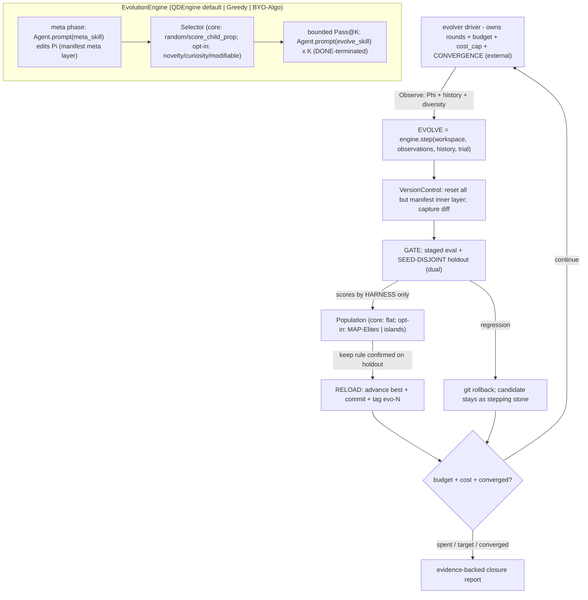

# Harness the Durak autoresearch loop (AEvo + HyperAgents + QD + A-Evolve + Hermes; Ralph/ALE-minimal)

## The problem, precisely

Today the loop is *agent-prose-driven*: a human pastes a Cursor prompt, and **one agent** runs experiments, does meta-reviews, *and decides when to stop*. [program.md](program.md) literally says `NEVER STOP`, yet `## Search mode` is now `CLOSURE / PLATEAU` — the agent exercised stop authority it shouldn't have, via greedy single-best hill-climbing. This is exactly AEvo's critique: "an agent's internal stopping decision can conflict with the external evolution budget."

Seven sources shape the fix:

- **AEvo** — put the agent **inside an explicit harness** where *rounds, candidate records, and evaluation feedback live outside the agent's local decision loop*. The driver owns the budget; the agent only proposes candidates and edits the mechanism.
- **HyperAgents (paper)** — greedy single-best search gets trapped in local optima; an **open-ended archive of stepping stones + probabilistic parent selection** sustains progress. You are *plateaued*, so this matters.
- **HyperAgents (code)** — candidate = **git diff vs base**; protect the contract by **git-resetting everything outside an allowlist back to base after the agent runs**; **pluggable parent selection over valid parents only**; inline `git -c` commits; always reset in `finally`; `iterations_left` for compute-awareness.
- **Ralph** ([ralph.sh](https://github.com/snarktank/ralph/blob/main/ralph.sh)) — minimalist proof that an **external loop with a hard budget** + **fresh context** + **file/git memory** keeps an agent working long-horizon; we reject its greedy `COMPLETE` early-stop.
- **A-Evolve** ([DESIGN.md](https://github.com/A-EVO-Lab/a-evolve/blob/main/DESIGN.md)) — "the workspace IS the interface"; a `manifest.yaml` declares **evolvable layers**; the whole algorithm is one plug-in `EvolutionEngine.step(...)`; the 5-phase loop **Solve->Observe->Evolve->Gate->Reload** validates each mutation on a **holdout** and **rolls back regressions via git** with `evo-N` tags; convergence is **harness-owned** (EGL).
- **ALE Claw** ([README](https://github.com/rdi-berkeley/agents-last-exam/blob/main/ale_run/agents/ale_claw/README.md), [agent_loop.py](https://raw.githubusercontent.com/rdi-berkeley/agents-last-exam/main/ale_run/agents/ale_claw/harness/agent_loop.py)) — the inner-loop counterpart: a **minimal** harness with the right loop/tools/memory/context management matches bigger harnesses at far fewer tokens/$/min ("[Does the Harness Matter?](https://agents-last-exam.org/blogs/harness-matters)"). Mechanics worth copying: **DONE-based termination + bare-text nudge** (never "stop when tool calls stop"), **memory flush before context compaction**, **byte-stable post-compaction re-anchor** for cache hits, bounded turns, and **robust failure capture** (provider truncation -> synthetic tool_error -> retry, never crash the run).
- **Hermes Agent** ([repo](https://github.com/NousResearch/hermes-agent), [AGENTS.md](https://github.com/NousResearch/hermes-agent/blob/main/AGENTS.md)) — a personal-assistant platform whose transferable core is its **closed learning loop**: a background **Curator** (`agent/curator.py`) that tracks per-skill usage telemetry (`use_count`/`patch_count`/`last_activity`) and **auto-archives stale agent-created skills - never deletes, restorable, pre-run backups, pins exempt, only touches `created_by: agent`**; **skills created from experience** that self-improve; **two-tier curated memory** with periodic nudges; and an **FTS5-searchable history** (`hermes_state.py` SessionDB). Plus a cost pattern: express multi-step work as one harness-run script/**sweep** = "zero-context-cost" turns. (Its gateways/TUI/voice/user-modeling do not transfer.)

## What already maps (keep) vs what's missing (build)

- Already there: protected/locked evaluator ([scripts/triage.bat](scripts/triage.bat) -> `simulate.exe`) **with a seed-disjoint cross-check** (`dual`: seed_base 0 then 1, escalate only if both agree); candidate ledger ([results.tsv](results.tsv)); durable memory ([program.md](program.md)); `forbidden_check`; rich free behavioral descriptors ([scripts/diagnose_b4_features.py](scripts/diagnose_b4_features.py)).
- Missing: external budget-owning process; meta/evolution split; harness-owned scoring (AEvo). Archive + probabilistic selection + structured memory + metacognition; git-reset allowlist; patch candidates + valid-parent gating (HyperAgents). Pluggable population (flat/MAP-Elites/novelty/islands) + collapse detection (QD). Pluggable `EvolutionEngine` + manifest layers + holdout Gate + rollback/`evo-N` + harness convergence + update-attribution (A-Evolve). Minimal-core discipline + bounded-session hygiene (ALE Claw). Lifecycle curation of the archive/skills/memory (active/stale/archived + pin + never-delete + provenance), FTS-searchable history, a skills-from-experience library, and zero-context-cost deterministic mutation operators (Hermes).

## Phasing: minimal core vs opt-in layers (Does the Harness Matter?)

ALE Claw's evidence (minimal harness ~= big harness, far cheaper) + A-Evolve's "Harness Updating Is Not Harness Benefit" mandate that **complexity must earn its place**. So the build is two phases and the harness measures its own value:

- **Phase 1 - Minimal core (must work first):** external driver owning rounds/budget + AEvo anti-stop; **manifest-allowlist reset** (VersionControl); protected staged eval + **seed-disjoint holdout Gate** (TrialRunner); **flat** archive; **random / score_child_prop** selection; durable memory + compact Phi; harness-owned convergence; `EvolutionEngine` interface with `QDEngine` + a `GreedyEngine` baseline; bounded inner-session contract. This alone fixes "the agent stops early / writes its own scores / keeps noise."
- **Phase 2 - Opt-in layers (default OFF, enabled by config/meta, each measured vs the Phase-1 baseline):** MAP-Elites grid, islands+migration, gridless novelty, curiosity/modifiable selection, harness-update attribution. A layer stays only if it beats the minimal baseline on holdout-confirmed gain at acceptable cost (attribution + GreedyEngine/flat are the controls).

## Architecture (A-Evolve 5-phase loop)

The agent appears only inside `engine.step`'s `Agent.prompt(...)` boxes; VersionControl immediately resets everything outside its manifest layer. The loop, budget, cost cap, Gate/holdout, scoring, and convergence live in the driver. No `COMPLETE` early-stop; only the *reported best* advances, and only after the holdout confirms it.

## Pluggable engine + shared primitives (A-Evolve)

`EvolutionEngine.step(workspace, observations, history, trial) -> StepResult` (+ `manages_own_evaluation`, `on_cycle_end`) in `evolver/engine/base.py`. Default **`QDEngine`** = meta-edit Pi -> `Selector.parents(K)` -> bounded Pass@K. A **`GreedyEngine`** ships as the ablation control. An opt-in non-LLM **`SweepEngine`** implements Hermes' "zero-context-cost" pattern: the meta agent expresses a parametric family or ablation **once**, and the harness deterministically expands it into N candidates with **no per-candidate agent call** (maps onto the existing SWEEP/ABLATE search modes) - reserving expensive agent sessions for *structural/novel* proposals while cheap local search runs LLM-free. Shared primitives, named to match A-Evolve: `VersionControl` (`protect.py`), `TrialRunner` (`engine/trial.py`, "use sparingly"), `EvolutionHistory` (`engine/history.py`, FTS-searchable), and `AgentWorkspace`/`evolve/manifest.yaml` (`evolvable_layers`; "change what's evolvable = edit the manifest").

## Meta-agent procedure evolution (AEvo worked example)

The meta phase edits the **procedure Pi itself**, not the strategy — and AEvo shows Pi improving as a *lineage of edits*, each spawning a generation of candidates with the best score climbing (0.15 -> 0.25 -> 0.30 -> 0.35). `meta_skill.md` is seeded with this trajectory as a **few-shot menu of procedure-level moves** (mapped to our domain) so the meta agent knows *what kinds of edits to make*:
- **P0 - best-parent rewrite** (select by validation accuracy) -> our `GreedyEngine` / `best` baseline.
- **P1 - add Pass@K + local scoring** (verifier-guided generation) -> bounded Pass@K + quick-gate local scoring before submit.
- **P2 - fix observation parsing** (activate feedback-guided refinement) -> make `observe.py`/`feedback_spec.md` surface signal the inner agent can actually act on (a broken Phi silently disables refinement).
- **P3 - extend the refinement horizon** (more pass/fail feedback before submission) -> more inner turns / iterate on quick-gate feedback within a session.
- **P4 - drop stale feedback + sample diverse alternatives when stuck** -> de-anchor: switch selector to `novelty`/`curiosity`, prune stale memory (Curator), target an empty cell.
- **P5-6 - stronger de-anchoring** (task-profile/skeleton prompts + fresh final sampling) -> **regressed from P4** - the cautionary half: aggressive meta-edits can make things *worse*.

Two lessons this encodes:
1. **Meta-edits are first-class candidates, gated like any other.** Because P5-6 regressed, the harness applies the same discipline to Pi that it applies to strategies: the holdout Gate + **harness-update attribution** check whether a meta-edit precedes a holdout-confirmed gain, and the driver **rolls back / throttles** meta-edits that don't pay off. The meta agent logs the Pi->best-score trajectory in `memory.md` so it can see which moves helped.
2. **The menu is a starting point, not a script.** Per the lean-skill choice, these are *example* moves to draw on and combine (chosen from Phi: plateau length, coverage, diversity, attribution), never a fixed sequence.

## Inner-session contract (ALE Claw)

Each `Agent.prompt(...)` is a **bounded** session — the Cursor SDK manages within-session context, so we adopt ALE Claw's *principles*, not its compaction engine:
- **Minimal tool surface**: read/edit the manifest-allowed file + `memory_search`/`memory_get` over history; **no** evaluator, git, web, or GUI (scoring is harness-owned; reset-protection is the mechanical backstop, `disabled_tools` is the cost/focus reduction).
- **Bounded + DONE-terminated**: `max_turns`, `thinking_level` caps; the session ends on an explicit submit/DONE, never by going quiet; a **bare-text nudge** keeps it productive. The OUTER budget is the only real ceiling (anti-stop).
- **Cache + drift control**: a **byte-stable** skill/contract prefix (cache prefix), re-anchored after the run; vary only Phi/parent.
- **Robust failure capture**: agent error / timeout / malformed output => the candidate is marked **invalid** (archived, non-branchable) and the loop continues; combined with the `finally` reset, the loop is crash-proof.

## Population & quality-diversity (QDEngine internals)

Reported best is always the locked keep rule confirmed on the holdout; the population is the search engine. **`b(x)`** (`descriptors.py`, free from `--mode features`): `defense_voluntariness` (`chal_voluntary_takes`), `endgame_trump_aggression` (`chal_trump_attack_cards_deck_0`/`chal_deck0_high_trump_attacks`), `card_intake` (`chal_cards_taken`), `complexity` (`complexity_score`/`kComplexity` in [durak/src/strategy_heuristic.cpp](durak/src/strategy_heuristic.cpp)).
- **Container**: `flat` (core) · `map_elites` (opt-in: coarse 2-3D grid, elite per cell; a complexity axis illuminates the score-vs-Occam frontier) · `islands` (opt-in: K subpops + ring migration).
- **Selector** (valid parents only): `random`/`score_child_prop` (core) · `novelty` (gridless k-NN in `b(x)`) · `curiosity` (cell sampling) · `modifiable` (`select_policy.json`, meta-edited) — opt-in.

## Gate on a seed-disjoint holdout (A-Evolve)

The highest-value import for a noisy scalar (SE~0.0016 at 100k). [scripts/triage.bat](scripts/triage.bat) `dual` already runs seed_base 0 then 1 and escalates only if **both agree**. The engine selects/escalates on `seed_base=0`; a candidate becomes a cell elite / reported best only after it *also* clears the keep rule on the disjoint holdout (`dual` + final `full`). A lucky `+eps` that doesn't generalize is **rolled back** (it stays as a non-elite stepping stone). Every accepted advance is an inline-`-c` commit **tagged `evo-N`**.

## Computational cost

Cost is **agent-session-bound**, not eval-bound (`simulate.exe` has no LLM):
- Per round = `1 meta + K inner` fresh, bounded sessions; at K=4, 100 rounds ~= 500 sessions. Knobs: K, rounds, `max_turns`, `thinking_level`, `disabled_tools`.
- Eval CPU is near-free (quick ~6-10s; `dual` holdout ~12s; full ~1.7 min; most candidates die at quick).
- Controls: byte-stable cached prefix + compact Phi + ALE Claw description-first skills + append-only JSONL memory; per-candidate `tokens`/`eval_seconds` in `meta.json`; hard `cost_cap`. The minimal core is the cheapest configuration; opt-in layers add cost and must justify it. Ballpark ~$25-150 per 100-round run.
- **Big LLM-free lever (Hermes):** the `SweepEngine` runs local parameter sweeps/ablations with **zero agent calls** (only CPU eval), so cheap local search costs ~nothing; the Curator keeps the active archive/prompt bounded and FTS+summarized recall avoids dumping history into context.

## Preventing reward collapse

- **Hacking** — harness-owned scores + manifest allowlist reset: a candidate physically cannot touch simulator/metric/tests/`forbidden_check` (only `strategy_heuristic.cpp` survives).
- **Diversity collapse** — QD layer + `observe.py` detection (coverage, mean pairwise `b(x)` distance, family entropy) -> force curiosity/novelty/island.
- **Saturation + noise** — flat-scalar fallback to the B4 residual via `b(x)`; the seed-disjoint holdout stops noise-chasing.

## Harness-owned convergence + attribution

- **Convergence (EGL analog)** — the driver (never the agent) computes holdout-confirmed improvement rate + seed-fold stability + coverage saturation, deciding termination with the budget. "Closure" becomes an evidence-backed verdict.
- **Attribution (opt-in)** — log which meta-edits precede holdout-confirmed gains; periodic no-meta-edit control; throttle the meta phase if churn isn't causing gains ("Harness Updating Is Not Harness Benefit").

## Lifecycle curation + learning loop (Hermes)

An open-ended archive plus a self-editing mechanism grows without bound, which bloats cost and dilutes selection. Hermes' **Curator** is the missing garbage-collector, and its closed learning loop sharpens our memory/skills:

- **Curator over the population + skills** (`evolver/curator.py`): per-candidate/cell/skill telemetry (`selection_count`, `children`, `last_improvement_round`, `state` active/stale/archived, `pinned`). **Core hygiene** (cheap, on by default): **pin** the reported-best lineage + locked artifacts (exempt from curation), **never delete** (max action = move to `candidates/.archive/`, restorable; pre-run backup), and **provenance gating** - the Curator only touches harness/agent-created artifacts, never the locked contract (already enforced by the manifest reset). **Opt-in** (Phase 2): usage-driven `active->stale->archived` auto-transitions + a periodic LLM review pass that distills/merges skills and prunes dead branches; pinned items skip review. This keeps the *active* population/prompt bounded (cost) and the selection distribution healthy (anti-collapse).
- **Two-tier curated memory** (`evolve/mechanism/memory.md` + history): episodic append-only ("tried X@cell -> Y / why", ALE Claw flush-before-loss) **plus** a curated semantic tier the meta phase consolidates on a periodic nudge (Hermes), so durable insight is distilled, not just accreted.
- **FTS-searchable history** (`evolution.db`, SQLite FTS5 like `hermes_state.py`): the agent queries "have we tried X? why did family F fail?" via `memory_search`/`memory_get`; retrieved history is LLM-summarized before injection (cost). This powers de-anchoring and redundancy/pathology detection directly.
- **Skills-from-experience** (opt-in): after a notable outcome the meta agent distills a reusable search-tactic into `evolve/mechanism/skills/` (description-first, agentskills.io-style: cheap description in-prompt, body on demand); skills self-improve and are curated. Core ships only the base `evolve_skill.md`/`meta_skill.md`.

## Workspace layout (new)

`evolver/` (PEP8, pathlib, single-quotes): `cli.py`, `loop.py`, `protect.py` (VersionControl), `descriptors.py`, `select.py`, `observe.py`, `curator.py`, `agents.py`, `config.py`, `engine/{base,trial,history,qd,greedy,sweep}.py`, `population/{flat,map_elites,islands}.py`.
`evolve/`: `manifest.yaml` (evolvable_layers), `config.json` (engine/population/holdout/cost_cap/max_rounds/K/session knobs/`curator`), `state.json` (round, best pointer, base commit, budget+cost, plateau/diversity/convergence counters), `mechanism/` (meta layer: `evolve_skill.md`, `meta_skill.md`, `next_goal.md`, `family_map.md`, `memory.md` two-tier, `feedback_spec.md`, `select_policy.json`, `skills/` distilled-tactic library), `candidates/candidate_NNNN/` (`model_patch.diff` + snapshot, `meta.json` with parent_id/`b_descriptor`/cell/holdout_passed/tokens/eval_seconds/`state`/`pinned`, `triage_output.txt`, `scores.json` harness-only), `candidates/.archive/` (curator-archived, restorable), `evolution.db` (FTS5), `observations/round_NNN.md`, `evolve.log`.
Git: `manifest.yaml` + `mechanism/*` tracked; `candidates/`, `evolution.db`, logs, `state.json` untracked like [results.tsv](results.tsv).

## The loop (driver-owned, A-Evolve 5-phase)

Per round, until **budget / cost_cap / harness convergence**:
1. **Solve + Observe** — last segment's candidates evaluated + ingested into `EvolutionHistory`; `observe.py` writes compact Phi (best curve, last-segment outcomes, plateau, families/cells, coverage/diversity, cost+budget, B4 residual, convergence signals).
2. **Evolve = `engine.step(...)`** — meta phase edits the meta layer (incl. its own skill, `select_policy.json`, opt-in toggles); reset all but the meta layer. Then `Selector.parents(K)` over valid nodes, then bounded Pass@K from each restored parent (inner-session contract).
3. **Reset + capture** — reset all but `strategy_heuristic.cpp`; capture diff; skip if empty.
4. **Gate** — `build.bat fast` -> `forbidden_check` + tests (fail/agent-error => invalid) -> `triage.bat quick` (search bank, yields `b(x)`) -> escalate by locked deltas -> `dual` holdout -> `full` holdout when warranted; harness-only scores.
5. **Reload** — every valid candidate enters the population; a candidate clearing the locked keep rule confirmed on the holdout advances the reported best via inline-`-c` commit **tagged `evo-N`**; regressions roll back. Update `state.json`, migrate if due, decrement budget+cost, print progress, loop. All resets in `finally`.

**Anti-stop**: each inner session is bounded and DONE-terminated; even if it declares "saturated/done", the driver starts the next segment. `evolve_skill.md` encodes AEvo's rule: *"While budget remains you do not get to exit; if you feel done, name the specific structural reason it is stuck and submit a candidate from a different family/cell."*

## Memoryless guardrails (per your choice)

The contract is mechanically enforced by the **manifest allowlist reset**: a candidate physically cannot alter the engine, baselines, metric, simulator, thresholds, tests, or `forbidden_check` — only `strategy_heuristic.cpp` survives, and it must still pass `forbidden_check` (no memory/state/IO/clock/random). Novelty, cells, islands, and de-anchoring explore **within** the memoryless space. The population, editable selection, history, and persistent memory live in the *harness* (`evolve/`), never inside B2.

## Integration with the existing contract

- Locked column of [program.md](program.md) untouched; the harness only *calls* the locked evaluator/build and *reads* locked thresholds + rejected directions.
- The harness auto-regenerates [results.tsv](results.tsv) from the population so [analysis.ipynb](analysis.ipynb) keeps working; the agent no longer writes scores.
- Add `cursor-sdk` to [pyproject.toml](pyproject.toml); requires `CURSOR_API_KEY`.
- Driver prints round/candidate/parent/coverage/holdout/budget/cost progress (your "show progress" rule) using macro `point_rate`/`search_score`.

## Honest expectation

You chose to stay memoryless, where the space is well-mapped, so score upside is uncertain — which is exactly why the build is minimal-core-first and measured. The Phase-1 core alone converts "the agent feels done" into "the external budget is spent under a holdout-gated keep rule." If that still plateaus, the opt-in QD layers (MAP-Elites -> islands -> novelty) branching from diverse stepping stones are the most likely way to extract any remaining memoryless residual *without* fooling itself on noise; if they don't beat the baseline, attribution says so and they stay off.

## Validation

Tiny-budget dry run (`max_rounds=2`, `K=2`, quick+dual gate) asserting: the **minimal baseline** (flat + score_child_prop, all opt-in OFF) runs end-to-end; agents spawn via SDK; an edit outside the manifest layer (e.g. `durak/src/engine.cpp`) is discarded by the reset; the **engine swaps** (QDEngine <-> GreedyEngine) without loop changes; a candidate that beats the search bank but **fails the seed-disjoint holdout is rolled back**; an **inner-session crash becomes an invalid candidate** without killing the loop; a non-best parent is sampled; an accepted advance gets an **`evo-N` tag**; the **Curator pins the best lineage + archives a stale candidate to `.archive/` without deleting** (restorable) and never touches locked files; an **FTS history query returns a prior attempt**; the **`SweepEngine` yields candidates with zero agent calls**; `cost_cap` and **harness convergence** each halt a run; the loop continues past an inner "we're done". Then enable each opt-in layer (map_elites/islands/novelty/curiosity/modifiable/attribution/curator-auto/sweep) and confirm it loads and runs.
