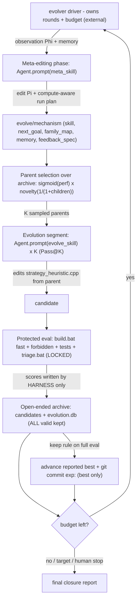

# Harness the Durak autoresearch loop (AEvo + HyperAgents)

## The problem, precisely

Today the loop is *agent-prose-driven*: a human pastes a Cursor prompt, and **one agent** runs experiments, does meta-reviews, *and decides when to stop*. [program.md](program.md) literally says `NEVER STOP`, and `## Search mode` is now `CLOSURE / PLATEAU` — the agent exercised stop authority it shouldn't have. This is exactly AEvo's critique: "an agent's internal stopping decision can conflict with the external evolution budget."

Two papers give two complementary fixes:

- **AEvo** — put the agent **inside an explicit harness** where *rounds, candidate records, and evaluation feedback live outside the agent's local decision loop*. An external driver owns the budget; the agent only proposes candidates and edits the mechanism — it cannot end the run.
- **HyperAgents (DGM-H)** — *how* the harness searches matters. DGM-H proves that greedy single-best search (their `w/o open-ended exploration` ablation: keep only the latest/best, discard the rest) achieves "little to no improvement" and gets trapped in local optima, whereas an **open-ended archive of stepping stones + probabilistic parent selection** sustains progress. Your system is *plateaued*, so this is the decisive ingredient.

## What already maps (keep) vs what's missing (build)

- Already there: protected/locked evaluator ([scripts/triage.bat](scripts/triage.bat) -> `durak/build/simulate.exe`), a candidate ledger ([results.tsv](results.tsv)), durable process memory ([program.md](program.md)), a meta-review cadence, search modes, and a no-reward-hacking guard (`forbidden_check`). The staged triage (quick -> ... -> full) already mirrors DGM-H's staged evaluation (cheap subset first, promote only if it passes).
- Missing (AEvo): (1) an external process that owns rounds + budget so the agent can't stop; (2) a meta-editing phase / evolution segment split; (3) true *mechanism* editing (Pass@K, de-anchoring, restructured feedback); (4) harness-owned scoring (today the agent writes its own scores into [results.tsv](results.tsv) — a reward-hacking surface).
- Missing (HyperAgents): (5) an **archive** of stepping stones instead of keep-best/revert; (6) **probabilistic parent selection** so the search branches from diverse parents, not the one stuck optimum; (7) **compute-aware** planning (explore early, exploit late); (8) **persistent structured memory** + pathology/redundancy detection, and (9) **metacognitive self-modification** (the meta agent may edit its own skill).

## Architecture

The agent appears only inside the two `Agent.prompt(...)` boxes. The loop, budget, parent selection, scoring, and archive are all in the driver. Note there is no greedy "revert and forget": every valid candidate is preserved in the archive as a branchable stepping stone; only the *reported best* is advanced by the locked keep rule.

## Workspace layout (new)

A new Python package `evolver/` plus a contained workspace dir `evolve/`:

- `evolver/` (PEP8, pathlib, single-quotes): `cli.py` (`init|run|status|continue|stop`), `loop.py` (two-phase loop + compute-aware budget), `evaluate.py` (protected eval + archive store), `select.py` (probabilistic parent selection), `observe.py` (Phi + memory), `agents.py` (Cursor SDK wrapper), `config.py`.
- `evolve/config.json` — budget: `max_rounds` (e.g. 100, mirroring DGM-H), `segment_size` K (e.g. 4), top-m and lambda for parent selection, optional cost cap, `target`, model ids for inner vs meta agent.
- `evolve/state.json` — process-level state: round index, reported-best pointer, budget remaining, plateau counter.
- `evolve/mechanism/` — this is Pi, edited by the meta agent and committed with `meta:`: `evolve_skill.md` (inner-agent skill), `meta_skill.md` (meta-agent skill, itself editable = metacognitive self-modification), `next_goal.md` (compute-aware run plan + this segment's hypotheses), `family_map.md` (mechanism families tried/closed), `memory.md` (structured insights/causal hypotheses/plans), `feedback_spec.md`.
- `evolve/candidates/candidate_NNNN/` — the archive entry: a copy of that candidate's `strategy_heuristic.cpp`, `meta.json` (round, **parent id**, family, compiled bit, children count, cost, provenance), `triage_output.txt`, `scores.json` (**written by harness only**).
- `evolve/evolution.db` (SQLite index over the archive for parent selection + Phi), `evolve/observations/round_NNN.md`, `evolve/evolve.log`.

Git: `evolve/mechanism/*` is tracked (the evolving Pi); `evolve/candidates/`, `evolution.db`, logs, `state.json` are untracked like [results.tsv](results.tsv).

## The loop (driver-owned)

Per round, until the **external** budget is exhausted (the agent never decides this):

1. **Observe**: `observe.py` writes `evolve/observations/round_NNN.md` = compact Phi over the archive + [program.md](program.md) + `memory.md`: best-so-far curve, last-segment outcomes, plateau length, families tried/closed, cost, remaining budget, the localized B4 residual (deck-empty initiative, from loop notes / `--mode features`), and any detected pathology (e.g. the inner agent repeatedly re-proposing a rejected family = redundancy).
2. **Meta-editing phase**: `Agent.prompt(meta_skill + observation)` (local, `cwd=repo`). The meta agent edits `evolve/mechanism/*` (including, if useful, its own `meta_skill.md` and `memory.md`) and writes a **compute-aware** run plan (segment size, which family to target, `de_anchor` flag, exploit-vs-explore bias scaled to remaining budget). Forbidden from editing `strategy_heuristic.cpp`, `candidates/`, `scores.json`, or the locked contract.
3. **Parent selection**: `select.py` samples K parents from the archive with `p_i ~ sigmoid(lambda*(perf_i - mid_topm)) * 1/(1+children_i)`. This biases toward strong performers while novelty-weighting under-explored stepping stones — so the search is not pinned to the single stuck optimum.
4. **Evolution segment (Pass@K)**: for each sampled parent, restore its stored `strategy_heuristic.cpp`, then `Agent.prompt(evolve_skill + next_goal + feedback)` -> the inner agent makes **one** memoryless candidate edit. The agent may inspect any archived candidate (diff + trace) to recombine stepping stones or learn from failures.
5. **Protected evaluation (harness, not agent)**: `build.bat fast` -> `forbidden_check` + tests (invalid/contract-violating candidates are recorded but not branchable) -> `triage.bat quick` -> escalate by the **locked** delta gates -> `full` when warranted; parse scores; append `candidate_NNNN` to the archive with parent id and `scores.json`.
6. **Advance best + continue**: every valid candidate stays in the archive; if a candidate clears the **locked keep rule** on full eval, advance the reported best and `git commit` with `exp:`. Update `state.json`, plateau counter, decrement budget, print console progress, loop.

**Anti-stop**: each inner session is one-shot and bounded; even if it declares "saturated/done", the driver ignores that and starts the next segment after a meta-edit + new parent draw. `evolve_skill.md` encodes AEvo's rule: *"While budget remains you do not get to exit; if you feel done, name the specific structural reason it is stuck and submit a candidate from a different family."*

## Memoryless guardrails (per your choice)

The contract is unchanged: `forbidden_check` stays, `evolve_skill.md` forbids memory/state/IO/clock/random in `strategy_heuristic.cpp`, and de-anchoring switches families **within** the memoryless space (attack-open / pile / strip / defense-take / phase-window / tie-break). HyperAgents' editable-meta and persistent-memory live in the *harness* (`evolve/`), never inside the B2 policy. Parent selection and the evaluator stay fixed/locked (DGM-H's main-experiment choice; its appendix shows editable parent-selection is feasible but is deferred here for stability and to respect your locked contract).

## Integration with the existing contract

- Locked column of [program.md](program.md) is untouched; the harness only *calls* the locked evaluator/build and *reads* locked thresholds + rejected directions.
- The harness auto-regenerates [results.tsv](results.tsv) from the archive so [analysis.ipynb](analysis.ipynb) keeps working; the agent no longer writes scores.
- Add `cursor-sdk` to [pyproject.toml](pyproject.toml); requires `CURSOR_API_KEY` in the environment.
- Driver prints round/candidate/parent/budget progress to console (your "show progress" rule) and uses the existing macro `point_rate`/`search_score`.

## Honest expectation

You chose to stay memoryless, where the space is already well-mapped, so score upside is uncertain. But the HyperAgents evidence is encouraging precisely here: the current "plateau" was reached by greedy single-best search, which DGM-H shows is the weakest search structure. An archive + probabilistic parent selection branching from diverse stepping stones is the configuration most likely to extract any remaining memoryless residual. If the space is genuinely closed, the harness converts "closure" into an *evidence-backed* outcome of a fully spent external budget across many de-anchored families and parents — not the agent's subjective "I feel done."

## Validation

End-to-end dry run with a tiny budget (`max_rounds=2`, `K=2`, quick-only gate) to confirm: agents spawn via SDK; candidates are scored by the harness; the archive accumulates valid candidates with parent ids; parent selection samples a non-best stepping stone at least once; the keep rule advances the reported best + commits; and the loop continues past an inner "we're done" without stopping.
