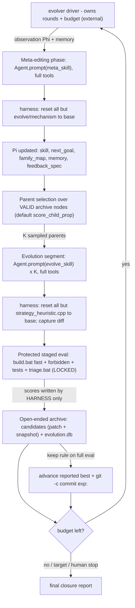

# Harness the Durak autoresearch loop (AEvo + HyperAgents)

## The problem, precisely

Today the loop is *agent-prose-driven*: a human pastes a Cursor prompt, and **one agent** runs experiments, does meta-reviews, *and decides when to stop*. [program.md](program.md) literally says `NEVER STOP`, and `## Search mode` is now `CLOSURE / PLATEAU` — the agent exercised stop authority it shouldn't have. This is exactly AEvo's critique: "an agent's internal stopping decision can conflict with the external evolution budget."

Three sources shape the fix:

- **AEvo** — put the agent **inside an explicit harness** where *rounds, candidate records, and evaluation feedback live outside the agent's local decision loop*. An external driver owns the budget; the agent only proposes candidates and edits the mechanism — it cannot end the run.
- **HyperAgents (paper)** — *how* the harness searches matters. DGM-H proves greedy single-best search (their `w/o open-ended exploration` ablation) gets trapped in local optima, whereas an **open-ended archive of stepping stones + probabilistic parent selection** sustains progress. Your system is *plateaued*, so this is decisive.
- **HyperAgents (released code)** — concrete, battle-tested patterns: a candidate is a **git diff vs base**; the evaluator/contract is protected by **git-resetting everything outside an allowlist back to base after the agent runs** (`run_meta_agent.py` → `reset_paths_to_commit(..., paths=["domains/"])`); parent selection is **pluggable over valid parents only**; commits use **inline `git -c`**; and every run **resets in a `finally`** with `iterations_left` passed in for compute-awareness.

## What already maps (keep) vs what's missing (build)

- Already there: protected/locked evaluator ([scripts/triage.bat](scripts/triage.bat) -> `durak/build/simulate.exe`), a candidate ledger ([results.tsv](results.tsv)), durable process memory ([program.md](program.md)), a meta-review cadence, search modes, and a no-reward-hacking guard (`forbidden_check`). The staged triage (quick -> ... -> full) already mirrors DGM-H's staged evaluation (cheap subset first, promote only if it clears a threshold).
- Missing (AEvo): (1) an external process that owns rounds + budget so the agent can't stop; (2) a meta-editing phase / evolution segment split; (3) true *mechanism* editing (Pass@K, de-anchoring, restructured feedback); (4) harness-owned scoring.
- Missing (HyperAgents paper): (5) an **archive** of stepping stones instead of keep-best/revert; (6) **probabilistic parent selection**; (7) **compute-aware** planning; (8) **persistent structured memory** + pathology detection; (9) **metacognitive self-modification** (the meta agent may edit its own skill).
- Missing (HyperAgents code): (10) **git-reset allowlist protection** (full-tool agent + reset all but the allowed paths to base) — robustly enforces the locked contract and closes reward-hacking, replacing the fragile "the agent only edits one file" assumption; (11) **patch-based candidates + lineage**; (12) **valid-parent gating** and pruning of repeatedly-failing parents.

## Architecture

The agent appears only inside the two `Agent.prompt(...)` boxes; it runs with full tools, but the harness immediately resets everything outside its allowlist. The loop, budget, parent selection, scoring, and archive are all in the driver. There is no greedy "revert and forget": every *valid* candidate stays in the archive as a branchable stepping stone; only the *reported best* is advanced by the locked keep rule.

## Patterns adopted from the HyperAgents code

- **Allowlist reset-protection** (`utils/git_utils.py: reset_paths_to_commit`, used in `run_meta_agent.py`): after each agent run, `git checkout <base> -- <protected>` + `git clean -fd -- <protected>`. Here the harness inverts it: reset *all* paths except the agent's allowlist (inner agent -> `durak/src/strategy_heuristic.cpp`; meta agent -> `evolve/mechanism/**`). This guarantees the engine, baselines, metric, simulator, thresholds, and tests are untouchable by any candidate.
- **Candidate = patch vs base** (`diff_versus_commit`, Windows-aware): store each candidate's `model_patch.diff` plus a full-file snapshot; branch from a parent by restoring its snapshot. Skip eval when the diff is empty (`run_eval = file_exist_and_not_empty`).
- **Valid-parent gating** (`generate_loop.py`): a node is a branchable parent only if it produced a non-empty diff, compiled, and evaluated successfully; parents whose children repeatedly fail get `valid_parent=False` and drop out of selection.
- **Pluggable parent selection** (`--parent_selection {random,latest,best,score_prop,score_child_prop}`, default `score_child_prop`; the editable seed `select_next_parent.py` is uniform `random.choice` over valid parents).
- **Inline-`-c` commits** (`commit_repo`): `git -c user.name=... -c user.email=... commit` — never mutates global git config.
- **Always-reset-in-`finally`** + `iterations_left` passed to the agent (`max_generation - current_genid`) for compute-aware behavior. Note: the repo README warns about executing model-generated code; for Durak the agent only edits a C++ heuristic compiled by the locked build and run by the locked simulator, but the finally-reset is the key safety guard.

## Workspace layout (new)

A new Python package `evolver/` plus a contained workspace dir `evolve/`:

- `evolver/` (PEP8, pathlib, single-quotes): `cli.py` (`init|run|status|continue|resume|stop`), `loop.py`, `evaluate.py` (protected staged eval + archive), `protect.py` (allowlist reset + diff capture + inline-c commit), `select.py` (parent selection), `observe.py` (Phi + memory), `agents.py` (Cursor SDK wrapper), `config.py`.
- `evolve/config.json` — budget: `max_rounds` (e.g. 100), `segment_size` K (e.g. 4), `parent_selection` + its top-m/lambda, optional cost cap, `target`, model ids for inner vs meta agent.
- `evolve/state.json` — round index, reported-best pointer, base commit, budget remaining, plateau counter.
- `evolve/mechanism/` — Pi, the meta agent's allowlist (committed `meta:`): `evolve_skill.md`, `meta_skill.md` (itself editable = metacognitive self-modification), `next_goal.md` (compute-aware run plan), `family_map.md`, `memory.md`, `feedback_spec.md`.
- `evolve/candidates/candidate_NNNN/` — archive entry: `model_patch.diff` + `strategy_heuristic.cpp` snapshot, `meta.json` (round, **parent_id**, family, `compiled`, `eval_succeeded`, `valid_parent`, `children`, cost, provenance), `triage_output.txt`, `scores.json` (**harness-only**).
- `evolve/evolution.db` (SQLite index for selection + Phi), `evolve/observations/round_NNN.md`, `evolve/evolve.log`.

Git: `evolve/mechanism/*` tracked; `evolve/candidates/`, `evolution.db`, logs, `state.json` untracked like [results.tsv](results.tsv).

## The loop (driver-owned)

Per round, until the **external** budget is exhausted (the agent never decides this):

1. **Observe**: `observe.py` writes `evolve/observations/round_NNN.md` = compact Phi over the archive + [program.md](program.md) + `memory.md`: best curve, last-segment outcomes, plateau length, families tried/closed, cost, remaining budget, the localized B4 residual (deck-empty initiative), and detected pathology (e.g. repeated re-proposal of a rejected family).
2. **Meta-editing phase**: `Agent.prompt(meta_skill + observation)` (local, `cwd=repo`, full tools). It edits `evolve/mechanism/*` (incl. its own `meta_skill.md`/`memory.md`) and writes a **compute-aware** run plan. The harness then resets all paths except `evolve/mechanism/**` to base (so a meta run can't touch the contract or the B2 policy).
3. **Parent selection**: `select.py` samples K parents over **valid** archive nodes by `config.parent_selection` (default `score_child_prop`); `random` keeps search open; `best` reproduces today's greedy behavior (kept only for ablation).
4. **Evolution segment (Pass@K)**: for each parent, restore its snapshot, then `Agent.prompt(evolve_skill + next_goal + feedback)` (full tools). The agent may inspect any archived candidate (patch + trace) to recombine stepping stones or learn from failures.
5. **Reset + capture + protected eval (harness, not agent)**: reset all paths except `durak/src/strategy_heuristic.cpp` to base; capture `model_patch.diff`; if empty, skip. Else `build.bat fast` -> `forbidden_check` + tests (failure -> invalid, archived but non-branchable) -> `triage.bat quick` -> escalate by the **locked** delta gates -> `full` when warranted; parse scores; append `candidate_NNNN`.
6. **Advance best + continue**: every valid candidate stays in the archive; if a candidate clears the **locked keep rule** on full eval, advance the reported best and `git -c ... commit` with `exp:`. Update `state.json`, plateau/valid-parent metadata, decrement budget, print console progress, loop. All resets happen in a `finally`.

**Anti-stop**: each inner session is one-shot and bounded; even if it declares "saturated/done", the driver ignores that and starts the next segment after a meta-edit + new parent draw. `evolve_skill.md` encodes AEvo's rule: *"While budget remains you do not get to exit; if you feel done, name the specific structural reason it is stuck and submit a candidate from a different family."*

## Memoryless guardrails (per your choice)

The contract is unchanged and now *mechanically* enforced: the allowlist reset means a candidate physically cannot alter the engine, baselines, metric, simulator, thresholds, tests, or `forbidden_check` — only `strategy_heuristic.cpp` survives, and it must still pass `forbidden_check` (no memory/state/IO/clock/random). De-anchoring switches families **within** the memoryless space. HyperAgents' editable-meta and persistent-memory live in the *harness* (`evolve/`), never inside B2. Parent selection and the evaluator stay fixed/locked (DGM-H's main-experiment choice; its `--edit_select_parent` shows editable selection is feasible but is deferred here).

## Integration with the existing contract

- Locked column of [program.md](program.md) is untouched; the harness only *calls* the locked evaluator/build and *reads* locked thresholds + rejected directions.
- The harness auto-regenerates [results.tsv](results.tsv) from the archive so [analysis.ipynb](analysis.ipynb) keeps working; the agent no longer writes scores.
- Add `cursor-sdk` to [pyproject.toml](pyproject.toml); requires `CURSOR_API_KEY`.
- `git_utils`-style helpers (`diff_versus_commit`, inline-c `commit`, allowlist reset) are reimplemented in `evolver/protect.py` (Windows-aware, like the original `NUL` handling).
- Driver prints round/candidate/parent/budget progress to console (your "show progress" rule) and uses the existing macro `point_rate`/`search_score`.

## Honest expectation

You chose to stay memoryless, where the space is already well-mapped, so score upside is uncertain. But the current "plateau" was reached by greedy single-best search, which DGM-H shows is the weakest structure; an archive + probabilistic parent selection branching from diverse stepping stones is the configuration most likely to extract any remaining memoryless residual. If the space is genuinely closed, the harness converts "closure" into an *evidence-backed* outcome of a fully spent external budget across many de-anchored families and parents — not the agent's subjective "I feel done."

## Validation

End-to-end dry run with a tiny budget (`max_rounds=2`, `K=2`, quick-only gate) asserting: agents spawn via SDK; an edit outside the allowlist (e.g. to `durak/src/engine.cpp`) is discarded by the reset; candidates accumulate in the archive with parent ids; parent selection samples a non-best stepping stone at least once; an empty diff is skipped; the keep rule advances the reported best + inline-c commit; and the loop continues past an inner "we're done" without stopping.
