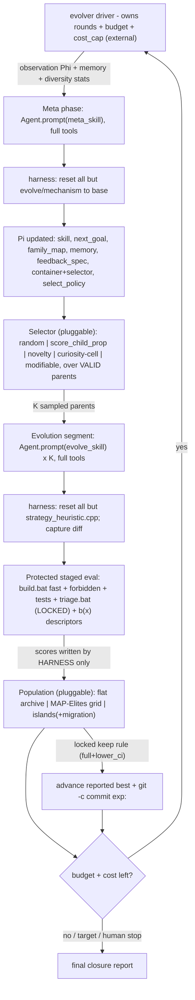

# Harness the Durak autoresearch loop (AEvo + HyperAgents + QD, Ralph-minimal)

## The problem, precisely

Today the loop is *agent-prose-driven*: a human pastes a Cursor prompt, and **one agent** runs experiments, does meta-reviews, *and decides when to stop*. [program.md](program.md) literally says `NEVER STOP`, yet `## Search mode` is now `CLOSURE / PLATEAU` — the agent exercised stop authority it shouldn't have, via greedy single-best hill-climbing. This is exactly AEvo's critique: "an agent's internal stopping decision can conflict with the external evolution budget."

Four sources shape the fix:

- **AEvo** — put the agent **inside an explicit harness** where *rounds, candidate records, and evaluation feedback live outside the agent's local decision loop*. An external driver owns the budget; the agent only proposes candidates and edits the mechanism — it cannot end the run.
- **HyperAgents (paper)** — *how* the harness searches matters. DGM-H proves greedy single-best search (their `w/o open-ended exploration` ablation) gets trapped in local optima, whereas an **open-ended archive of stepping stones + probabilistic parent selection** sustains progress. Your system is *plateaued*, so this is decisive.
- **HyperAgents (released code)** — concrete patterns: a candidate is a **git diff vs base**; the evaluator/contract is protected by **git-resetting everything outside an allowlist back to base after the agent runs** (`run_meta_agent.py` -> `reset_paths_to_commit(..., paths=["domains/"])`); parent selection is **pluggable over valid parents only**; commits use **inline `git -c`**; every run **resets in a `finally`** with `iterations_left` passed in for compute-awareness.
- **Ralph** ([ralph.sh](https://github.com/snarktank/ralph/blob/main/ralph.sh)) — the minimalist proof that an **external `for`-loop owning a hard iteration budget** + **fresh agent context each iteration** + **file/git memory** is enough to keep an agent working long-horizon. We copy its skeleton (external budget, clean context, append-only memory) but **reject its dynamics**: Ralph is greedy and *stops* on a `COMPLETE` sentinel against a finite PRD — fatal for open-ended optimization, so our driver has **no early-stop sentinel** and a **population**, not a checklist.

## What already maps (keep) vs what's missing (build)

- Already there: protected/locked evaluator ([scripts/triage.bat](scripts/triage.bat) -> `durak/build/simulate.exe`), a candidate ledger ([results.tsv](results.tsv)), durable process memory ([program.md](program.md)), a meta-review cadence, search modes, a no-reward-hacking guard (`forbidden_check`), and **rich free behavioral descriptors** ([scripts/diagnose_b4_features.py](scripts/diagnose_b4_features.py) over `--mode features`). Staged triage (quick -> ... -> full) already mirrors DGM-H staged evaluation.
- Missing (AEvo): external process owning rounds+budget; meta-editing/evolution split; true mechanism editing (Pass@K, de-anchoring); harness-owned scoring.
- Missing (HyperAgents paper): an **archive** of stepping stones; **probabilistic parent selection**; **compute-aware** planning; **structured memory** + pathology detection; **metacognitive self-modification**.
- Missing (HyperAgents code): **git-reset allowlist protection**; **patch-based candidates + lineage**; **valid-parent gating**.
- Missing (QD, this revision): a **pluggable population layer** — flat archive, **MAP-Elites** grid, **gridless novelty**, and **island models** — with **pluggable + meta-editable** selection; explicit **collapse detection**; a first-class **cost cap**.

## Architecture

The agent appears only inside the two `Agent.prompt(...)` boxes; it runs with full tools, but the harness immediately resets everything outside its allowlist. The loop, budget, cost cap, **container**, **selector**, scoring, and migration all live in the driver. There is no greedy "revert and forget" and **no `COMPLETE` early-stop**: every *valid* candidate stays in the population as a branchable stepping stone; only the *reported best* is advanced by the locked keep rule.

## Patterns adopted from the HyperAgents code

- **Allowlist reset-protection** (`utils/git_utils.py: reset_paths_to_commit`, used in `run_meta_agent.py`): after each agent run, `git checkout <base> -- <protected>` + `git clean -fd -- <protected>`. Here the harness inverts it: reset *all* paths except the agent's allowlist (inner -> `durak/src/strategy_heuristic.cpp`; meta -> `evolve/mechanism/**`). Engine, baselines, metric, simulator, thresholds, tests are untouchable by any candidate.
- **Candidate = patch vs base** (`diff_versus_commit`, Windows-aware): store each candidate's `model_patch.diff` plus a full-file snapshot; branch from a parent by restoring its snapshot. Skip eval when the diff is empty.
- **Valid-parent gating** (`generate_loop.py`): a node is a branchable parent only if it produced a non-empty diff, compiled, and evaluated; parents whose children repeatedly fail get `valid_parent=False` and drop out.
- **Pluggable parent selection** (`--parent_selection {random,latest,best,score_prop,score_child_prop}`); the editable seed `select_next_parent.py` is uniform `random.choice` — which is why we make selection a first-class, *meta-editable* plug-in below.
- **Inline-`-c` commits** + **always-reset-in-`finally`** + `iterations_left` passed to the agent for compute-aware behavior.

## Population & quality-diversity (pluggable)

Two orthogonal plug-ins, both selected in `config.json` and switchable by the meta agent. The single **reported best** is *always* governed by the locked keep rule; the population is the **search engine**, not the deliverable.

**Behavioral descriptor `b(x)`** (`evolver/descriptors.py`, free from the existing harness): batch-mean a small set of style features from the candidate's `--mode features` TSV plus the manifest, e.g.
- `defense_voluntariness` = mean `chal_voluntary_takes`
- `endgame_trump_aggression` = mean `chal_trump_attack_cards_deck_0` (or `chal_deck0_high_trump_attacks / chal_deck0_legal_high_trump_attack_options`)
- `card_intake` = mean `chal_cards_taken`
- `complexity` = `complexity_score` (the `kComplexity` manifest in [durak/src/strategy_heuristic.cpp](durak/src/strategy_heuristic.cpp)) — an Occam axis
- optional `win_share` from the W/L/S profile vs B4

`b(x)` is a cheap, behaviorally meaningful fingerprint shared by every backend.

**(A) Container** (`config.population.container`), common ABC `add / iter_valid / cells / coverage / diversity`:
- `flat` — HyperAgents keep-all archive (default-compatible; no binning).
- `map_elites` — coarse **2-3D grid** over chosen `b(x)` axes (e.g. 4-6 bins each => a few dozen cells); each cell holds the **elite** (best `search_score`). A complexity axis makes the grid *illuminate* the score-vs-Occam frontier directly. De-anchoring gets a concrete target: an empty/sparse cell.
- `islands` — K subpopulations (each a flat or map_elites sub-container), one active per round-robin round, with **ring migration** of elites every `migration_interval`; islands may carry different selectors/descriptor emphases to diversify search pressure.

**(B) Selector** (`config.population.selector`), over **valid parents only**, composes under `islands`:
- `random` / `latest` / `best` — open search / recency / greedy (ablation).
- `score_prop` — softmax over performance.
- `score_child_prop` — HyperAgents paper default: `sigmoid(perf vs top-m midpoint) x 1/(1+children)`.
- `novelty` — **gridless QD ("MAP-Elites without grid")**: weight ∝ behavioral novelty = mean distance to k-NN in `b(x)` space.
- `curiosity` — **MAP-Elites cell sampling**: pick a cell (uniform over filled / biased to sparse / recently-improving), then its elite.
- `modifiable` — reads `evolve/mechanism/select_policy.json` (weights/formula) that the **meta agent may edit** (DGM-H `--edit_select_parent`); safe default if absent. This is the requested *modifiable parent selection*, kept inside the harness allowlist (never inside B2).

**Noise-robust admission** (shared, prevents collapse-by-noise): a candidate enters as `valid` on any successful eval, but a **cell elite / the reported best changes only under the LOCKED keep rule** (full eval + `lower_ci >= incumbent lower_ci`). Coarse bins + lower_ci stop a lucky `+eps` (SE~0.0016 at 100k) from flipping elites.

## Computational cost

Cost splits cleanly because **our evaluator has no LLM** (`simulate.exe` is pure CPU), unlike HyperAgents where eval itself calls FMs.
- **Agent (LLM) cost — dominant.** Per round = `1 meta + K inner` fresh sessions. At K=4, 100 rounds ~= 500 sessions. Knobs: **K, rounds, tokens/session**. Ralph "small task + fresh context" + a **compact Phi** (summary, not the whole archive) bound tokens/session.
- **Eval (CPU) cost — near-free.** Staged triage kills most candidates at the quick gate (~6-10s); only gate-clearers reach 5M full (~1.7 min). A typical round is well under a minute of CPU; descriptor extraction reuses the quick-gate `--mode features` pass.
- **Caching vs drift.** Fresh-per-candidate avoids drift but loses prompt caching (AEvo notes caching is what keeps agentic evolution cheap). Resolution: fresh context, but **cache the static prefix** (skill + locked contract) and vary only Phi/parent.
- **Controls in the harness:** record per-candidate `tokens` + `eval_seconds` in `meta.json`; surface cost in Phi; a hard `cost_cap` the driver enforces beside `max_rounds`. Ballpark with a cached prefix: ~$0.25-1.50/round, ~$25-150 per 100-round run (in line with AEvo's $/R 0.3-1.5).

## Preventing reward collapse (three failure modes)

- **Reward hacking** (agent games the metric) — strongest guarantee: harness-owned `scores.json` (agent never writes scores) + the **reset allowlist** means a candidate *physically cannot* touch simulator/metric/tests/`forbidden_check` (only `strategy_heuristic.cpp` survives). This is exactly the protection whose absence made 2/3 HyperAgents "w/o harness" runs reward-hack. The locked keep rule (no sequential peeking) blocks keeping a noise-inflated candidate.
- **Diversity collapse** (population converges to one mode = the plateau) — the QD layer is the fix; plus `observe.py` **collapse detection**: track map coverage (filled/total cells), mean pairwise `b(x)` distance, and family entropy; on a drop, force `curiosity`/`novelty` selection, a de-anchor to a sparse cell, or spawn a new island.
- **Reward saturation** (the scalar flattens — your current state) — when `search_score` gives no gradient, the harness **falls back to the non-scalar signal**: optimize the localized B4 residual (deck-empty initiative) guided by `b(x)`, so moves stay meaningful instead of noise-chasing. The composite `search_score` (B4+B1+B0) already smooths the gradient; descriptors extend it when even that saturates.

## Workspace layout (new)

`evolver/` package + contained workspace `evolve/`:
- `evolver/` (PEP8, pathlib, single-quotes): `cli.py`, `loop.py`, `evaluate.py`, `descriptors.py`, `protect.py`, `select.py`, `observe.py`, `agents.py`, `config.py`, and `population/{__init__,flat,map_elites,islands}.py`.
- `evolve/config.json` — `max_rounds`, `segment_size` K, `cost_cap`, `target`, inner/meta model ids, and a `population` block: `container` (flat|map_elites|islands), `selector`, descriptor `axes` + `bins`, island `count`/`migration_interval`, selector params (top-m, lambda, k-NN).
- `evolve/state.json` — round index, reported-best pointer, base commit, budget + cost remaining, plateau + diversity counters.
- `evolve/mechanism/` — Pi (meta allowlist, committed `meta:`): `evolve_skill.md`, `meta_skill.md` (self-editable), `next_goal.md`, `family_map.md`, `memory.md`, `feedback_spec.md`, `select_policy.json` (modifiable selection).
- `evolve/candidates/candidate_NNNN/` — `model_patch.diff` + `strategy_heuristic.cpp` snapshot, `meta.json` (round, parent_id, family, `b_descriptor`, cell, compiled, eval_succeeded, valid_parent, children, tokens, eval_seconds), `triage_output.txt`, `scores.json` (**harness-only**).
- `evolve/evolution.db` (SQLite index for selection/Phi/coverage), `evolve/observations/round_NNN.md`, `evolve/evolve.log`.

Git: `evolve/mechanism/*` tracked; `evolve/candidates/`, `evolution.db`, logs, `state.json` untracked like [results.tsv](results.tsv).

## The loop (driver-owned)

Per round, until the **external** budget OR `cost_cap` is exhausted (the agent never decides this):
1. **Observe**: `observe.py` writes `evolve/observations/round_NNN.md` = compact Phi over the population + [program.md](program.md) + `memory.md`: best curve, last-segment outcomes, plateau length, families tried/closed, **coverage/diversity stats**, cost + remaining budget, localized B4 residual, detected pathology.
2. **Meta phase**: `Agent.prompt(meta_skill + observation)` (full tools) edits `evolve/mechanism/*` (incl. its own skill, `select_policy.json`, and may switch `container`/`selector` + retune bins/lambda/migration) and writes a **compute-aware** plan. Harness resets all but `evolve/mechanism/**` to base.
3. **Parent selection**: `select.py` samples K parents over **valid** nodes by the chosen selector (composes under islands).
4. **Evolution segment (Pass@K)**: per parent, restore snapshot, `Agent.prompt(evolve_skill + next_goal + feedback)` (full tools); may inspect any archived candidate (patch + trace) to recombine stepping stones.
5. **Reset + capture + protected eval (harness)**: reset all but `strategy_heuristic.cpp`; capture diff; if empty skip; else `build.bat fast` -> `forbidden_check` + tests (fail => invalid/non-branchable) -> `triage.bat quick` (also yields `b(x)`) -> escalate by **locked** gates -> `full` when warranted; parse scores; compute `b(x)`; `container.add()`; run migration if due.
6. **Advance best + continue**: every valid candidate stays in the population; a candidate clearing the **locked keep rule** on full eval advances the reported best + `git -c ... commit exp:`. Update `state.json`, plateau/diversity/valid-parent metadata, decrement budget + cost, print console progress, loop. All resets in a `finally`.

**Anti-stop**: each inner session is one-shot and bounded; even if it declares "saturated/done", the driver ignores it and starts the next segment after a meta-edit + new parent draw. `evolve_skill.md` encodes AEvo's rule: *"While budget remains you do not get to exit; if you feel done, name the specific structural reason it is stuck and submit a candidate from a different family/cell."*

## Memoryless guardrails (per your choice)

The contract is unchanged and now *mechanically* enforced: the allowlist reset means a candidate physically cannot alter the engine, baselines, metric, simulator, thresholds, tests, or `forbidden_check` — only `strategy_heuristic.cpp` survives, and it must still pass `forbidden_check` (no memory/state/IO/clock/random). De-anchoring, novelty, cells, and islands all explore **within** the memoryless space. The QD population, editable selection, and persistent memory live in the *harness* (`evolve/`), never inside B2. `b(x)` descriptors come from behavior-neutral `--mode features` instrumentation (already a sanctioned diagnostic).

## Integration with the existing contract

- Locked column of [program.md](program.md) untouched; the harness only *calls* the locked evaluator/build and *reads* locked thresholds + rejected directions.
- The harness auto-regenerates [results.tsv](results.tsv) from the population so [analysis.ipynb](analysis.ipynb) keeps working; the agent no longer writes scores.
- Add `cursor-sdk` to [pyproject.toml](pyproject.toml); requires `CURSOR_API_KEY`.
- `git_utils`-style helpers reimplemented in `evolver/protect.py` (Windows-aware).
- Driver prints round/candidate/parent/coverage/budget/cost progress (your "show progress" rule) using the macro `point_rate`/`search_score`.

## Honest expectation

You chose to stay memoryless, where the space is already well-mapped, so score upside is uncertain. But the "plateau" was reached by greedy single-best search — DGM-H's weakest structure. A pluggable QD population (flat -> MAP-Elites -> islands) with probabilistic + meta-editable selection branching from diverse stepping stones is the configuration most likely to extract any remaining memoryless residual. If the space is genuinely closed, the harness converts "closure" into an *evidence-backed* outcome of a fully spent external budget across many de-anchored families, cells, and islands — not the agent's subjective "I feel done."

## Validation

End-to-end dry run with a tiny budget (`max_rounds=2`, `K=2`, quick-only gate) asserting: agents spawn via SDK; an edit outside the allowlist (e.g. to `durak/src/engine.cpp`) is discarded by the reset; each `container` (flat/map_elites/islands) and each `selector` loads and runs; candidates accumulate with parent ids + `b(x)` + cell; **map_elites coverage grows** and a noisy `+eps` does **not** flip a cell elite; a non-best parent is sampled at least once; an empty diff is skipped; the keep rule advances the reported best + inline-c commit; `cost_cap` halts a run; and the loop continues past an inner "we're done" without stopping.
