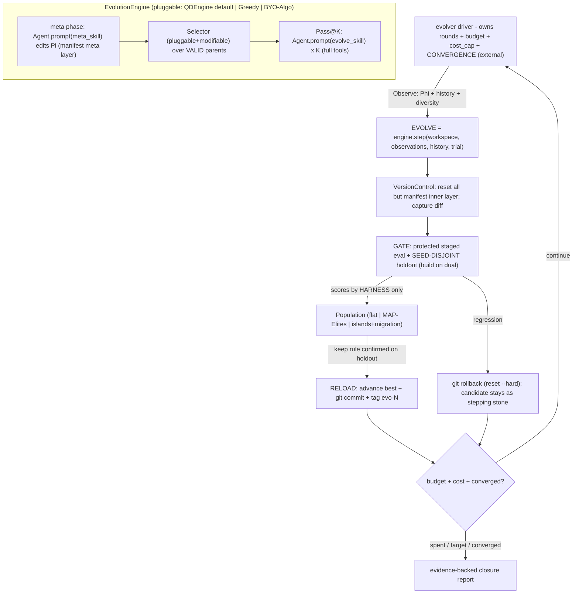

# Harness the Durak autoresearch loop (AEvo + HyperAgents + QD + A-Evolve, Ralph-minimal)

## The problem, precisely

Today the loop is *agent-prose-driven*: a human pastes a Cursor prompt, and **one agent** runs experiments, does meta-reviews, *and decides when to stop*. [program.md](program.md) literally says `NEVER STOP`, yet `## Search mode` is now `CLOSURE / PLATEAU` — the agent exercised stop authority it shouldn't have, via greedy single-best hill-climbing. This is exactly AEvo's critique: "an agent's internal stopping decision can conflict with the external evolution budget."

Five sources shape the fix:

- **AEvo** — put the agent **inside an explicit harness** where *rounds, candidate records, and evaluation feedback live outside the agent's local decision loop*. An external driver owns the budget; the agent only proposes candidates and edits the mechanism.
- **HyperAgents (paper)** — *how* the harness searches matters. DGM-H proves greedy single-best search gets trapped in local optima, whereas an **open-ended archive of stepping stones + probabilistic parent selection** sustains progress. You are *plateaued*, so this is decisive.
- **HyperAgents (code)** — candidate = **git diff vs base**; protect the contract by **git-resetting everything outside an allowlist back to base after the agent runs**; **pluggable parent selection over valid parents only**; inline `git -c` commits; always reset in `finally`; `iterations_left` for compute-awareness.
- **Ralph** ([ralph.sh](https://github.com/snarktank/ralph/blob/main/ralph.sh)) — minimalist proof that an **external loop with a hard budget** + **fresh context per iteration** + **file/git memory** keeps an agent working long-horizon. We copy the skeleton but **reject its greedy `COMPLETE` early-stop** (fatal for open-ended search).
- **A-Evolve** ([repo](https://github.com/A-EVO-Lab/a-evolve), [DESIGN.md](https://github.com/A-EVO-Lab/a-evolve/blob/main/DESIGN.md)) — "the workspace IS the interface": agent reads FS, evolver writes FS, never talk directly; a `manifest.yaml` declares **evolvable layers**. The whole algorithm is one plug-in `EvolutionEngine.step(workspace, observations, history, trial)` over shared primitives; the 5-phase loop **Solve -> Observe -> Evolve -> Gate -> Reload** validates each mutation on a **holdout** and **rolls back regressions via git** with `evo-N` tags; convergence is a **harness-owned** metric (EGL), not the agent's feeling.

## What already maps (keep) vs what's missing (build)

- Already there: protected/locked evaluator ([scripts/triage.bat](scripts/triage.bat) -> `durak/build/simulate.exe`) — **including a seed-disjoint cross-check** (`dual`: seed_base 0 then 1, escalate only if *both agree*); a candidate ledger ([results.tsv](results.tsv)); durable memory ([program.md](program.md)); meta-review cadence; `forbidden_check`; and rich free behavioral descriptors ([scripts/diagnose_b4_features.py](scripts/diagnose_b4_features.py) over `--mode features`). Staged triage mirrors DGM-H/A-Evolve staged eval.
- Missing (AEvo): external process owning rounds+budget; meta/evolution split; true mechanism editing; harness-owned scoring.
- Missing (HyperAgents): archive of stepping stones; probabilistic parent selection; compute-aware planning; structured memory + pathology detection; metacognitive self-modification; git-reset allowlist; patch candidates + valid-parent gating.
- Missing (QD): pluggable population — flat / MAP-Elites / gridless novelty / islands — with pluggable + meta-editable selection; collapse detection; cost cap.
- Missing (A-Evolve, this revision): (a) a top-level **pluggable evolution-algorithm interface** (`EvolutionEngine.step`) with named **shared primitives**; (b) a **manifest of evolvable layers** (cleaner than hard-coded allowlist paths); (c) an explicit **Gate on a seed-disjoint holdout + git rollback + evo-N tags**; (d) a **harness-owned convergence** signal (EGL analog); (e) **harness-update attribution** ("Harness Updating Is Not Harness Benefit", arXiv 2605.30621) — verify meta-edits actually *cause* gains.

## Architecture (A-Evolve 5-phase loop)

The agent appears only inside `engine.step`'s `Agent.prompt(...)` boxes; it runs with full tools, but VersionControl immediately resets everything outside its manifest layer. The loop, budget, cost cap, **engine**, **Gate/holdout**, scoring, migration, and **convergence** all live in the driver. No greedy "revert and forget" and **no `COMPLETE` early-stop**: every *valid* candidate stays in the population; only the *reported best* advances, and only after the holdout Gate confirms it.

## Pluggable evolution engine + shared primitives (A-Evolve)

A-Evolve's key abstraction is that the *whole algorithm* is one method over shared primitives; the loop never changes. We adopt it so the QD machinery the project wants becomes the **default engine**, and entirely different strategies drop in later.

- `EvolutionEngine.step(workspace, observations, history, trial) -> StepResult` (+ `manages_own_evaluation`, `on_cycle_end(accepted, score)`), in `evolver/engine/base.py`.
- **Default `QDEngine`** = meta-edit Pi -> `Selector.parents(K)` -> Pass@K inner sessions -> emit candidates. Container + Selector (below) are its composable internals. A **`GreedyEngine`** (best-parent, no archive) ships only as the DGM-H ablation baseline.
- **Shared primitives** (named to match A-Evolve, so module boundaries are proven):
  - `VersionControl` (`evolver/protect.py`) — allowlist reset, diff-vs-base capture, inline-`-c` commit, **rollback**, **evo-N tag**.
  - `TrialRunner` (`evolver/engine/trial.py`) — protected staged eval ("use sparingly — expensive"); the engine may call it for on-demand validation, but authoritative scores are harness-owned.
  - `EvolutionHistory` (`evolver/engine/history.py`) — query past observations + candidate versions for Phi and parent selection.
  - `AgentWorkspace` / `evolve/manifest.yaml` — declares `evolvable_layers` (inner -> `strategy_heuristic.cpp`; meta -> `evolve/mechanism/**`); everything else locked. "Change what's evolvable = edit the manifest," not the code.

## Population & quality-diversity (the QDEngine internals)

The single **reported best** is *always* governed by the locked keep rule confirmed on the holdout; the population is the **search engine**, not the deliverable.

**Behavioral descriptor `b(x)`** (`evolver/descriptors.py`, free from the existing harness): batch-mean style features from the candidate's `--mode features` TSV plus the manifest — `defense_voluntariness` (`chal_voluntary_takes`), `endgame_trump_aggression` (`chal_trump_attack_cards_deck_0` / `chal_deck0_high_trump_attacks`), `card_intake` (`chal_cards_taken`), `complexity` (`complexity_score`, the `kComplexity` manifest in [durak/src/strategy_heuristic.cpp](durak/src/strategy_heuristic.cpp)), optional `win_share`.

- **Container** (`config.population.container`, ABC `add/iter_valid/cells/coverage/diversity`): `flat` (HyperAgents keep-all) · `map_elites` (coarse 2-3D grid, elite per cell; a complexity axis illuminates the score-vs-Occam frontier) · `islands` (K subpops + ring migration every `migration_interval`).
- **Selector** (`config.population.selector`, over **valid parents only**, composes under islands): `random`/`latest`/`best` · `score_prop` · `score_child_prop` (HyperAgents default `sigmoid(perf vs top-m) x 1/(1+children)`) · `novelty` (gridless QD: k-NN distance in `b(x)`) · `curiosity` (MAP-Elites cell sampling) · `modifiable` (reads `evolve/mechanism/select_policy.json` the meta agent may edit — DGM-H `--edit_select_parent`).

## Gate on a seed-disjoint holdout (A-Evolve) — the anti-overfit upgrade

This is the highest-value A-Evolve import for a noisy scalar (SE~0.0016 at 100k). A-Evolve gates each mutation on holdout tasks and rolls back regressions. Durak already has the primitive: [scripts/triage.bat](scripts/triage.bat) `dual` runs the quick ladder on `seed_base=0` then `seed_base=1` and recommends `full` only if **both agree**.

- **Search vs confirm split**: the engine selects/escalates on the search seed bank (`seed_base=0`); a candidate may only become a **cell elite or the reported best** after it *also* clears the keep rule on a **disjoint holdout bank** (`seed_base=1` agreement via `dual`, then a final `full` holdout). A lucky `+eps` on the search seeds that does not generalize is **rolled back via `VersionControl`** (it still stays in the population as a non-elite stepping stone).
- **Audit trail**: every accepted advance is an inline-`-c` commit **tagged `evo-N`** (A-Evolve reproducibility); rollbacks are logged.
- This makes "reward collapse via noise" structurally hard: lower_ci *and* a disjoint holdout must both agree before anything is kept.

## Computational cost

Cost splits cleanly because **our evaluator has no LLM** (`simulate.exe` is pure CPU), unlike A-Evolve's Docker/FM evals.
- **Agent (LLM) cost — dominant.** Per round = `1 meta + K inner` fresh sessions; at K=4, 100 rounds ~= 500 sessions. Knobs: K, rounds, tokens/session. Compact Phi + Ralph's small-task fresh context bound tokens; A-Evolve's **description-first skills** (cheap description in prompt, body on-demand) and **append-only JSONL memory** keep the mechanism prompt lean.
- **Eval (CPU) cost — near-free.** Staged triage kills most candidates at the quick gate (~6-10s); only gate-clearers reach the `dual` holdout (~12s) and `full` (~1.7 min). Descriptor extraction reuses the quick `--mode features` pass.
- **Controls:** cache the static skill/contract prefix (vary only Phi/parent); per-candidate `tokens` + `eval_seconds` in `meta.json`; a hard `cost_cap` beside `max_rounds`. Optional throughput: parallel Pass@K via per-candidate git worktrees (A-Evolve's ProcessPool-with-workspace-copy pattern). Ballpark ~$25-150 per 100-round run.

## Preventing reward collapse (three failure modes)

- **Reward hacking** — harness-owned `scores.json` + the **manifest allowlist reset**: a candidate *physically cannot* touch simulator/metric/tests/`forbidden_check` (only `strategy_heuristic.cpp` survives). This is exactly the protection whose absence made 2/3 HyperAgents "w/o harness" runs reward-hack.
- **Diversity collapse** — the QD layer + `observe.py` detection (map coverage, mean pairwise `b(x)` distance, family entropy); on a drop, force `curiosity`/`novelty`, de-anchor to a sparse cell, or spawn an island.
- **Reward saturation** (your current state) + **noise** — when `search_score` is flat, fall back to the localized B4 residual guided by `b(x)`; and the **seed-disjoint holdout Gate** above stops noise-chasing.

## Harness-owned convergence + attribution

- **Convergence (EGL analog).** A-Evolve converges when EGL stabilizes *or* `max_cycles`. The **driver** (never the agent) computes a convergence signal — holdout-confirmed improvement rate + score stability across seed folds + population coverage saturation — and decides termination together with the budget. "Closure" becomes an *evidence-backed* harness verdict, not the agent's "I feel done."
- **Attribution ("Harness Updating Is Not Harness Benefit").** Log which meta-edits precede which holdout-confirmed gains; periodically run a no-meta-edit control segment. If mechanism churn isn't causing gains, the meta phase is throttled. Prevents harness-update theater.

## Workspace layout (new)

`evolver/` package + contained workspace `evolve/`:
- `evolver/` (PEP8, pathlib, single-quotes): `cli.py`, `loop.py`, `protect.py` (VersionControl), `descriptors.py`, `select.py`, `observe.py`, `agents.py`, `config.py`, `engine/{base,trial,history,qd,greedy}.py`, `population/{flat,map_elites,islands}.py`.
- `evolve/manifest.yaml` — `evolvable_layers` (inner/meta) + locked declaration.
- `evolve/config.json` — `engine`, `population{container,selector,axes,bins,island,migration}`, `holdout` seed banks, `max_rounds`, K, `cost_cap`, `target`, inner/meta model ids.
- `evolve/state.json` — round, reported-best pointer, base commit, budget+cost remaining, plateau/diversity/convergence counters.
- `evolve/mechanism/` (meta evolvable layer, committed `meta:`): `evolve_skill.md`, `meta_skill.md` (self-editable), `next_goal.md`, `family_map.md`, `memory.md` (append-only JSONL-style), `feedback_spec.md`, `select_policy.json`.
- `evolve/candidates/candidate_NNNN/` — `model_patch.diff` + snapshot, `meta.json` (round, parent_id, family, `b_descriptor`, cell, compiled, eval_succeeded, valid_parent, children, holdout_passed, tokens, eval_seconds), `triage_output.txt`, `scores.json` (**harness-only**).
- `evolve/evolution.db` (history index), `evolve/observations/round_NNN.md`, `evolve/evolve.log`.

Git: `evolve/manifest.yaml` + `evolve/mechanism/*` tracked; `evolve/candidates/`, `evolution.db`, logs, `state.json` untracked like [results.tsv](results.tsv).

## The loop (driver-owned, A-Evolve 5-phase)

Per round, until **budget / cost_cap / harness convergence** (the agent never decides this):
1. **Solve + Observe**: prior segment's candidates are evaluated and ingested into `EvolutionHistory`; `observe.py` writes compact Phi (best curve, last-segment outcomes, plateau, families/cells, coverage/diversity, cost+budget, B4 residual, convergence + attribution signals).
2. **Evolve = `engine.step(...)`**: meta phase `Agent.prompt(meta_skill + Phi)` edits the meta layer (incl. its own skill, `select_policy.json`, engine/container/selector choice, bins/lambda/migration); VersionControl resets all but the meta layer. Then `Selector.parents(K)` over valid nodes, then Pass@K `Agent.prompt(evolve_skill + next_goal + feedback)` from each restored parent (full tools; may read any archived candidate).
3. **Reset + capture**: VersionControl resets all but `strategy_heuristic.cpp`; capture `model_patch.diff`; skip if empty.
4. **Gate**: `build.bat fast` -> `forbidden_check` + tests (fail => invalid) -> `triage.bat quick` (search bank, yields `b(x)`) -> escalate by **locked** deltas -> **`dual` seed-disjoint holdout** -> `full` holdout when warranted; parse scores (harness-only).
5. **Reload**: every valid candidate enters the population; a candidate clearing the **locked keep rule confirmed on the holdout** advances the reported best via inline-`-c` commit **tagged `evo-N`**; regressions are **rolled back**. Update `state.json`, run migration if due, decrement budget+cost, print console progress, loop. All resets in a `finally`.

**Anti-stop**: each inner session is one-shot and bounded; even if it declares "saturated/done", the driver ignores it and starts the next segment. `evolve_skill.md` encodes AEvo's rule: *"While budget remains you do not get to exit; if you feel done, name the specific structural reason it is stuck and submit a candidate from a different family/cell."*

## Memoryless guardrails (per your choice)

The contract is unchanged and now *mechanically* enforced by the **manifest allowlist reset**: a candidate physically cannot alter the engine, baselines, metric, simulator, thresholds, tests, or `forbidden_check` — only `strategy_heuristic.cpp` survives, and it must still pass `forbidden_check` (no memory/state/IO/clock/random). Novelty, cells, islands, and de-anchoring explore **within** the memoryless space. The QD population, editable selection, history, and persistent memory live in the *harness* (`evolve/`), never inside B2.

## Integration with the existing contract

- Locked column of [program.md](program.md) untouched; the harness only *calls* the locked evaluator/build and *reads* locked thresholds + rejected directions.
- The harness auto-regenerates [results.tsv](results.tsv) from the population so [analysis.ipynb](analysis.ipynb) keeps working; the agent no longer writes scores.
- Add `cursor-sdk` to [pyproject.toml](pyproject.toml); requires `CURSOR_API_KEY`.
- `git_utils`-style helpers reimplemented in `evolver/protect.py` (Windows-aware).
- Driver prints round/candidate/parent/coverage/holdout/budget/cost progress (your "show progress" rule) using macro `point_rate`/`search_score`.

## Honest expectation

You chose to stay memoryless, where the space is already well-mapped, so score upside is uncertain. But the "plateau" was reached by greedy single-best search — DGM-H's weakest structure. A pluggable QD engine (flat -> MAP-Elites -> islands) with probabilistic + meta-editable selection, gated on a seed-disjoint holdout, is the configuration most likely to extract any remaining memoryless residual *without* fooling itself on noise. If the space is genuinely closed, the harness converts "closure" into an *evidence-backed, harness-owned* convergence verdict over a fully spent budget across many families, cells, and islands.

## Validation

End-to-end dry run with a tiny budget (`max_rounds=2`, `K=2`, quick+dual gate) asserting: agents spawn via SDK; an edit outside the manifest layer (e.g. to `durak/src/engine.cpp`) is discarded by the reset; the **engine swaps** (QDEngine <-> GreedyEngine) without loop changes; each `container` + `selector` loads; map_elites **coverage grows**; a candidate that beats the search bank but **fails the seed-disjoint holdout is rolled back** (not kept); a non-best parent is sampled; an accepted advance gets an **`evo-N` tag**; `cost_cap` and **harness convergence** each halt a run; and the loop continues past an inner "we're done" without stopping.
