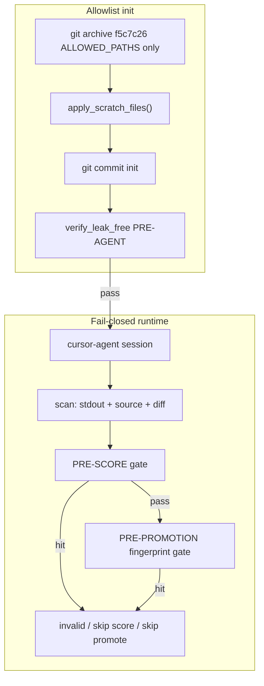

# Audit-clean ladder init + runtime leak tripwire (Tier A)

## Что мы реально гарантируем (и что нет)

**Не read-sandbox clean.** `cursor-agent --trust` может читать любой файл, доступный процессу. Allowlist в [`evolver/protect.py`](evolver/protect.py) защищает **коммиты**, не **информационный доступ**.

**Гарантируем (fail-closed на известных evidence surfaces):**

```text
forbidden files absent from initialized worktree (allowlist init)
forbidden paths absent from init commit (git ls-tree)
worktree is standalone repo, not linked to main (git-dir invariants)
known markers absent from: stdout, candidate source, git diff (pre-score)
high-confidence template fingerprints absent from candidate artifacts (pre-promotion)
leak hit → invalid candidate, skip scoring, skip promotion
```

**Не гарантируем:** silent structural borrowing без markers/fingerprints; organic совпадение имён (`conservation_take`); homonym `candidate_0019`.

Tier B (read allowlist sandbox) — out of scope, нужен для настоящего «zero information access».



---

## Корневая причина (A1–A5)

1. [`populate_base_tree()`](scripts/ladder_lib.py) — **extract-all** `@ f5c7c26` → leaky `evolve/sweep/template.cpp`, `results_full.tsv`, `knowledge/`, …
2. Blacklist-purge недостаточен и хрупок (новые забытые пути: `*.bak`, `scratch/`, `notes/`, …).
3. Init batch `150224` закоммитил template в **первый commit** — verify не ловил committed tree.
4. Агент `--trust` прочитал template → применил (r1/r6/r9/r10). **Stdout-only scanner этого не поймает** при silent use.

A0/A6 чисты: init без template в commit tree.

---

## 1. Allowlist init (primary) — [`scripts/ladder_lib.py`](scripts/ladder_lib.py)

### 1a. `ALLOWED_ARCHIVE_PATHS` + `materialize_base_tree()`

**Primary mechanism** — не «extract all → purge», а:

```bash
git archive f5c7c26 -- durak/ evolver/ evolve/config.json evolve/select_policy.json ...
```

Explicit allowlist prefix paths из `f5c7c26`. **Никогда** не материализовать:

- `evolve/sweep/`
- `results_full.tsv`, `knowledge/`
- `progress*.png`, `scripts/make_ladder.py`, `scripts/sweep_*.py`
- `.cursor/`

### 1b. `purge_forbidden_paths()` — fallback only

После materialize (defense-in-depth): удалить anything matching `FORBIDDEN_GLOBS` если случайно попало.

### 1c. Post-materialize invariant

```text
every path in worktree must match ALLOWED_PATHS prefix union
(no extra top-level dirs/files)
```

Fail if unexpected path exists (allowlist verification, not blacklist-only).

---

## 2. `verify_leak_free(wt, *, stage)` — три уровня

| Stage | When | Surfaces |
|-------|------|----------|
| `pre_agent` | after init / before spawn | full wt filesystem |
| `post_agent` | after agent session, before score | wt + candidate snapshot + diff |
| `pre_promotion` | before official_best promote | snapshot + fingerprint |

### 2a. Filesystem walk (primary)

Scan **all** files under `wt` (not only `_leak_scan_paths`):

- tracked + **untracked** + **ignored** (use `git ls-files -co --exclude-standard` + walk for non-git files)
- symlinks to forbidden targets → fail
- generated artifacts in wt if agent created them

Extensions: `.md .cpp .json .tsv .txt .py .log .jsonl`

### 2b. Git tree check (secondary)

- `git ls-tree -r HEAD` — no forbidden paths in **init commit**
- Catches «deleted on disk but already committed»

### 2c. Git isolation invariants (linked-worktree hardening)

Fail unless **all** true:

```text
Path(wt / '.git').is_dir()          # not a .git file pointer to main repo
git rev-parse --show-toplevel == wt
git rev-parse --git-dir resolves inside wt/.git
git rev-parse --git-common-dir resolves inside wt/.git   # not shared main .git
```

Reject linked worktrees to main repo (`destroy_arm_repo` already handles legacy; verify catches regressions).

### 2d. Content markers + fingerprints

**Text markers** ([`LEAK_TEXT_MARKERS`](scripts/ladder_lib.py) + template-traceable):

`sweep template`, `near-winner`, `0.77648`, `A3 SWEEP TEMPLATE`, `template candidate_0019`, …

**Fingerprint scanner** (high-confidence, fail-closed):

- SHA256 of normalized forbidden snippets from leaky template header (e.g. `candidate_0019 (the 0.77648 near-winner family)`)
- Known manifest block hashes from `@ f5c7c26` template.cpp
- Near-exact overlap threshold on normalized token n-grams (optional, conservative)

`conservation_take` alone — **not** absolute marker (organic FP accepted per governance).

### 2e. Hash invariants

- `program.md` == `PROGRAM_COMMIT` (`2c11101`)
- `durak/src/strategy_heuristic.cpp` == `STRATEGY_COMMIT`

Call sites: [`init_worktree()`](scripts/ladder_lib.py), [`verify_worktree()`](scripts/ladder_lib.py), [`launch_ladder_parallel.py`](scripts/launch_ladder_parallel.py), [`verify_ladder_launch.py`](scripts/verify_ladder_launch.py), [`scrub_phase1_worktree()`](scripts/ladder_lib.py) post-scrub.

---

## 3. Shared scanner — `scan_leak_markers()`

New module or section in [`scripts/ladder_lib.py`](scripts/ladder_lib.py), reused by evolver:

```python
scan_agent_stdout(text) -> list[LeakHit]
scan_candidate_source(snapshot: str) -> list[LeakHit]
scan_git_diff(wt, base: str) -> list[LeakHit]
scan_fingerprints(text: str) -> list[LeakHit]
```

Export marker/fingerprint sets for [`evolver/loop.py`](evolver/loop.py) and [`evolver/agents.py`](evolver/agents.py).

---

## 4. Runtime tripwire (fail-closed) — not stdout-only

### 4a. [`evolver/agents.py`](evolver/agents.py)

- Accumulate assistant text during session → `AgentResult.leak_hits`
- Log tool call paths to `run_dir/agent_tools.jsonl` (audit; post-hoc «read template.cpp?»)
- `leak_detected = bool(leak_hits)` — **warning surface only**; loop owns final gate

### 4b. [`evolver/loop.py`](evolver/loop.py) — hard gates

After agent, **before scoring**:

```python
hits = scan_stdout + scan_candidate_source(snapshot) + scan_git_diff(wt, base)
if hits:
    candidate.status = 'invalid'
    candidate.reason = 'agent_leak_detected'
    skip scoring
    skip promotion
    log [LEAK-ALERT] with stage + snippet
```

**Before promotion** (additional):

```python
hits += scan_fingerprints(snapshot)
if hits: same fail-closed path
```

Config in ladder JSON:

```json
"leak_policy": {"enabled": true, "stop_after_hits": 1}
```

→ write `stop.flag` after N leak hits (default N=1).

**No warnings-only path** for ladder arms when `leak_policy.enabled`.

---

## 5. Phase-1 template policy

- **Never** create `evolve/sweep/` in phase-1 init
- A3 only via [`init_a3_worktree()`](scripts/ladder_lib.py) — per-arm snapshot template, scrubbed, verified
- [`scrub_phase1_worktree()`](scripts/ladder_lib.py): delete `evolve/sweep/` + re-run `verify_leak_free(pre_agent)`

---

## 6. Re-init contaminated arms

A1/A2/A4/A5 — **contaminated**, partial scrub недостаточен:

```bash
python scripts/launch_ladder_parallel.py --force-init --init-only --arms A1 A2 A4 A5
python scripts/verify_ladder_launch.py --force-init --arms A1 A2 A4 A5
python scripts/_audit_leakage.py
```

Gate: init commit has **no** `evolve/sweep/`; `verify_leak_free == []`; git isolation passes.

---

## 7. Tests — [`evolver/tests/test_ladder_leak.py`](evolver/tests/test_ladder_leak.py)

- Allowlist materialize → no forbidden paths
- Untracked forbidden file in wt → verify fails
- Ignored `.gitignore` forbidden file → verify fails
- Symlink to forbidden → verify fails
- Committed forbidden path in init → verify fails
- Linked-worktree mock → verify fails
- Fingerprint hit in candidate source → loop marks invalid (integration stub)
- Stdout hit without marker in source but fingerprint in diff → invalid

---

## Out of scope

| Item | Reason |
|------|--------|
| Agent read sandbox (Tier B) | user declined |
| homonym `candidate_0019` block | local ID |
| Scrub main repo template.cpp | separate; not blocker if allowlist init works |
| `git log` own-score markers | foreign markers only (`71069a0`, `6657f53`) for history scan |

---

## Readiness criteria (ship gate)

1. `verify_ladder_launch.py --force-init --arms A1 A2 A4 A5` → pass
2. `_audit_leakage.py` → no LEAK/GAP
3. Synthetic: forbidden file on disk → **init verify fail**
4. Synthetic: stdout leak marker → **invalid, no score**
5. Synthetic: silent stdout but template fingerprint in diff → **invalid, no score**
6. Synthetic: marker in source pre-promotion → **no promote**
7. Clean re-init smoke (first N rounds): no forbidden paths; no leak hits; no promotion after any hit

**Removed:** weak criterion «no template-vocabulary in first 20 rounds only».

---

## Implementation order

1. **Allowlist init + verify_leak_free (3 stages) + git isolation** — blocks ship without this
2. **scan_leak_markers + fingerprint + loop fail-closed gates** — blocks ship without this
3. Tests (untracked/ignored/symlink/linked)
4. `--force-init` A1/A2/A4/A5 + audit
5. (Optional) overlay leak bars after clean re-run

**Do not launch clean ladder comparison until steps 1–2 complete.**
