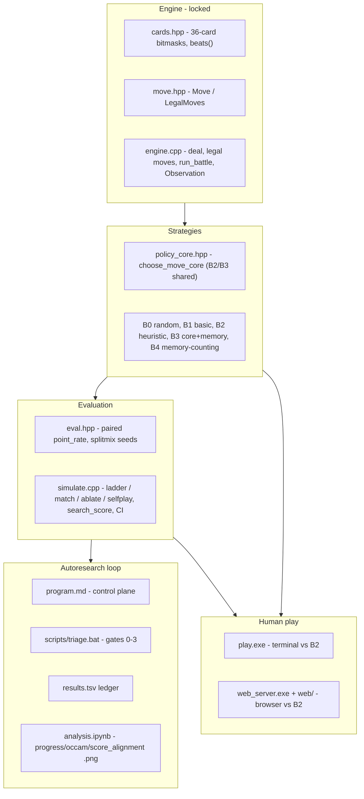

# Comprehensive Durak autoresearch README

Rewrite [README.md](README.md) (currently 178 lines, loop-focused) so it is a written form of the system: a faithful, self-contained description of how the whole thing actually works, with run instructions as the operational part of that description rather than the focus. All facts below are verified against source.

## Guiding principle

- The README is the canonical prose description of the system, but `program.md` and source remain authoritative for locked rules, metrics, thresholds, implementation, and current-best state (per review - never call the README "canonical" without this qualification). It mirrors the real components: every section names a real file/layer, explains what it does, how it behaves (data structures, control flow, key design decisions), and how it connects to the next layer. A reader should be able to understand the entire system from the README alone, then run it.
- Description-first: lead each section with how the component works; fold commands in as "and this is how you run it". Avoid a pure tutorial/marketing tone.
- Navigability guard (per review): every section opens with a 1-2 sentence "what this layer does" summary before any detail, table, or command. Depth is fine, but each section must be skimmable from its lead paragraph. The README is a system document, not a spec dump.

## Guiding constraints

- `program.md` marks README rules / Durak rules / metric formula / keep-revert thresholds as the locked contract. This rewrite reorganizes and expands documentation only; it preserves every locked fact verbatim in meaning and does not alter rules, the metric formula, thresholds, or reported result numbers.
- Keep result numbers from `program.md` `## Current best`: B4 `point_rate` 0.64489 (lower CI 0.64464), `search_score` 0.79506, B3vsB2 0.50000, complexity 100, commit `f5bb135`, jun22 run closed.
- English throughout; backtick file/function names; one architecture mermaid diagram.
- Anti-drift rule (per review): any README section that restates source behavior (rules, metric formula, strategy dispatch/thresholds, result numbers, file layout, scripts, build behavior) must include either a commit/date snapshot note or an explicit pointer to the authoritative file. Every duplicated fact is a maintenance liability; prefer a short restatement plus a "see `<file>`" pointer over an exhaustive mirror.
- Size control (per review): keep the main README readable. Sections 7, 9/10, and 11 are the most likely to bloat; favor compact subsections and source links over restating every low-level detail. Defer to source rather than turning the README into a contract mirror.

## Target structure (section by section)

1. Title + hero image + one-paragraph elevator pitch + a short table of contents.
2. The research question ("What are we testing" / "Why interesting") — condense current lines 7-25.
3. Authority model (NEW, short callout near the top, per review) — three sources of truth and what wins on conflict: `program.md` = the research contract (locked rules, metric, thresholds, current best); the `durak/` source files = implementation truth (engine, baselines, the heuristic); this README = the prose explanation kept in sync with both. If the README ever disagrees with source or `program.md`, those are authoritative. Keep this to ~3 lines.
4. System architecture (NEW) — describe the layered design and the data flow of one turn/game in prose: `new_game(seed)` deals 6+6 and sets trump = bottom `deck[0]`; `first_attacker` is the lowest-trump holder; `run_battle` builds an `Observation` (own hand + table + counts; opponent hand identity and deck order hidden) and `LegalMoves`, asks a `StrategyFn` for a `Move`, validates it, resolves bito-to-discard vs take, then `draw_to_six` (attacker first); deck-empty determines the durak. Separate splitmix64 deck vs strategy RNG keeps deals reproducible. Then the diagram:



5. Durak rules (locked) — keep current text (verified accurate vs `durak/src/engine.cpp`: trump = bottom `deck[0]`, lowest-trump attacks first, throw-ins match a table rank, cap `min(6, defender hand at battle start)`, no perevod, draw attacker-first, deck-empty loser).
6. Baseline ladder B0-B4 + memory ablation — lead with one line on what the ladder is for, then expand the current table with the shared-core design from [durak/include/policy_core.hpp](durak/include/policy_core.hpp): B2 calls `choose_move_core(L, nullptr, legal)`, B3 calls it with `MemoryFeatures*`; memory is a tie-break prior only (`-0.001 * unknown_rank_count`). B4 (`durak/src/strategy_mem.cpp`) is independent. Note `Observation` hides opponent hand identity (count only) and deck order. Reference `b2_heuristic` ([durak/src/strategy_heuristic.cpp](durak/src/strategy_heuristic.cpp)) and its single-heuristic manifest.
7. The current best heuristic (NEW) — open with a prominent, hard-to-miss callout (blockquote) per review: "Snapshot, not authoritative: this is a prose summary of the currently accepted B2 stack (commit `f5bb135`), checked against source on <date>; `strategy_heuristic.cpp` and `program.md` remain authoritative. Re-summarize after any future keep." Then a faithful written form of `choose_move_core` (manifest = 1 declared heuristic `H1 min_non_trump_play`, 0 parameters, `complexity_score` 100, ~194 lines, `strategy_name() = "B2_heuristic_nomem"`):
   - Dispatch: defense if any `DefendPlay`/`DefendTake` is legal, else attack; `has_done` (is `AttackDone` legal) distinguishes the initial open from throw-in/pile-on.
   - Scoring primitives: `attack_value` = `rank` (+100 if trump, so non-trumps are dumped first; -5 open / -8 pile if the opponent is likely void in that non-trump suit, inferred from a non-trump attack already beaten by a trump on the table); defense cost = `rank` (+50 if trump). Memory adds only a tiny `-0.001 * unknown_rank_count` tie-break prior in the B3 branch.
   - Initial open, in order: (1) midgame pair-open `deck>=5` (open lowest non-trump rank in `[mnt, mnt+2]` that has a pair); (2) endgame pair-open `deck<=2` when the lowest non-trump `mnt` is a singleton, gated by `deck != 2 OR total <= 16` where `total = deck + hand + opp + table`; (3) trump-strip `deck==0`, `opp<=2`, `>=1` trump -> play lowest trump; else (4) lowest non-trump at the chosen rank.
   - Pile-on / throw-in: dump the lowest non-trump; if only trumps remain, pile the lowest trump as a finish iff `deck<=3`, `opp<=5`, `hand>=opp`, `>=1` trump; otherwise `AttackDone`.
   - Defense: take if any uncovered attack is unbeatable, else play the cheapest beater (non-trump preferred).
   - Load-bearing thresholds (from `program.md` WR ablation map): `hand>=opp` (-0.0018), strip `opp<=2` (-0.014), `deck<=2` pair (-0.012), pile trump `deck<=3` (-0.020); `total<=16` optimal.
8. The metric (NEW, promote from "What counts as a win") — paired `point_rate` (challenger plays both seats on the same deck, win=1/draw=0.5/loss=0) from [durak/include/eval.hpp](durak/include/eval.hpp); `search_score = 0.50*B4 + 0.30*B1 + 0.20*B0 - complexity/10000`; 95% normal CI `mean +/- 1.96*se` (or `--ci bootstrap`); `complexity_score = 100*heuristics + 10*parameters`; parity 0.50, edge `lower_ci > 0.52`.
9. Repository layout (full refresh of current lines 149-167) — add `cards.hpp`, `move.hpp`, `eval.hpp`, `policy_core.hpp`; explicit strategy sources (`strategy_random_legal`, `strategy_basic_nomem`, `strategy_heuristic`, `strategy_heuristic_mem`, `strategy_mem`); `play.cpp`, `play_session.*`, `play_ui.*`, `web_server.cpp`; `web/` (index.html, app.js, styles.css); `third_party/httplib.h`; `cmake/check_forbidden.cmake`; scripts (`triage.bat`, `triage_ladder.ps1`, `post_keep.bat`, `run_analysis.bat`, `play_web.bat`, `sweep_atk_trump.py`, `rebuild_*.py`, `run_batch*.py`); `results.tsv` (untracked).
10. End-to-end usage (expand "Quick start") — lead with one line on the build->test->evaluate->play flow, then:
   - Prerequisites: C++23 compiler + CMake (+ Python/Jupyter for charts).
   - Build: `durak\build.bat` (all targets), `fast` (note: `simulate` target only, per [durak/build.bat](durak/build.bat) line 32), `test`; generic `cmake -S durak -B durak/build` then `cmake --build durak/build`.
   - Test: `durak\build.bat test` runs `engine_tests`, `simulation_tests`, and `forbidden_check` (bans static/IO/clock/thread/random in `strategy_heuristic.cpp`).
   - Evaluate: `simulate` modes (`ladder`/`match`/`ablate`/`selfplay`) and flags (`--challenger`, `--opponent`, `--strategy`, `--eval quick|full`, `--seeds`, `--batch`, `--ci`, `--seed-base`); eval sizes (quick=100k, full=5M seeds; games = 2*seeds); progress printed every `--batch` seeds. Include a copy-paste command cheat sheet.
   - Play against the agent (NEW): CLI `durak\build\play.exe [--seed N] [--seat 0|1]`; browser `scripts\play_web.bat` or `durak\build\web_server.exe --port 8080` (http://localhost:8080). State explicitly: run the full `durak\build.bat` first - `build.bat fast` (and the current `play_web.bat`, which calls it) only build `simulate`, so the play/web binaries will be missing otherwise.
   - Common mistakes (NEW mini-section, per review): `build.bat fast` builds only `simulate` (play/web need the full build); `--eval quick` (100k) is a screen, not the `full` (5M) keep eval; `results.tsv` is untracked (live ledger, not in git); B3 memory is only a tie-break prior, not a separate policy; `Observation` hides opponent hand identity and deck order (count-only).
11. The autoresearch loop (expand "Running the agent") — lead with a 1-2 sentence summary of the two-mode loop, then keep details behind compact subsections (per review, so this section does not dominate the README): Operating model (experiment vs meta); Locked vs mutable; Setup a new run (`git checkout -b autoresearch/<tag>`, in-scope files, `build.bat test`, init `results.tsv`); Triage gates and thresholds (gates 0-3, `BEST_SEARCH`/`BEST_B4`/`FORCE_FULL` env vars, delta thresholds 0.003 discard / 0.006 search / 0.005 B4, keep rule `search_full >= best + 0.005 AND lower_ci >= best_lower_ci`); `results.tsv` schema (`commit opponent point_rate search_score lower_ci games complexity status description`); Meta cadence and search modes (triggers; EXPLORE/COMBO/SWEEP/ABLATE/PIVOT/EXPLOIT); Charts (`scripts\run_analysis.bat` -> `progress.png`, `occam.png`, `score_alignment.png`); The Cursor prompts. Link `program.md` as the source of truth.
    - The Cursor prompts subsection includes two blocks: (a) the existing full kickoff prompt (`@README.md @program.md @analysis.ipynb` + the "Run the Durak autoresearch meta-loop..." instructions, kept from the current README), and (b) the user's recurrent continue prompt, labeled as the day-to-day one, verbatim:

```
@README.md @program.md @analysis.ipynb
Continue the Durak autoresearch meta-loop from the durable state in program.md and results.tsv.
```
12. Results (jun22 run) — keep current numbers/table; add a one-line checked-facts note (numbers verified against `program.md` `## Current best` at `f5bb135`); align wording with the verified WR stack.
13. Legacy LLM experiment — keep.
14. License (MIT) — keep.

## Minor accuracy fix

- Add a one-line caption noting the hero `progress_ladder.png` is a curated ladder chart, while `analysis.ipynb` generates `progress.png` / `occam.png` / `score_alignment.png` (resolves the current mismatch).

## Out of scope

- No engine/metric/baseline/threshold changes (locked contract).
- Not fixing the latent `scripts\play_web.bat` bug (it calls `build.bat fast`, which won't build `web_server`); instead the README states explicitly (in usage and "Common mistakes") that a full `durak\build.bat` is required before browser play, so users do not think the play system is broken. The script fix can be flagged separately.

## Execution order (per review)

1. Skeleton, TOC, authority model, architecture (the backbone).
2. Durak rules, baseline ladder, metric.
3. Usage / build / test / eval / play.
4. Autoresearch loop.
5. Current-best heuristic and results last - they are the most drift-prone and should be checked against `program.md` + source at the end.

## Definition of Done

```text
Done when:
- README.md is rewritten in the target structure.
- No engine, metric, baseline, threshold, or result number is changed.
- build.bat test passes.
- README current-best numbers match program.md ## Current best.
- Usage commands are copy-paste tested or marked as source-derived.
- The play/web full-build warning appears in both Usage and Common mistakes.
```