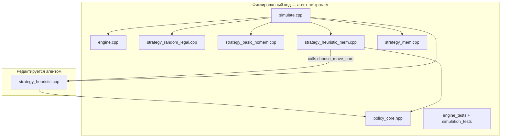

# Durak autoresearch: лаборатория local heuristics vs memory

## Цели (две оси)

**Engineering:** быстрый, воспроизводимый, закрытый движок подкидного Дурака — правила зафиксированы, симулятор не редактируется агентом.

**Research:** найти **минимальную по complexity score** no-memory стратегию, которая **максимизирует `point_rate`** против фиксированных baseline-уровней; **отдельно** (post-keep) измерить чистую ценность памяти через **direct B3 vs B2** ablation на accepted candidate.

Это **не** «решить Дурак глобально». Гипотеза: *может ли memoryless local policy конкурировать с fixed memory-counting baseline в игре с неполной информацией?*

Успех — не только `>50%` vs B4, но и содержательные выводы:

```text
B2 > B1  => эвристики добавляют силу
B3 > B2  => чистая ценность памяти при той же логике
B2 ~ B3  => память мало помогает этой логике
B2 > B4  => сильный результат
B2 < B4  => не провал, если B2 простая и близка к B4
```

Чистая ценность памяти:

```text
primary  = point_rate(B3 vs B2), paired eval, same seeds, synchronized logic
secondary = win_rate(B3 vs B1) − win_rate(B2 vs B1)  // ladder-метрика, не substitute
```

## Контекст репозитория

Код Дурака отсутствует. LLM-файлы ([train.py](train.py), [prepare.py](prepare.py)) остаются как legacy; autoresearch scope — только `durak/`. Полная замена [program.md](program.md) и [README.md](README.md).

## Архитектура



| Уровень | Файл | Роль |
|---------|------|------|
| B0 | `strategy_random_legal.cpp` | sanity: случайный легальный ход |
| B1 | `strategy_basic_nomem.cpp` | min card attack / min defense, без эвристик |
| **B2** | **`strategy_heuristic.cpp`** | **редактируемая policy core + manifest (Occam target)** |
| B3 | `strategy_heuristic_mem.cpp` | **фиксированный** wrapper: `choose_move_core(local, &memory)` — post-keep ablation only |
| B4 | `strategy_mem.cpp` | независимый сильный memory-counting baseline |

Стратегия получает только `HandView` (B0–B2) или `HandView + MemoryView` (B3–B4), **не** полный `GameState`.

## Shared policy core (B2/B3 contract)

**Не** codegen/sync arbitrary C++ из B2→B3. Ablation честен только через **общий интерфейс**, зафиксированный в read-only [`durak/include/policy_core.hpp`](durak/include/policy_core.hpp):

```cpp
struct LocalFeatures {
    CardMask hand;
    CardMask table_attack;
    CardMask table_defense;
    Card trump_card;
    int deck_count;
    int opponent_hand_count;
    bool is_attacker;
    // legal moves supplied separately or via callback
};

struct MemoryFeatures {
    CardMask unknown_cards;
    int unknown_trump_count;
    int unknown_rank_count[9];
    int known_opponent_rank_count[9];
};

// Implemented in strategy_heuristic.cpp (agent edits body, not signature)
Move choose_move_core(
    const LocalFeatures& local,
    const MemoryFeatures* memory,  // nullptr = no-memory mode
    const LegalMoves& legal
);
```

Вызовы:

```text
B2 (no-memory): choose_move_core(local, nullptr, legal)
B3 (ablation):  choose_move_core(local, &memory_features, legal)
```

Harness строит `MemoryFeatures` из `MemoryView`; B3 **не** содержит отдельной стратегии — только wrapper + memory feature extraction.

**Ограничения B3 / memory hooks** (в `program.md` и тестах):

```text
B3 may only use MemoryFeatures for tie-breaks or unknown-card priors.
B3 must not add new action classes that B2 does not consider.
B3 must preserve the same heuristic manifest; only memory_parameter_count may differ.
```

Допустимо: B2 выбирает min non-trump; B3 among ties picks rank more common in `unknown_cards`.

Недопустимо: B3 добавляет новую take/defend/throw-in эвристику, отсутствующую в B2 manifest.

Агент редактирует **только** `strategy_heuristic.cpp` — реализацию `choose_move_core` и manifest. Memory branches внутри core: `if (memory) { tie-break }` — разрешены; новые `H5_*` только в no-memory path — нет.

## Правила движка (жёсткая спецификация)

Вариант: **2-player podkidnoy Durak, no transfer (перевод запрещён)**.

| Тема | Правило |
|------|---------|
| Колода | 36 карт, ранги 6–Т, 4 масти |
| Козырь | масть нижней карты под колодой |
| Раздача | 6 карт каждому |
| Первый ход (игра 1) | обладатель **младшего козыря** атакует; при paired eval — симметрия через swap сторон |
| Первый ход атаки | можно атаковать **несколькими картами одного ранга** (пара/тройка) |
| Лимит атаки | `total_attack_cards ≤ min(6, defender_hand_size_at_battle_start)` |
| Подкидывание | ранг карты должен **уже присутствовать** среди любых карт на столе в текущем бою — **атакующих и защитных** (если 7♣ побита 9♣, на столе ранги 7 и 9 — оба легальны для подкидывания) |
| Защита | выше той же масти или козырь; не-козырь не бьёт козырь |
| Беру | защитник берёт все карты со стола; **тот же атакующий** атакует снова (защитник не получает ход) |
| Бито | все карты в отбой; **защитник** становится следующим атакующим |
| Добор | после боя до 6 карт: **атакующий первым**, затем защитник (роли из завершённого боя); порядок тот же после «беру» |
| Победа | колода пуста и рука пуста |
| Ничья | если после исчерпания колоды оба опустошили руки в одном бою → **0.5 win** каждому |

**H3 (козырь того же номинала)** имеет смысл только если защитная карта открывает ранг для подкидывания — движок должен это реализовать (см. throw-in legality выше).

## Представление данных

```cpp
using Card = uint8_t;           // 0..35
using CardMask = uint64_t;      // 36 бит, не std::bitset

constexpr CardMask card_bit(Card c) { return 1ull << c; }
// rank_mask[9], suit_mask[4], trump_mask — constexpr

struct HandView {
    CardMask hand;
    CardMask table_attack;
    CardMask table_defense;
    Card trump_card;              // или suit + rank нижней карты
    int deck_count;
    int opponent_hand_count;
    bool is_attacker;
    // NO discard, NO history
};

struct MemoryView {
    CardMask known_discarded;        // отбой — гарантированно не в игре
    CardMask known_in_own_hand;      // своя рука
    CardMask known_on_table;         // стол (атака + защита)
    CardMask known_in_opponent_hand; // карты, видимые в руке оппонента (взятые с стола и т.п.)
    CardMask seen_ever;              // union всех видимых карт (для аудита)
    int deck_count;
    int opponent_hand_count;         // размер руки оппонента (может > popcount(known_in_opponent_hand))
    // unknown_cards = ALL_CARDS
    //   - known_discarded - known_in_own_hand - known_on_table - known_in_opponent_hand
    // остаток: колода + скрытые карты в руке оппонента
};
```

Hot path: `hand & trump_mask`, `mask & rank_mask[r]`, итерация `while (m) { c = countr_zero(m); m &= m-1; }`. Без heap, легальные ходы в `std::array<Move, MAX_MOVES>`.

## Baseline ladder

### B0 — random legal

Случайный легальный ход. Проверка: paired self-play ≈ 50%.

### B1 — basic no-memory

Атака/подкидывание: минимальная карта (любая). Защита: минимально достаточная. Без групп, без «беру»-эвристик.

### B2 — heuristic no-memory (агент редактирует)

Стартовый manifest (v1):

```cpp
// HEURISTICS:
// H1 min_non_trump_attack
// H2 near_rank_group_attack delta=2
// H3 same_rank_trump_defense
// (H4 отключён в v1 — см. ниже)

constexpr int kHeuristicCount = 3;
constexpr int kParameterCount = 1;  // delta
constexpr int kComplexityScore = 100 * kHeuristicCount + 10 * kParameterCount;
```

| # | Фаза | Правило |
|---|------|---------|
| H1 | Атака/подкидывание | Минимальная **некозырная** легальная карта |
| H2 | Атака | Пара/тройка, если max_rank ≤ min_non_trump + δ (δ=2) |
| H3 | Защита | Нет масти выше → козырь **того же номинала** что атака |

**H4 не в v1:** «беру пары с дефицитной мастью» — экспериментальный флаг для агента:

```text
H4_take_when_defense_expensive
  беру только если cost(defense) > cost(take)
  и взятые карты дают будущие группы
```

Агент может включить H4, но должен обновить manifest и complexity score.

### B3 — heuristic + memory (ablation, post-keep)

B3 **не участвует** в autoresearch hot loop. Post-keep:

```text
simulate --ablate --eval full
→ runs B3 (fixed wrapper) vs B2 (current accepted choose_move_core)
→ point_rate(B3 vs B2), same paired deck symmetry
```

B3 = `strategy_heuristic_mem.cpp` (фиксированный): собирает `MemoryFeatures`, вызывает **тот же** `choose_move_core` с `memory != nullptr`. Нет копирования/генерации C++ из B2.

`primary memory value = point_rate(B3 vs B2)` (expect ≈ 0.5 if memory adds nothing to same core).

### B4 — independent memory baseline

Упрощённый card-counting (не full belief-state inference), использует **раздельный** `MemoryView`:

- `known_discarded` — отбой.
- `known_on_table` — стол.
- `known_in_own_hand` — своя рука.
- `known_in_opponent_hand` — карты, которые **точно** в руке оппонента (взятые с стола, видимые при использовании); обновляется при розыгрыше.
- `unknown_cards` = ALL − (discarded + own + table + known_opponent) — колода + скрытые карты оппонента.
- **Не** смешивать «out of play» и «in opponent hand».

Эвристики: min-weight attack по `unknown_cards`; min sufficient defense; блокирующий ранг; осторожное подкидывание; «беру» если защита дорогая по козырям в pool.

Намеренно сильнее B2, но не полноценный hidden-state solver.

## Occam: manifest, не подсчёт `if`

В `strategy_heuristic.cpp` обязательны:

```cpp
constexpr int kHeuristicCount = ...;
constexpr int kParameterCount = ...;
constexpr int kComplexityScore = 100 * kHeuristicCount + 10 * kParameterCount;
```

`simulate` печатает `strategy_name`, `heuristic_count`, `parameter_count`, `complexity_score` из API стратегии.

**keep vs current best** при `|point_rate − best| < 0.005`: предпочитать **меньший** `complexity_score`.

CI/grep в `strategy_heuristic.cpp` запрещает: `static`, mutable globals, `fstream`, `random_device`, `chrono`, `thread`, `filesystem`.

## Paired evaluation

### Deck symmetry (формализация)

Для seed `S`:

1. Генерировать **один** порядок колоды `D` (и козырь) из `S`.
2. Раздать: `hand0`, `hand1` — фиксированные множества карт по seat.

```text
Game A:
  seat0 (hand0) controlled by challenger
  seat1 (hand1) controlled by opponent

Game B (same D, same trump, same hand0/hand1):
  seat0 controlled by opponent
  seat1 controlled by challenger
```

**Swap strategies, not cards** — усредняем seat/strategy assignment, не создаём новую раздачу. Правило «младший козырь атакует» применяется в каждой игре к **текущему** seat0/seat1; при swap стратегий первый ход может отличаться — это часть paired symmetry.

### Point scoring (primary metric)

Исход одной игры:

```text
win  = 1.0
draw = 0.5
loss = 0.0
```

Для seed `S`:

```text
pair_score = (points_A + points_B) / 2   // challenger points across both games
```

Примеры: 2-0 → 1.0; 1.5-0.5 → 0.75; 1-1 → 0.5; 0.5-1.5 → 0.25; 0-2 → 0.0.

**Primary metric:** `point_rate = mean(pair_score)` по seeds.

Дополнительно report:

```text
pair_win_rate  = P(pair_score > 0.5)
pair_loss_rate = P(pair_score < 0.5)
split_rate     = P(pair_score == 0.5)
```

Wilson CI **не** для дробного `point_rate`. **Default CI** (scores bounded in `{0, 0.25, 0.5, 0.75, 1}`):

```text
mean ± 1.96 * std(pair_score) / sqrt(n)
```

CLI: `--ci normal` (default) | `--ci bootstrap` (optional, e.g. 1000 resamples). На 5M seeds normal ≈ bootstrap, но быстрее. Wilson только для бинарного `pair_win_rate`.

## Метрики: reporting vs search

**Primary reporting metric** (README, финальные claims, `results.tsv` vs B4):

```text
point_rate(B2 vs B4)
```

**Optional search metric** (autoresearch `keep/discard` — более гладкий градиент):

```text
search_score =
  0.50 * point_rate(B2 vs B4)
+ 0.30 * point_rate(B2 vs B1)
+ 0.20 * point_rate(B2 vs B0)
- complexity_penalty   // e.g. complexity_score / 10000
```

`program.md`: B4 — primary benchmark for reporting; composite ladder score stabilizes search only.

## Статистика (без peeking early stopping)

**Не** останавливать эксперимент при первом `ci_low > 0.50` после batch — это sequential peeking.

Двухэтапный протокол:

| Этап | Paired deals | Назначение |
|------|--------------|------------|
| `quick_eval` | 100k seeds (200k games) | smoke, crash detection, progress |
| `full_eval` | 5M seeds (10M games) | **единственный** этап для `keep/discard` |

На `quick_eval` — progress (`games_per_sec`, running `point_rate`, running `search_score`). На `full_eval` — normal 95% CI для `point_rate` и `search_score`.

**keep vs current_best** (full_eval only):

```text
search_score_full >= best_search_score + 0.005
AND normal_lower_ci(search_score) >= best_normal_lower_ci
```

При `|search_score − best| < 0.005`: prefer lower `complexity_score`.

**dominates B4** (reporting claim only):

```text
normal_lower_ci(point_rate vs B4) > 0.52
```

**Memory ablation** (post-keep):

```text
simulate --ablate --eval full
→ point_rate(B3 vs B2), normal CI
```

## Autoresearch loop ([program.md](program.md))

| LLM autoresearch | Durak autoresearch |
|------------------|-------------------|
| `train.py` | `durak/src/strategy_heuristic.cpp` |
| read-only harness | engine, simulate, B0/B1/B3/B4, tests, CMake |
| `uv run train.py` | `cmake build` + `simulate --eval full` |
| val_bpb | `search_score` (loop); `point_rate` vs B4 (reporting) |
| time budget | fixed checkpoints (100k / 5M) |
| simplicity | `complexity_score`; ladder composite for search gradient |

**Жёсткие запреты для агента:**

```text
Agent may edit ONLY durak/src/strategy_heuristic.cpp (choose_move_core body + manifest).
Agent must NOT change policy_core.hpp signature, engine, simulator, RNG, B0/B1/B3/B4, tests, CMake.
Agent must NOT use static/global state to remember turns, cards, seeds, games, or opponent actions.
Agent must NOT infer hidden history through simulator artifacts.
Agent must NOT add I/O, files, networking, clock access, or randomness inside strategy_heuristic.cpp.
Agent must NOT add new heuristic classes only in memory branch (B3 contract).
```

**results.tsv:**

```text
commit  opponent  point_rate  search_score  lower_ci  games  complexity  status  description
```

`opponent`: `B0` | `B1` | `B4` | `B2_ablation` (B3 vs B2, post-keep).

Reporting: **B2 vs B4 `point_rate`**. Loop `keep/discard`: **`search_score`**. Ablation — отдельная строка после `keep`.

`status`: `keep` | `discard` | `crash` | `timeout`

## README.md

Три вопроса в начале:

1. **Что проверяем?** Может ли no-memory эвристика конкурировать с memory-counting в 2-player подкидном Дураке?
2. **Почему интересно?** Локальные эвристики vs belief-state inference при неполной информации.
3. **Что считается победой?** Reporting: `point_rate` vs B4. Search: `search_score` + `complexity_score`. Memory ablation post-keep.

Дополнительно в README:

```text
B4 is the primary benchmark for reporting.
Composite ladder score is used only to stabilize search.
```

Явно:

```text
This project is not trying to solve Durak globally.
It tests whether a memoryless local heuristic policy can approach or beat
fixed memory-based baselines under a locked rules engine.
```

Build: Windows (VS 2022 / clang), CMake + Ninja, C++23. Legacy LLM — ссылка на train.py.

## Тесты (обязательно до autoresearch)

### engine_tests

- defense: same suit higher beats; same suit lower fails
- trump beats non-trump; non-trump cannot beat trump
- throw-in rank matches attack card rank
- throw-in rank matches **defense** card rank
- total attack cards ≤ min(6, defender_initial_hand_size)
- successful defense → defender attacks next
- take → same attacker attacks again
- draw order: attacker first, defender second (after take too)
- simultaneous empty hands after deck exhaustion → draw (0.5 each)
- first attacker: youngest trump holder

### simulation_tests

- random vs random `point_rate` ≈ 0.5
- basic (B1) vs random wins clearly (`point_rate` > 0.55)
- heuristic (B2) self-play `point_rate` ≈ 0.5
- mem (B4) self-play `point_rate` ≈ 0.5
- paired symmetry: same seed → same hand0/hand1 in A and B, strategies swapped
- deterministic seed → exact game replay
- B3 vs B2 ablation: same `choose_move_core`, memory only affects tie-breaks (manifest unchanged)
- grep/static check: no forbidden symbols in `strategy_heuristic.cpp`

## Порядок реализации

1. `cards.hpp` + `policy_core.hpp` (fixed interface)
2. Deterministic `engine.cpp` + **golden engine_tests**
3. `strategy_random_legal` (B0)
4. `strategy_basic_nomem` (B1)
5. `simulate` с paired seeds + `point_rate` + normal CI + progress
6. **simulation_tests** (B0/B1 sanity)
7. `strategy_heuristic.cpp` (B2) — `choose_move_core`, H1–H3, manifest
8. `strategy_heuristic_mem.cpp` (B3) — fixed wrapper, calls `choose_move_core(..., &memory)`
9. `strategy_mem` (B4)
10. Full ladder eval + `results.tsv`
11. `program.md` + `README.md`
12. Windows Release build verify

**Не** начинать с `strategy_mem` — сначала движок и тесты.

## Риски

- Edge cases подкидывания и лимита атаки — golden tests критичны
- B4 может быть непобедим для B2 — ladder и ablation дают содержательный результат в любом случае
- Manifest/complexity можно геймить — grep + ревью + приоритет complexity при ±0.5% search_score
- B3 через shared `choose_move_core` — не codegen; агент не может ломать ablation отдельной логикой в memory-only branch

## Что агент НЕ делает

- Не меняет `policy_core.hpp`, engine, simulate, B0/B1/B3/B4, tests, CMake
- Не коммитит `results.tsv`
- Не добавляет pyproject зависимости (чистый CMake/C++)
