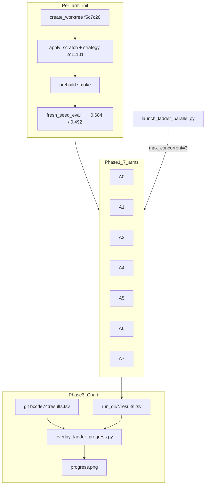

# Parallel A0–A7 from scratch (revised v2)

**Вердикт:** одобрено после правок v1 + jun22 baseline alignment.

**Ключевой принцип (уточнён):**

```text
from scratch ≠ baseline 0
from scratch ≠ minimal 1-H seed (~0.57)
from scratch = чистая harness-память + jun22 day-0 seed + fresh seed eval
```

Сравнение и overlay на [`progress.png`](d:/Projects/autoresearch/progress.png) требуют **того же стартового бейзлайна, что jun22** — первая точка на графике (`baseline B2 H1-H3`, search ≈ **0.684**, B4 ≈ **0.492**).

Harness-память (rejected directions, family_map dead-ends, 0.776 anchor) остаётся чистой; меняется только **seed strategy** с `78ebff8` (1-H) на **`2c11101`** (jun22 H1–H3).

---

## Jun22 reference baseline

Источник истины для progress.png — [`bccde74:results.tsv`](d:/Projects/autoresearch/results.tsv) / [`results_full.tsv`](d:/Projects/autoresearch/results_full.tsv):

| Поле | Значение |
|------|----------|
| commit (ledger) | `228791f` (row id; strategy file from `2c11101`) |
| strategy git | **`2c11101`** — `baseline: Durak C++23 engine + ladder B0-B4 + B2 heuristics H1-H3` |
| `kHeuristicCount` | 3, complexity 310 |
| `search_score` | **0.68404** |
| `point_rate` B4 | **0.49211** |
| description | `baseline B2 H1-H3` |

Все 7 arms получают **идентичный** `strategy_heuristic.cpp` из `2c11101`. `fresh_seed_eval()` через **`run_full()`** (Gate 3, 5M seeds) должен попасть в band **±0.003** от ledger (0.684/0.492). Точное совпадение с `0.684040` **не гарантировано**: engine (`simulate.cpp`) менялся после `2c11101`, ledger row 0 commit `228791f` — исторический id, не hash файла стратегии.

---

## Проблема (без изменений)

Параллель на одном repo root → corruption. Ladder живёт вне main repo:

```text
D:/Projects/.evolver_ladder/worktrees/
D:/Projects/.evolver_runs/ladder_parallel/
```

---

## Архитектура



---

## 1. Fresh seed baseline (jun22-aligned)

### Неправильно

- `baseline: 0` — keep-rule бессмысленен
- seed `78ebff8` (1-H ~0.57) — **не совпадает** с t=0 на progress.png

### Правильно

```text
1. scratch worktree + strategy @ 2c11101 (jun22 H1-H3)
2. build / test / **run_full()** on seed (Gate 3, 5M seeds — NOT quick)
3. baseline.best_search ≈ 0.684, best_b4 ≈ 0.492, best_lower_ci from full eval
4. commit: "scratch: {Arm} jun22 seed baseline eval"
5. Loop → candidate_0000 @ measured baseline
```

```text
baseline_source: fresh_seed_eval
baseline_reference: jun22 row 0 (0.684 / 0.492)
legacy_results_baseline: disabled  # --no-results-baseline
harness_memory: clean (no 0.776, no dead-ends in Phi)
```

---

## Scratch snapshot

Код: **`f5c7c26`**. Overlay файлов:

| Файл | Источник | Зачем |
|------|----------|-------|
| `durak/src/strategy_heuristic.cpp` | **`2c11101`** | jun22 H1-H3 — **same as progress.png t=0** |
| `results.tsv` | header-only | legacy baseline disabled |
| `results_full.tsv` | **delete or header-only** | иначе agent видит весь jun22 ledger |
| `program.md` | **`2c11101`** (136 lines, no Rejected/Archived) | чистый jun22 doc; **не** `78ebff8` (Superseded QA 0.824) |
| `evolve/mechanism/*` | `77d3c66` | clean contract, generic family_map |
| `evolve/config.json` | per-arm template | baseline filled after seed eval |

---

## Per-arm configs

Общие для всех arms (критично для честного overlay vs jun22):

```json
"promotion": { "holdout_trigger_delta": 0.006 },
"keep_rule": { "search_delta": 0.005 }
```

`holdout_trigger_delta: 0.006` = порог Gate 3 в [`scripts/triage.bat`](scripts/triage.bat) (`FULL_SEARCH_THRESH`). **Без этого** evolver запускает full eval при любом `search >= best` (delta 0) — кривая будет нечестно «быстрее» jun22.

| Arm | `engine` | Descriptor | `max_rounds` |
|-----|----------|------------|--------------|
| A0 | default | shadow off | 20 |
| A1 | default | feature + shadow | 20 |
| A2 | default | feature + novelty λ=0.25 | 20 |
| A4 | map_elites | feature + shadow | 20 |
| A5 | islands | feature + shadow | 20 |
| A6 | default | feature + meta.every=5 | 20 |
| A7 | default | convergence min_rounds=10 | 40 |

---

## progress.png overlay — audit честности

**Вердикт:** overlay **может быть честным по Y**, но только если соблюдены правила ниже. На текущем evolver config (`holdout_trigger_delta: 0.0`) + наивный cummax по всем строкам `results.tsv` график **будет нечестным**.

### Что jun22 progress.png реально рисует

Из [`analysis.ipynb`](d:/Projects/autoresearch/analysis.ipynb):

| Элемент | jun22 |
|---------|-------|
| Точки discard | серые, `status == discard` |
| Точки keep | зелёные/синие, `status == keep` |
| **Running best line** | `cummax` **только по keep** (full-eval promotions) |
| Y: search_score | composite `0.5*B4 + 0.3*B1 + 0.2*B0 − complexity/10000` |
| Y: point_rate | B4 full ladder |
| Gate для keep | Gate 3 full (5M seeds), keep rule +0.005 |
| Gate для full attempt | quick Δsearch ≥ **0.006** OR ΔB4 ≥ **0.005** |

### Расхождения evolver → results.tsv (если не исправить)

1. **Status mapping:** evolver пишет `official_best` / `valid_stepping_stone` / `invalid`, не `keep`/`discard`.
2. **Score source:** [`loop.py`](evolver/loop.py) `_build_candidate` берёт `best = full or holdout or search`. Stepping stones с только quick eval попадают в TSV с **quick** scores — jun22 такие точки не входят в running best.
3. **Full-eval trigger:** с `holdout_trigger_delta=0` full eval при `search >= best` — гораздо чаще, чем jun22 (0.006). Больше promotions от шума quick gate.
4. **Seed baseline:** `fresh_seed_eval` **обязан** вызывать `run_full()` (Gate 3), не `run_search()` — иначе t=0 не совпадёт с jun22 row 0.
5. **B4-first trigger:** triage.bat ещё пускает full при ΔB4 ≥ 0.005 даже при малом Δsearch; evolver смотрит только search. Мелкий gap — todo `align-full-gate` (optional v2: mirror B4-first в loop).

### Правила честного overlay (обязательные)

```text
Frontier (running best):
  jun22:  status == "keep"
  arms:   status == "official_best" ONLY
  НЕ включать valid_stepping_stone в cummax (аналог discard / failed full)

Scatter (optional):
  jun22 discards → grey
  arms valid_stepping_stone → grey (archive: score_kind=="search" → quick-only)

Seed point:
  candidate_0000 official_best @ full-eval baseline (~0.684 / 0.492)
  первая точка frontier каждого arm совпадает с jun22 t=0 по Y

Metrics:
  frontier rows: status==official_best AND score_kind in ("baseline", "full")
  (candidate_0000 is score_kind=baseline per loop._seed_root — NOT full)

X-axis:
  twin axes per system + подпись "experiment # within run" — Y сопоставим, X нет

Legend:
  явно: "jun22 manual loop" vs "evolver arm Ax"; A7 = stopping control
```

### Скрипт [`scripts/overlay_ladder_progress.py`](scripts/overlay_ladder_progress.py)

- Reference: `git show bccde74:results.tsv` — frontier = `keep` cummax (как notebook)
- Per arm: `{run_dir}/results.tsv` + `{run_dir}/archive.json` для score_kind filter
- Frontier = `official_best` rows ordered by candidate id
- Twin x-axes; parity 0.50 / dominates 0.52 — те же горизонтали
- Self-check: first official_best search_score in [0.681, 0.687] (engine drift vs ledger 0.68404)

**Historical vs live (важно для интерпретации):** jun22 reference curve — **замороженный** `bccde74:results.tsv` (scores на engine того времени). Новые arms — **live** `run_full()` на `f5c7c26` simulate. Overlay честен как «новый harness vs исторический jun22 ladder», но **не** как «одновременный remeasure одного engine». Drift ±0.003 на t=0 — ожидаем; если band fail — не подгонять Y, а логировать measured vs ledger.

```powershell
conda run -n py310 python scripts/overlay_ladder_progress.py `
  --reference git:bccde74:results.tsv `
  --runs D:\Projects\.evolver_runs\ladder_parallel `
  --out D:\Projects\autoresearch\progress.png
```

A3 curves: `{Arm}_A3` run dirs; frontier = sweep variants that became `official_best` only.

---

## Полный audit (v3) — чеклист перед запуском

### A. Изоляция и память

| Check | Status | Notes |
|-------|--------|-------|
| 8× parallel на одном repo root | BLOCKED | worktrees обязательны |
| run_dir вне worktree | OK | `config.paths` default sibling `.evolver_runs` |
| `--no-results-baseline` | TODO | CLI ещё нет |
| Rejected directions пуст | OK | `78ebff8` program.md + parser stops at next `##` |
| family_map dead-ends | OK | `77d3c66` generic; Φ только при A6 meta |
| baseline 0 / 0.776 | OK | fresh seed eval, not legacy |
| **Git log leak** | GAP | worktree @ `f5c7c26` видит историю incl. `71069a0` 0.776; agent может `git log`. Fix: orphan branch (todo `git-history-shallow`) |
| **results_full.tsv leak** | GAP | tracked @ `f5c7c26` — полный jun22 ledger (0.826); agent может прочитать. Scratch init: empty или delete in worktree |
| **program.md filesystem leak** | GAP | `78ebff8` имеет `### Superseded history` (QA 0.824…) — не в Φ, но agent `--trust` читает файл. Fix: minimal program.md overlay или truncate Current best |
| evolve_skill pollution | OK | `77d3c66` overlay |

### B. Seed и baseline

| Check | Status | Notes |
|-------|--------|-------|
| Strategy = jun22 H1-H3 | OK | `2c11101`, complexity 310 |
| Seed eval = Gate 3 full | REQUIRED | `run_full()`, 5M seeds (`simulate.cpp` default) |
| candidate_0000 | OK | `official_best`, `score_kind=baseline`, scores from config |
| Ledger row 0 match | SOFT | `228791f` ≠ strategy commit; engine drift since `2c11101`; band ±0.003 not exact 0.68404 |
| games column 10M vs 5M | OK | ledger `games=10000000` = 5M paired seeds × 2 (same as current full protocol, not old 10M-seed eval) |

### C. Eval protocol (overlay fairness)

| Check | Status | Notes |
|-------|--------|-------|
| search_score formula | OK | `0.5*B4+0.3*B1+0.2*B0−complexity/10000` in triage_ladder |
| keep rule +0.005 | OK | `search_delta` in config |
| full trigger Δsearch≥0.006 | TODO | `holdout_trigger_delta: 0.006` in ladder configs (currently 0.0 in repo) |
| B4-first ΔB4≥0.005 | GAP | triage.bat has it; loop only checks search — todo `align-full-gate` |
| dual seed agreement before full | SOFT GAP | `triage.bat dual` only **prints** agree/disagree; exit 0 if both gate2 runs succeed. Jun22 agent reads verdict before `full`; evolver auto-runs `holdout+full` when seed-0 search passes trigger — **более агрессивный full**, promotions всё равно требуют holdout+full+keep |
| medium/dual maybe zone | GAP | jun22 runs medium/dual for Δ∈[0.003,0.006); evolver skips — minor protocol diff |
| sweep eval path | OK | same `_run_candidate` precheck→search→holdout→full |

### D. progress.png overlay

| Check | Status | Notes |
|-------|--------|-------|
| jun22 frontier = `keep` cummax | OK | analysis.ipynb |
| arms frontier = `official_best` only | REQUIRED | NOT all stepping_stones |
| score_kind filter | FIX | include `baseline` (seed) + `full` (promotions); exclude `search`/`holdout`-only |
| rejected full eval stepping stones | OK | status≠official_best → grey scatter, not frontier |
| invalid rows in results.tsv | OK | exclude from scatter and frontier (status==invalid) |
| twin x-axes | REQUIRED | 566 vs ~40 exp |
| Y at t=0 aligned | SOFT | same strategy + full eval; engine drift → tolerance band |
| A0 vs jun22 comparison | OK | both default engine |
| A1–A6 vs jun22 | LABELED | different Phase-2 treatment, same Y metric |
| A7 on same chart | CAUTION | stopping control; may end ~round 10 — label separately |
| Model transition bands | OK | only on jun22 reference panel |

### E. A3 follow-up

| Check | Status | Notes |
|-------|--------|-------|
| Fresh worktree per arm | OK | not same worktree |
| Commit snapshot before sweep | OK | reset_to_base safe |
| Same eval gates as phase-1 | OK | |
| Frontier on overlay | OK | official_best sweep variants only |

### F. Ops

| Check | Status | Notes |
|-------|--------|-------|
| max_concurrent=3, stagger=60 | OK | in plan |
| prebuild smoke, skip_build=false | OK | |
| CURSOR_AUTH_TOKEN not in logs | OK | |
| CLI --repo-root | TODO | |

### Итоговый вердикт audit

```text
Запуск:  OK после implement todos (CLI, launcher, configs, scratch file scrub)
Overlay:  ЧЕСТЕН ПО Y если official_best frontier + holdout_trigger 0.006 + baseline/full score_kind
          НЕ ЧЕСТЕН если naive cummax / holdout_trigger 0 / quick seed eval
Agent memory: Φ чист; filesystem/git/results_full/program.md leaks остаются без scrub (см. A)
Остаточные gaps (документировать, не блокер overlay):
  - engine drift vs frozen bccde74 curve (tolerance band; jun22 frozen, arms live)
  - B4-first + medium/dual vs evolver (minor)
  - invalid rows — exclude from overlay scatter
```

---

## Изменения в коде (summary)

1. **CLI** — `--repo-root`, `--no-results-baseline`
2. **Launcher** — jun22 seed, fresh eval, max_concurrent/stagger
3. **A3** — fresh worktree per arm (не тот же worktree)
4. **overlay_ladder_progress.py** — финальный chart deliverable

---

## verify-launch (обновлено)

```text
strategy hash == git show 2c11101:durak/src/strategy_heuristic.cpp hash (all arms)
baseline.best_search in [0.681, 0.687]  # full eval band (engine drift vs ledger 0.68404)
baseline.best_b4 in [0.489, 0.495]
promotion.holdout_trigger_delta == 0.006 in evolve/config.json
NOT baseline 0, NOT 0.776
candidate_0000: official_best, score_kind=baseline, snapshot==2c11101
git -C {worktree} rev-parse --show-toplevel == {worktree}
run_dir.resolve() not under worktree.resolve()
load_rejected_directions() == []
first Phi: no dead-end bullets; no family_map unless A6
CURSOR_AUTH_TOKEN not in launcher.log
overlay dry-run: frontier official_best count >= 1; first point in band
```

---

## Запуск

```powershell
conda run -n py310 --no-capture-output python scripts/launch_ladder_parallel.py `
  --max-concurrent 3 --stagger-seconds 60
```

После прогонов / по мере готовности arms:
```powershell
conda run -n py310 python scripts/overlay_ladder_progress.py `
  --runs D:\Projects\.evolver_runs\ladder_parallel
```

---

## Критерии успеха

- Все arms стартуют с **jun22 baseline** (~0.684 full eval), не 0.57 и не 0.776
- `holdout_trigger_delta=0.006` — full eval frequency comparable to jun22
- `progress.png` overlay: **official_best frontier only**, Y aligned at t=0
- Overlay self-check fails if any arm first point outside [0.681, 0.687] search (warn, not hard block if engine drift documented)
- Cross-arm metrics: promotions, coverage, time-to-first-improvement above jun22 t=0
