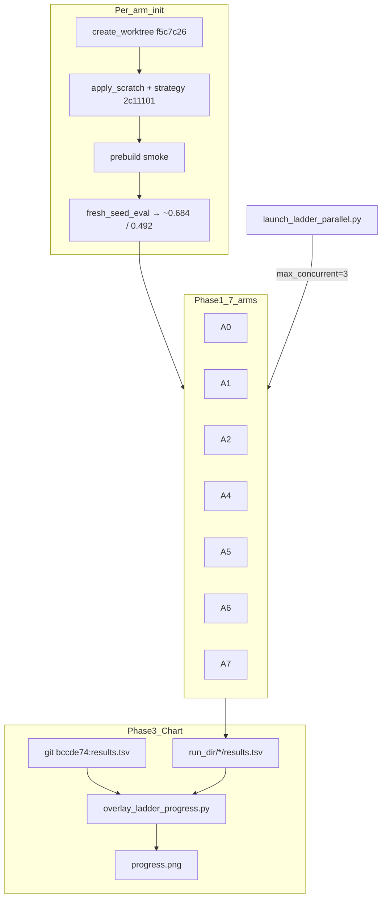

# Parallel A0–A7 from scratch: revised v2

**Verdict:** approved after v1 fixes + jun22 baseline alignment.

**Key principle, clarified:**

```text
from scratch ≠ baseline 0
from scratch ≠ minimal 1-H seed (~0.57)
from scratch = clean harness memory + jun22 day-0 seed + fresh seed eval
```

Comparison and overlay on [`progress.png`](d:/Projects/autoresearch/progress.png) require **the same starting baseline as jun22** — the first point on the graph (`baseline B2 H1-H3`, search ≈ **0.684**, B4 ≈ **0.492**).

Harness memory — rejected directions, family_map dead ends, 0.776 anchor — stays clean; only the **seed strategy** changes from `78ebff8` (1-H) to **`2c11101`** (jun22 H1–H3).

---

## Jun22 reference baseline

The source of truth for progress.png is [`bccde74:results.tsv`](d:/Projects/autoresearch/results.tsv) / [`results_full.tsv`](d:/Projects/autoresearch/results_full.tsv):

| Field             | Value                                                                               |
| ----------------- | ----------------------------------------------------------------------------------- |
| commit (ledger)   | `228791f` (row id; strategy file from `2c11101`)                                    |
| strategy git      | **`2c11101`** — `baseline: Durak C++23 engine + ladder B0-B4 + B2 heuristics H1-H3` |
| `kHeuristicCount` | 3, complexity 310                                                                   |
| `search_score`    | **0.68404**                                                                         |
| `point_rate` B4   | **0.49211**                                                                         |
| description       | `baseline B2 H1-H3`                                                                 |

All 7 arms receive the **identical** `strategy_heuristic.cpp` from `2c11101`. `fresh_seed_eval()` through **`run_full()`** (Gate 3, 5M seeds) should land within a **±0.003** band of the ledger (0.684/0.492). Exact equality with `0.684040` is **not guaranteed**: the engine (`simulate.cpp`) changed after `2c11101`; ledger row 0 commit `228791f` is a historical id, not the strategy file hash.

---

## Problem, unchanged

Running in parallel on one repo root causes corruption. Ladder lives outside the main repo:

```text
D:/Projects/.evolver_ladder/worktrees/
D:/Projects/.evolver_runs/ladder_parallel/
```

---

## Architecture



---

## 1. Fresh seed baseline: jun22-aligned

### Wrong

* `baseline: 0` — keep-rule becomes meaningless
* seed `78ebff8` (1-H ~0.57) — **does not match** t=0 on progress.png

### Correct

```text
1. scratch worktree + strategy @ 2c11101 (jun22 H1-H3)
2. build / test / **run_full()** on seed (Gate 3, 5M seeds — NOT quick)
3. baseline.best_search ≈ 0.684, best_b4 ≈ 0.492, best_lower_ci from full eval
4. commit: "scratch: {Arm} jun22 seed baseline eval"
5. Loop → candidate_0000 @ measured baseline
```

```text
baseline_source: fresh_seed_eval
baseline_reference: jun22 row 0 (0.684 / 0.492)
legacy_results_baseline: disabled  # --no-results-baseline
harness_memory: clean (no 0.776, no dead-ends in Phi)
```

---

## Scratch snapshot

Code: **`f5c7c26`**. File overlays:

| File                               | Source                                          | Why                                                      |
| ---------------------------------- | ----------------------------------------------- | -------------------------------------------------------- |
| `durak/src/strategy_heuristic.cpp` | **`2c11101`**                                   | jun22 H1-H3 — **same as progress.png t=0**               |
| `results.tsv`                      | header-only                                     | legacy baseline disabled                                 |
| `results_full.tsv`                 | **delete or header-only**                       | otherwise agent sees entire jun22 ledger                 |
| `program.md`                       | **`2c11101`** (136 lines, no Rejected/Archived) | clean jun22 doc; **not** `78ebff8` (Superseded QA 0.824) |
| `evolve/mechanism/*`               | `77d3c66`                                       | clean contract, generic family_map                       |
| `evolve/config.json`               | per-arm template                                | baseline filled after seed eval                          |

---

## Per-arm configs

Common to all arms, critical for a fair overlay vs jun22:

```json
"promotion": { "holdout_trigger_delta": 0.006 },
"keep_rule": { "search_delta": 0.005 }
```

`holdout_trigger_delta: 0.006` = Gate 3 threshold in [`scripts/triage.bat`](scripts/triage.bat) (`FULL_SEARCH_THRESH`). **Without this**, evolver runs full eval whenever `search >= best` (delta 0), making the curve dishonestly “faster” than jun22.

| Arm | `engine`   | Descriptor                | `max_rounds` |
| --- | ---------- | ------------------------- | ------------ |
| A0  | default    | shadow off                | 20           |
| A1  | default    | feature + shadow          | 20           |
| A2  | default    | feature + novelty λ=0.25  | 20           |
| A4  | map_elites | feature + shadow          | 20           |
| A5  | islands    | feature + shadow          | 20           |
| A6  | default    | feature + meta.every=5    | 20           |
| A7  | default    | convergence min_rounds=10 | 40           |

---

## progress.png overlay — fairness audit

**Verdict:** the overlay **can be fair on Y**, but only if the rules below are followed. With the current evolver config (`holdout_trigger_delta: 0.0`) + naive cummax over all `results.tsv` rows, the graph **will be unfair**.

### What jun22 progress.png actually plots

From [`analysis.ipynb`](d:/Projects/autoresearch/analysis.ipynb):

| Element               | jun22                                                   |
| --------------------- | ------------------------------------------------------- |
| Discard points        | grey, `status == discard`                               |
| Keep points           | green/blue, `status == keep`                            |
| **Running best line** | `cummax` **only over keep** rows: full-eval promotions  |
| Y: search_score       | composite `0.5*B4 + 0.3*B1 + 0.2*B0 − complexity/10000` |
| Y: point_rate         | B4 full ladder                                          |
| Keep gate             | Gate 3 full (5M seeds), keep rule +0.005                |
| Full-attempt gate     | quick Δsearch ≥ **0.006** OR ΔB4 ≥ **0.005**            |

### Evolver → results.tsv discrepancies, if not fixed

1. **Status mapping:** evolver writes `official_best` / `valid_stepping_stone` / `invalid`, not `keep`/`discard`.
2. **Score source:** [`loop.py`](evolver/loop.py) `_build_candidate` takes `best = full or holdout or search`. Stepping stones with only quick eval enter the TSV with **quick** scores — jun22 does not include such points in the running best.
3. **Full-eval trigger:** with `holdout_trigger_delta=0`, full eval runs when `search >= best` — much more often than jun22 (0.006). This creates more promotions from quick-gate noise.
4. **Seed baseline:** `fresh_seed_eval` **must** call `run_full()` (Gate 3), not `run_search()` — otherwise t=0 will not match jun22 row 0.
5. **B4-first trigger:** `triage.bat` also allows full when ΔB4 ≥ 0.005 even with a small Δsearch; evolver only looks at search. Small gap — todo `align-full-gate` (optional v2: mirror B4-first in loop).

### Rules for a fair overlay: mandatory

```text
Frontier (running best):
  jun22:  status == "keep"
  arms:   status == "official_best" ONLY
  Do NOT include valid_stepping_stone in cummax (analogous to discard / failed full)

Scatter (optional):
  jun22 discards → grey
  arms valid_stepping_stone → grey (archive: score_kind=="search" → quick-only)

Seed point:
  candidate_0000 official_best @ full-eval baseline (~0.684 / 0.492)
  first frontier point of each arm matches jun22 t=0 on Y

Metrics:
  frontier rows: status==official_best AND score_kind in ("baseline", "full")
  (candidate_0000 is score_kind=baseline per loop._seed_root — NOT full)

X-axis:
  twin axes per system + label "experiment # within run" — Y is comparable, X is not

Legend:
  explicitly: "jun22 manual loop" vs "evolver arm Ax"; A7 = stopping control
```

### Script [`scripts/overlay_ladder_progress.py`](scripts/overlay_ladder_progress.py)

* Reference: `git show bccde74:results.tsv` — frontier = `keep` cummax, as in notebook
* Per arm: `{run_dir}/results.tsv` + `{run_dir}/archive.json` for score_kind filter
* Frontier = `official_best` rows ordered by candidate id
* Twin x-axes; parity 0.50 / dominates 0.52 — same horizontal lines
* Self-check: first official_best search_score in [0.681, 0.687] (engine drift vs ledger 0.68404)

**Historical vs live, important for interpretation:** the jun22 reference curve is the **frozen** `bccde74:results.tsv` (scores on the engine from that time). New arms are **live** `run_full()` on `f5c7c26` simulate. The overlay is fair as “new harness vs historical jun22 ladder,” but **not** as “simultaneous remeasurement on one engine.” Drift of ±0.003 at t=0 is expected; if the band fails, do not adjust Y — log measured vs ledger.

```powershell
conda run -n py310 python scripts/overlay_ladder_progress.py `
  --reference git:bccde74:results.tsv `
  --runs D:\Projects\.evolver_runs\ladder_parallel `
  --out D:\Projects\autoresearch\progress.png
```

A3 curves: `{Arm}_A3` run dirs; frontier = only sweep variants that became `official_best`.

---

## Full audit v3 — pre-launch checklist

### A. Isolation and memory

| Check                          | Status  | Notes                                                                                                                                                       |
| ------------------------------ | ------- | ----------------------------------------------------------------------------------------------------------------------------------------------------------- |
| 8× parallel on one repo root   | BLOCKED | worktrees required                                                                                                                                          |
| run_dir outside worktree       | OK      | `config.paths` default sibling `.evolver_runs`                                                                                                              |
| `--no-results-baseline`        | TODO    | CLI does not exist yet                                                                                                                                      |
| Rejected directions empty      | OK      | `78ebff8` program.md + parser stops at next `##`                                                                                                            |
| family_map dead ends           | OK      | `77d3c66` generic; Φ only under A6 meta                                                                                                                     |
| baseline 0 / 0.776             | OK      | fresh seed eval, not legacy                                                                                                                                 |
| **Git log leak**               | GAP     | worktree @ `f5c7c26` sees history incl. `71069a0` 0.776; agent can run `git log`. Fix: orphan branch (todo `git-history-shallow`)                           |
| **results_full.tsv leak**      | GAP     | tracked @ `f5c7c26` — full jun22 ledger (0.826); agent can read it. Scratch init: empty or delete in worktree                                               |
| **program.md filesystem leak** | GAP     | `78ebff8` has `### Superseded history` (QA 0.824…) — not in Φ, but agent `--trust` reads the file. Fix: minimal program.md overlay or truncate Current best |
| evolve_skill pollution         | OK      | `77d3c66` overlay                                                                                                                                           |

### B. Seed and baseline

| Check                   | Status   | Notes                                                                                                |
| ----------------------- | -------- | ---------------------------------------------------------------------------------------------------- |
| Strategy = jun22 H1-H3  | OK       | `2c11101`, complexity 310                                                                            |
| Seed eval = Gate 3 full | REQUIRED | `run_full()`, 5M seeds (`simulate.cpp` default)                                                      |
| candidate_0000          | OK       | `official_best`, `score_kind=baseline`, scores from config                                           |
| Ledger row 0 match      | SOFT     | `228791f` ≠ strategy commit; engine drift since `2c11101`; band ±0.003, not exact 0.68404            |
| games column 10M vs 5M  | OK       | ledger `games=10000000` = 5M paired seeds × 2 (same as current full protocol, not old 10M-seed eval) |

### C. Eval protocol: overlay fairness

| Check                           | Status   | Notes                                                                                                                                                                                                                                                                        |
| ------------------------------- | -------- | ---------------------------------------------------------------------------------------------------------------------------------------------------------------------------------------------------------------------------------------------------------------------------- |
| search_score formula            | OK       | `0.5*B4+0.3*B1+0.2*B0−complexity/10000` in triage_ladder                                                                                                                                                                                                                     |
| keep rule +0.005                | OK       | `search_delta` in config                                                                                                                                                                                                                                                     |
| full trigger Δsearch≥0.006      | TODO     | `holdout_trigger_delta: 0.006` in ladder configs (currently 0.0 in repo)                                                                                                                                                                                                     |
| B4-first ΔB4≥0.005              | GAP      | triage.bat has it; loop only checks search — todo `align-full-gate`                                                                                                                                                                                                          |
| dual seed agreement before full | SOFT GAP | `triage.bat dual` only **prints** agree/disagree; exits 0 if both gate2 runs succeed. Jun22 agent reads verdict before `full`; evolver auto-runs `holdout+full` when seed-0 search passes trigger — **more aggressive full**, but promotions still require holdout+full+keep |
| medium/dual maybe zone          | GAP      | jun22 runs medium/dual for Δ∈[0.003,0.006); evolver skips — minor protocol diff                                                                                                                                                                                              |
| sweep eval path                 | OK       | same `_run_candidate` precheck→search→holdout→full                                                                                                                                                                                                                           |

### D. progress.png overlay

| Check                                | Status   | Notes                                                                            |
| ------------------------------------ | -------- | -------------------------------------------------------------------------------- |
| jun22 frontier = `keep` cummax       | OK       | analysis.ipynb                                                                   |
| arms frontier = `official_best` only | REQUIRED | NOT all stepping_stones                                                          |
| score_kind filter                    | FIX      | include `baseline` (seed) + `full` (promotions); exclude `search`/`holdout`-only |
| rejected full eval stepping stones   | OK       | status≠official_best → grey scatter, not frontier                                |
| invalid rows in results.tsv          | OK       | exclude from scatter and frontier (status==invalid)                              |
| twin x-axes                          | REQUIRED | 566 vs ~40 exp                                                                   |
| Y at t=0 aligned                     | SOFT     | same strategy + full eval; engine drift → tolerance band                         |
| A0 vs jun22 comparison               | OK       | both default engine                                                              |
| A1–A6 vs jun22                       | LABELED  | different Phase-2 treatment, same Y metric                                       |
| A7 on same chart                     | CAUTION  | stopping control; may end ~round 10 — label separately                           |
| Model transition bands               | OK       | only on jun22 reference panel                                                    |

### E. A3 follow-up

| Check                        | Status | Notes                             |
| ---------------------------- | ------ | --------------------------------- |
| Fresh worktree per arm       | OK     | not same worktree                 |
| Commit snapshot before sweep | OK     | reset_to_base safe                |
| Same eval gates as phase-1   | OK     |                                   |
| Frontier on overlay          | OK     | official_best sweep variants only |

### F. Ops

| Check                            | Status | Notes   |
| -------------------------------- | ------ | ------- |
| max_concurrent=3, stagger=60     | OK     | in plan |
| prebuild smoke, skip_build=false | OK     |         |
| CURSOR_AUTH_TOKEN not in logs    | OK     |         |
| CLI --repo-root                  | TODO   |         |

### Final audit verdict

```text
Launch:  OK after implementing todos (CLI, launcher, configs, scratch file scrub)
Overlay:  FAIR ON Y if official_best frontier + holdout_trigger 0.006 + baseline/full score_kind
          UNFAIR if naive cummax / holdout_trigger 0 / quick seed eval
Agent memory: Φ clean; filesystem/git/results_full/program.md leaks remain without scrub (see A)
Residual gaps (document, not overlay blockers):
  - engine drift vs frozen bccde74 curve (tolerance band; jun22 frozen, arms live)
  - B4-first + medium/dual vs evolver (minor)
  - invalid rows — exclude from overlay scatter
```

---

## Code changes: summary

1. **CLI** — `--repo-root`, `--no-results-baseline`
2. **Launcher** — jun22 seed, fresh eval, max_concurrent/stagger
3. **A3** — fresh worktree per arm, not the same worktree
4. **overlay_ladder_progress.py** — final chart deliverable

---

## verify-launch: updated

```text
strategy hash == git show 2c11101:durak/src/strategy_heuristic.cpp hash (all arms)
baseline.best_search in [0.681, 0.687]  # full eval band (engine drift vs ledger 0.68404)
baseline.best_b4 in [0.489, 0.495]
promotion.holdout_trigger_delta == 0.006 in evolve/config.json
NOT baseline 0, NOT 0.776
candidate_0000: official_best, score_kind=baseline, snapshot==2c11101
git -C {worktree} rev-parse --show-toplevel == {worktree}
run_dir.resolve() not under worktree.resolve()
load_rejected_directions() == []
first Phi: no dead-end bullets; no family_map unless A6
CURSOR_AUTH_TOKEN not in launcher.log
overlay dry-run: frontier official_best count >= 1; first point in band
```

---

## Launch

```powershell
conda run -n py310 --no-capture-output python scripts/launch_ladder_parallel.py `
  --max-concurrent 3 --stagger-seconds 60
```

After runs / as arms complete:

```powershell
conda run -n py310 python scripts/overlay_ladder_progress.py `
  --runs D:\Projects\.evolver_runs\ladder_parallel
```

---

## Success criteria

* All arms start from **jun22 baseline** (~0.684 full eval), not 0.57 and not 0.776
* `holdout_trigger_delta=0.006` — full eval frequency comparable to jun22
* `progress.png` overlay: **official_best frontier only**, Y aligned at t=0
* Overlay self-check fails if any arm first point is outside [0.681, 0.687] search (warn, not hard block if engine drift is documented)
* Cross-arm metrics: promotions, coverage, time-to-first-improvement above jun22 t=0
