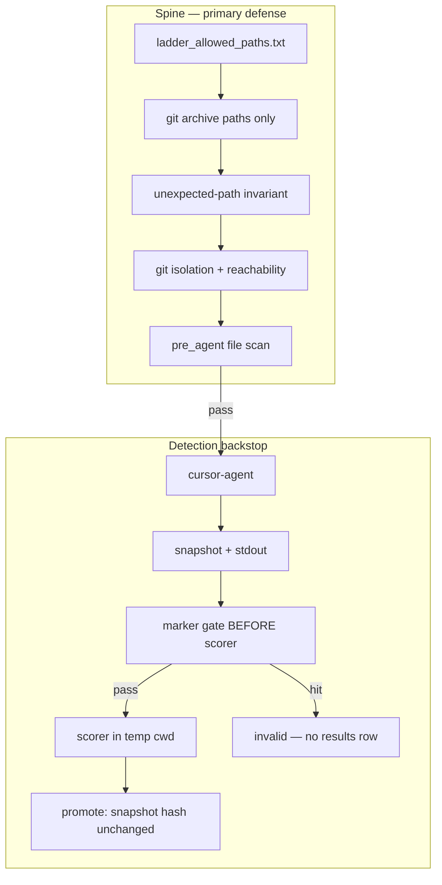

# Audit-clean ladder v5 lean: Tier A

## Threat model

```text
Honest-but-contaminated agent, not evasive adversary.
```

The agent may read leaked files if they are present and reuse ideas in code. We do **not** assume path traversal evasion, MOSS-style fingerprint games, or deliberate stdout suppression.

**Primary defense:**

```text
Template / jun22 ledger / knowledge MUST NOT exist as files in the arm worktree.
```

**Detection layer:**

```text
Cheap backstop — not proof of non-contamination.
Catches confession leaks + distinctive marker copy-paste into stdout/snapshot.
Silent structural reuse without markers remains possible and accepted.
```

Tier B read-sandbox is out of scope.

---

## What we guarantee

```text
disk-init clean     exact allowlist materialization + unexpected-path invariant
template absent     evolve/sweep/ never materialized in phase-1
result hygiene      leak hit → no scorer run, no results.tsv/archive row, no promote
control-plane safe  manifest + run_dir outside agent-writable worktree
not read-sandbox clean
```

---

## Spine: keep — do not cut

### S1. G1 Exact allowlist init

* [`scripts/ladder_allowed_paths.txt`](scripts/ladder_allowed_paths.txt) — audited paths at `f5c7c26`, no broad `evolver/` prefix
* [`materialize_base_tree()`](scripts/ladder_lib.py): `git archive f5c7c26 --` with paths read from file
* **No shell interpolation** — path list passed via argv/subprocess list, never `$(cat …)` string concatenation
* Never materialize: `evolve/sweep/`, `results_full.tsv`, `knowledge/`, `progress*.png`, jun22 sweep scripts
* `purge_forbidden_paths()` — fallback only

### S2. Stage-aware unexpected-path invariant

After materialize + scratch overlay, at `pre_agent`:

```text
∀ file f in wt: f must match ALLOWED_PATHS prefix union for this stage
```

Stage labels: `post_materialize`, `post_scratch`, `post_commit_init`. Fail on any extra file/dir. This is allowlist verification, not only blacklist purging.

### S3. G1.5 Reachability / isolation

Verify and record in manifest:

```text
.git is directory inside wt, not a file pointer to main
git-dir / git-common-dir resolve inside wt/.git
git rev-parse --show-toplevel == wt
```

Optional cheap label: `reachability=isolated_standalone` vs legacy linked. Fail on linked.

### S4. Control-plane outside agent-writable worktree

Already intended; enforce in verify:

* `run_dir` NOT under `wt` via [`verify_worktree()`](scripts/ladder_lib.py)
* [`MANIFEST_PATH`](scripts/ladder_lib.py) under `RUN_ROOT`, not in wt
* Ladder scripts / configs live in main repo; agent cwd = wt only

### S5. Gate before scorer: mandatory ordering

```text
agent finishes
→ collect strategy snapshot text + accumulated stdout
→ POST_AGENT leak backstop (markers on snapshot + stdout; optional wt file scan if files touched)
→ if hit: invalid, RETURN — scorer NOT invoked
→ scorer runs in temp/isolated cwd (see S6)
→ on promote path: assert snapshot hash unchanged since post_agent gate
→ promote or reject
```

**Forbidden:** score then invalidate. That contaminates `results.tsv`, `archive.json`, and logs.

### S6. Scorer temp side-effect isolation

Scorer/eval subprocess cwd = throwaway dir or wt snapshot copy; writes triage artifacts outside canonical results paths until gate passes. This prevents a leak-invalid candidate from leaving eval debris in wt.

### S7. Per-arm results hygiene

* Atomic or locked append to `results.tsv` / `archive.json`: one writer per run_dir
* Leak-invalid candidates: **no row append**

### S8. Quarantine contaminated arms

A1/A2/A4/A5 runs from batch `150224` are **contaminated**:

* Move/rename run dirs → `RUN_ROOT/_quarantine/A1_20260629_150224/`, with a read-only label in manifest
* Do not use for overlay comparison or A3 parent snapshots
* `force-init` fresh worktrees before any clean ladder

---

## Detection layer: lean — v5 cuts

### D1. Curated distinctive marker hashes, NOT rolling fingerprints

**Cut:** rolling/windowed n-grams, MOSS-style subtraction, triage machinery.

**Keep:** small set of **high-specificity** strings → SHA256 offline → hashes only in repo:

```python
LEAK_MARKER_HASHES: frozenset[str]  # ~5–15 entries
```

Candidates, raw offline only, never committed:

* `0.77648`
* `near-winner`, as part of distinctive phrases
* `sweep template`
* `template candidate_0019`
* unique A3 template header phrases

Plus narrow regex for gate, same as overlay chart: template-traceable only.

`conservation_take` / homonym `candidate_0019` are **not** gate markers.

Tests: synthetic fixture strings, not the real template body.

### D2. Pre-promotion: snapshot hash unchanged, NOT full re-scan

**Cut:** full pre-promotion fingerprint re-scan of entire snapshot.

**Keep:**

```python
assert sha256(snapshot_at_gate) == sha256(snapshot_at_promote)
```

If scorer or post-processing mutated an allowlist file → fail closed, no promote.

Optional: lightweight marker re-check on snapshot only if hash differs, which should not happen.

### D3. Encoding: simple

**Cut:** UTF-16 / encoding ladder.

**Keep:**

```text
try utf-8 → utf-8-sig → latin-1; on failure skip file + log "skipped binary"
null-byte heuristic for binary skip
max file size cap (2 MiB)
```

Scan all non-binary files under cap, any extension.

### D4. Surfaces for gate vs audit

| Surface                                           | Role                                                      |
| ------------------------------------------------- | --------------------------------------------------------- |
| **stdout**: assistant text                        | gate — fail-closed                                        |
| **strategy snapshot**: allowlist file after agent | gate — marker hash + regex                                |
| **worktree files**: pre_agent only                | gate at init                                              |
| **git diff**                                      | **audit-only** → `agent_tools.jsonl` / post-hoc, not gate |
| **shell commands**                                | **audit-only** — log cwd, raw command, `../` flags (G4)   |

Rationale: diff ⊂ snapshot for allowlist-only edits; diff gate duplicates snapshot scan and adds forensic complexity.

---

## Architecture



---

## Modules

| File                                                                   | Role                                             |
| ---------------------------------------------------------------------- | ------------------------------------------------ |
| [`scripts/ladder_allowed_paths.txt`](scripts/ladder_allowed_paths.txt) | audited path manifest                            |
| [`scripts/ladder_lib.py`](scripts/ladder_lib.py)                       | materialize, verify_leak_free, quarantine        |
| [`scripts/leak_scan.py`](scripts/leak_scan.py)                         | marker hashes, regex, read_text_safe, scan_files |
| [`evolver/loop.py`](evolver/loop.py)                                   | gate ordering, no score on leak, hash at promote |
| [`evolver/agents.py`](evolver/agents.py)                               | stdout accumulation, agent_tools.jsonl audit     |

---

## Phase-1 policy

* No `evolve/sweep/` in phase-1 init
* A3: per-arm snapshot template via [`init_a3_worktree()`](scripts/ladder_lib.py), scrubbed + pre_agent verify

---

## Tests — [`evolver/tests/test_ladder_leak.py`](evolver/tests/test_ladder_leak.py)

* Allowlist → no unexpected paths, stage-aware
* Leak marker in `.patch` / extensionless file → pre_agent fail
* Untracked forbidden file → fail
* Linked worktree → fail
* Marker in stdout → invalid, **scorer not called**, no results.tsv row
* Synthetic hash match in snapshot → invalid before scorer
* Promote blocked if snapshot hash changes after gate
* Quarantine path helper smoke test

**Cut from tests:** rolling fingerprint, diff-as-gate, UTF-16 fixtures.

---

## Readiness: ship gate

1. `verify_ladder_launch.py --force-init --arms A1 A2 A4 A5` → pass
2. `_audit_leakage.py` → no LEAK/GAP
3. `evolve/sweep/` absent from init commit: `git ls-tree`
4. Leak marker in stdout → invalid, no scorer, no results row
5. Contaminated runs quarantined; manifest points to new run dirs only
6. Smoke: first N rounds, no marker hits

**Do not launch clean ladder comparison until spine (S1–S8) + backstop gate (D1, D4, S5) ship.**

---

## Implementation order

1. **Spine:** allowlist manifest + materialize + unexpected-path + isolation + quarantine labels
2. **Backstop:** leak_scan.py + loop gate before scorer + snapshot hash at promote + agent_tools audit jsonl
3. **Hygiene:** scorer temp isolation + atomic results append
4. Tests
5. Force-init A1/A2/A4/A5 + audit + optional overlay after clean re-run

---

## Explicitly cut: v5 vs v3/v4

| Cut                             | Reason                                              |
| ------------------------------- | --------------------------------------------------- |
| Rolling/windowed fingerprints   | scaffold false positives → security theater         |
| MOSS-style subtraction / triage | overkill for threat model                           |
| Full pre-promotion re-scan      | snapshot hash unchanged suffices                    |
| UTF-16 encoding ladder          | utf-8/sig/latin-1 enough                            |
| diff as gate surface            | audit-only; snapshot is sufficient                  |
| pre_promotion fingerprint stage | merged into hash-unchanged + single post_agent gate |
r