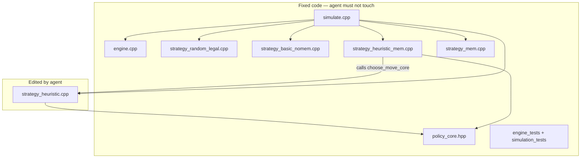

---

name: Durak C++ Autoresearch
overview: "C++23 Durak lab: locked engine, baseline ladder, B2 heuristic with shared policy_core + optional MemoryFeatures; B3 fixed wrapper; point_rate paired eval; ladder_score for search, B4 for reporting."
todos:

* id: cards-engine
  content: cards.hpp (uint64_t CardMask) + deterministic engine + golden engine_tests
  status: completed
* id: strategies-b0-b1
  content: strategy_random_legal + strategy_basic_nomem + simulate paired seeds (no mem)
  status: completed
* id: simulate-stats
  content: "simulate: paired symmetry, point_rate + normal CI (default) / optional bootstrap, quick/full eval"
  status: completed
* id: strategies-b2-b4
  content: policy_core interface; strategy_heuristic (B2); strategy_heuristic_mem (B3 wrapper); strategy_mem (B4)
  status: completed
* id: simulation-tests
  content: simulation_tests + static/grep check for forbidden symbols in strategy_heuristic.cpp
  status: completed
* id: docs-loop
  content: program.md (rules, restrictions, eval protocol) + README.md (research framing)
  status: completed
* id: baseline-run
  content: First full_eval run B2 vs ladder, results.tsv
  status: completed
  isProject: false

---

# Durak autoresearch: local heuristics vs memory lab

## Goals: two axes

**Engineering:** a fast, reproducible, locked engine for throw-in Durak — fixed rules, simulator not editable by the agent.

**Research:** find the **lowest-complexity-score** no-memory strategy that **maximizes `point_rate`** against fixed baseline levels; **separately** measure the pure value of memory post-keep through a **direct B3 vs B2** ablation on the accepted candidate.

This is **not** “solve Durak globally.” The hypothesis is: *can a memoryless local policy compete with a fixed memory-counting baseline in an imperfect-information game?*

Success is not only `>50%` vs B4, but also meaningful conclusions:

```text
B2 > B1  => heuristics add strength
B3 > B2  => pure value of memory with the same logic
B2 ~ B3  => memory helps little for this logic
B2 > B4  => strong result
B2 < B4  => not a failure if B2 is simple and close to B4
```

Pure value of memory:

```text
primary  = point_rate(B3 vs B2), paired eval, same seeds, synchronized logic
secondary = win_rate(B3 vs B1) − win_rate(B2 vs B1)  // ladder metric, not a substitute
```

## Repository context

Durak code is absent. LLM files ([train.py](train.py), [prepare.py](prepare.py)) remain as legacy; autoresearch scope is only `durak/`. Full replacement of [program.md](program.md) and [README.md](README.md).

## Architecture



| Level  | File                         | Role                                                                            |
| ------ | ---------------------------- | ------------------------------------------------------------------------------- |
| B0     | `strategy_random_legal.cpp`  | sanity: random legal move                                                       |
| B1     | `strategy_basic_nomem.cpp`   | min card attack / min defense, no heuristics                                    |
| **B2** | **`strategy_heuristic.cpp`** | **editable policy core + manifest (Occam target)**                              |
| B3     | `strategy_heuristic_mem.cpp` | **fixed** wrapper: `choose_move_core(local, &memory)` — post-keep ablation only |
| B4     | `strategy_mem.cpp`           | independent strong memory-counting baseline                                     |

The strategy receives only `HandView` (B0–B2) or `HandView + MemoryView` (B3–B4), **not** the full `GameState`.

## Shared policy core: B2/B3 contract

Do **not** codegen/sync arbitrary C++ from B2 → B3. The ablation is fair only through a **shared interface**, fixed in read-only [`durak/include/policy_core.hpp`](durak/include/policy_core.hpp):

```cpp
struct LocalFeatures {
    CardMask hand;
    CardMask table_attack;
    CardMask table_defense;
    Card trump_card;
    int deck_count;
    int opponent_hand_count;
    bool is_attacker;
    // legal moves supplied separately or via callback
};

struct MemoryFeatures {
    CardMask unknown_cards;
    int unknown_trump_count;
    int unknown_rank_count[9];
    int known_opponent_rank_count[9];
};

// Implemented in strategy_heuristic.cpp (agent edits body, not signature)
Move choose_move_core(
    const LocalFeatures& local,
    const MemoryFeatures* memory,  // nullptr = no-memory mode
    const LegalMoves& legal
);
```

Calls:

```text
B2 (no-memory): choose_move_core(local, nullptr, legal)
B3 (ablation):  choose_move_core(local, &memory_features, legal)
```

The harness builds `MemoryFeatures` from `MemoryView`; B3 **does not** contain a separate strategy — only a wrapper + memory feature extraction.

**B3 / memory hook restrictions** in `program.md` and tests:

```text
B3 may only use MemoryFeatures for tie-breaks or unknown-card priors.
B3 must not add new action classes that B2 does not consider.
B3 must preserve the same heuristic manifest; only memory_parameter_count may differ.
```

Allowed: B2 chooses the min non-trump; B3, among ties, picks the rank that is more common in `unknown_cards`.

Not allowed: B3 adds a new take/defend/throw-in heuristic absent from the B2 manifest.

The agent edits **only** `strategy_heuristic.cpp` — the implementation of `choose_move_core` and the manifest. Memory branches inside core, such as `if (memory) { tie-break }`, are allowed; new `H5_*` only in the no-memory path is not allowed.

## Engine rules: hard specification

Variant: **2-player throw-in Durak, no transfer**.

| Topic              | Rule                                                                                                                                                                                                                       |
| ------------------ | -------------------------------------------------------------------------------------------------------------------------------------------------------------------------------------------------------------------------- |
| Deck               | 36 cards, ranks 6–T, 4 suits                                                                                                                                                                                               |
| Trump              | suit of the bottom card under the deck                                                                                                                                                                                     |
| Deal               | 6 cards each                                                                                                                                                                                                               |
| First move, game 1 | holder of the **lowest trump** attacks; in paired eval, symmetry through side swapping                                                                                                                                     |
| First attack move  | may attack with **multiple cards of one rank**: pair/triple                                                                                                                                                                |
| Attack limit       | `total_attack_cards ≤ min(6, defender_hand_size_at_battle_start)`                                                                                                                                                          |
| Throw-in           | the card rank must **already be present** among any cards on the table in the current battle — **attacking and defending** cards. If 7♣ is beaten by 9♣, ranks 7 and 9 are on the table, so both are legal for throwing in |
| Defense            | higher card of the same suit or trump; non-trump cannot beat trump                                                                                                                                                         |
| Take               | defender takes all cards from the table; **the same attacker** attacks again; defender does not get the turn                                                                                                               |
| Beaten             | all cards go to discard; **defender** becomes the next attacker                                                                                                                                                            |
| Drawing            | after a battle, draw up to 6 cards: **attacker first**, then defender, using roles from the completed battle; same order after “take”                                                                                      |
| Victory            | deck is empty and hand is empty                                                                                                                                                                                            |
| Draw               | if, after deck exhaustion, both players empty their hands in the same battle → **0.5 win** for each                                                                                                                        |

**H3: same-rank trump** only makes sense if the defense card opens a rank for throw-in — the engine must implement this; see throw-in legality above.

## Data representation

```cpp
using Card = uint8_t;           // 0..35
using CardMask = uint64_t;      // 36 bits, not std::bitset

constexpr CardMask card_bit(Card c) { return 1ull << c; }
// rank_mask[9], suit_mask[4], trump_mask — constexpr

struct HandView {
    CardMask hand;
    CardMask table_attack;
    CardMask table_defense;
    Card trump_card;              // or suit + rank of the bottom card
    int deck_count;
    int opponent_hand_count;
    bool is_attacker;
    // NO discard, NO history
};

struct MemoryView {
    CardMask known_discarded;        // discard — guaranteed out of play
    CardMask known_in_own_hand;      // own hand
    CardMask known_on_table;         // table: attack + defense
    CardMask known_in_opponent_hand; // cards definitely in opponent hand, e.g. cards taken from table, visible during use
    CardMask seen_ever;              // union of all visible cards, for auditing
    int deck_count;
    int opponent_hand_count;         // opponent hand size; may be > popcount(known_in_opponent_hand)
    // unknown_cards = ALL_CARDS
    //   - known_discarded - known_in_own_hand - known_on_table - known_in_opponent_hand
    // remainder: deck + hidden cards in opponent hand
};
```

Hot path: `hand & trump_mask`, `mask & rank_mask[r]`, iteration with `while (m) { c = countr_zero(m); m &= m-1; }`. No heap, legal moves in `std::array<Move, MAX_MOVES>`.

## Baseline ladder

### B0 — random legal

Random legal move. Check: paired self-play ≈ 50%.

### B1 — basic no-memory

Attack/throw-in: minimum card, any suit. Defense: minimum sufficient card. No groups, no “take” heuristics.

### B2 — heuristic no-memory: edited by agent

Starting manifest, v1:

```cpp
// HEURISTICS:
// H1 min_non_trump_attack
// H2 near_rank_group_attack delta=2
// H3 same_rank_trump_defense
// (H4 disabled in v1 — see below)

constexpr int kHeuristicCount = 3;
constexpr int kParameterCount = 1;  // delta
constexpr int kComplexityScore = 100 * kHeuristicCount + 10 * kParameterCount;
```

| #  | Phase           | Rule                                                                |
| -- | --------------- | ------------------------------------------------------------------- |
| H1 | Attack/throw-in | Minimum legal **non-trump** card                                    |
| H2 | Attack          | Pair/triple if max_rank ≤ min_non_trump + δ, where δ=2              |
| H3 | Defense         | No higher same-suit card → trump of the **same rank** as the attack |

**H4 not in v1:** “take pairs with a deficient suit” — experimental flag for the agent:

```text
H4_take_when_defense_expensive
  take only if cost(defense) > cost(take)
  and taken cards create future groups
```

The agent may enable H4, but must update the manifest and complexity score.

### B3 — heuristic + memory: post-keep ablation

B3 **does not participate** in the autoresearch hot loop. Post-keep:

```text
simulate --ablate --eval full
→ runs B3 (fixed wrapper) vs B2 (current accepted choose_move_core)
→ point_rate(B3 vs B2), same paired deck symmetry
```

B3 = `strategy_heuristic_mem.cpp` (fixed): collects `MemoryFeatures`, calls **the same** `choose_move_core` with `memory != nullptr`. No copying/generating C++ from B2.

`primary memory value = point_rate(B3 vs B2)`; expect ≈ 0.5 if memory adds nothing to the same core.

### B4 — independent memory baseline

Simplified card-counting, not full belief-state inference, using a **separate** `MemoryView`:

* `known_discarded` — discard.
* `known_on_table` — table.
* `known_in_own_hand` — own hand.
* `known_in_opponent_hand` — cards that are **definitely** in the opponent’s hand, such as cards taken from the table or visible during use; updated during play.
* `unknown_cards` = ALL − (discarded + own + table + known_opponent) — deck + hidden opponent cards.
* Do **not** mix “out of play” and “in opponent hand.”

Heuristics: min-weight attack by `unknown_cards`; min sufficient defense; blocking rank; cautious throw-in; “take” if defense is expensive in trumps in the pool.

Intentionally stronger than B2, but not a full hidden-state solver.

## Occam: manifest, not counting `if`

Required in `strategy_heuristic.cpp`:

```cpp
constexpr int kHeuristicCount = ...;
constexpr int kParameterCount = ...;
constexpr int kComplexityScore = 100 * kHeuristicCount + 10 * kParameterCount;
```

`simulate` prints `strategy_name`, `heuristic_count`, `parameter_count`, and `complexity_score` from the strategy API.

**keep vs current best** when `|point_rate − best| < 0.005`: prefer the lower `complexity_score`.

CI/grep in `strategy_heuristic.cpp` forbids: `static`, mutable globals, `fstream`, `random_device`, `chrono`, `thread`, `filesystem`.

## Paired evaluation

### Deck symmetry: formalization

For seed `S`:

1. Generate **one** deck order `D`, including trump, from `S`.
2. Deal `hand0`, `hand1` — fixed card sets by seat.

```text
Game A:
  seat0 (hand0) controlled by challenger
  seat1 (hand1) controlled by opponent

Game B (same D, same trump, same hand0/hand1):
  seat0 controlled by opponent
  seat1 controlled by challenger
```

**Swap strategies, not cards** — average over seat/strategy assignment, not over a new deal. The “lowest trump attacks” rule is applied in each game to the **current** seat0/seat1; when strategies are swapped, the first move can differ — this is part of paired symmetry.

### Point scoring: primary metric

Single-game outcome:

```text
win  = 1.0
draw = 0.5
loss = 0.0
```

For seed `S`:

```text
pair_score = (points_A + points_B) / 2   // challenger points across both games
```

Examples: 2-0 → 1.0; 1.5-0.5 → 0.75; 1-1 → 0.5; 0.5-1.5 → 0.25; 0-2 → 0.0.

**Primary metric:** `point_rate = mean(pair_score)` across seeds.

Also report:

```text
pair_win_rate  = P(pair_score > 0.5)
pair_loss_rate = P(pair_score < 0.5)
split_rate     = P(pair_score == 0.5)
```

Wilson CI is **not** for fractional `point_rate`. **Default CI** for scores bounded in `{0, 0.25, 0.5, 0.75, 1}`:

```text
mean ± 1.96 * std(pair_score) / sqrt(n)
```

CLI: `--ci normal` default, or `--ci bootstrap` optional, for example 1000 resamples. At 5M seeds, normal ≈ bootstrap but faster. Wilson only for binary `pair_win_rate`.

## Metrics: reporting vs search

**Primary reporting metric** for README, final claims, and `results.tsv` vs B4:

```text
point_rate(B2 vs B4)
```

**Optional search metric** for autoresearch `keep/discard`, with a smoother gradient:

```text
search_score =
  0.50 * point_rate(B2 vs B4)
+ 0.30 * point_rate(B2 vs B1)
+ 0.20 * point_rate(B2 vs B0)
- complexity_penalty   // e.g. complexity_score / 10000
```

`program.md`: B4 is the primary benchmark for reporting; composite ladder score only stabilizes search.

## Statistics: no peeking early stopping

Do **not** stop the experiment at the first `ci_low > 0.50` after a batch — that is sequential peeking.

Two-stage protocol:

| Stage        | Paired deals           | Purpose                           |
| ------------ | ---------------------- | --------------------------------- |
| `quick_eval` | 100k seeds, 200k games | smoke, crash detection, progress  |
| `full_eval`  | 5M seeds, 10M games    | **only** stage for `keep/discard` |

During `quick_eval`: progress reporting with `games_per_sec`, running `point_rate`, and running `search_score`.

During `full_eval`: normal 95% CI for `point_rate` and `search_score`.

**keep vs current_best** only on `full_eval`:

```text
search_score_full >= best_search_score + 0.005
AND normal_lower_ci(search_score) >= best_normal_lower_ci
```

When `|search_score − best| < 0.005`: prefer the lower `complexity_score`.

**dominates B4**, reporting claim only:

```text
normal_lower_ci(point_rate vs B4) > 0.52
```

**Memory ablation**, post-keep:

```text
simulate --ablate --eval full
→ point_rate(B3 vs B2), normal CI
```

## Autoresearch loop: [program.md](program.md)

| LLM autoresearch  | Durak autoresearch                                        |
| ----------------- | --------------------------------------------------------- |
| `train.py`        | `durak/src/strategy_heuristic.cpp`                        |
| read-only harness | engine, simulate, B0/B1/B3/B4, tests, CMake               |
| `uv run train.py` | `cmake build` + `simulate --eval full`                    |
| val_bpb           | `search_score` for loop; `point_rate` vs B4 for reporting |
| time budget       | fixed checkpoints: 100k / 5M                              |
| simplicity        | `complexity_score`; ladder composite for search gradient  |

**Hard restrictions for the agent:**

```text
Agent may edit ONLY durak/src/strategy_heuristic.cpp (choose_move_core body + manifest).
Agent must NOT change policy_core.hpp signature, engine, simulator, RNG, B0/B1/B3/B4, tests, CMake.
Agent must NOT use static/global state to remember turns, cards, seeds, games, or opponent actions.
Agent must NOT infer hidden history through simulator artifacts.
Agent must NOT add I/O, files, networking, clock access, or randomness inside strategy_heuristic.cpp.
Agent must NOT add new heuristic classes only in memory branch (B3 contract).
```

**results.tsv:**

```text
commit  opponent  point_rate  search_score  lower_ci  games  complexity  status  description
```

`opponent`: `B0` | `B1` | `B4` | `B2_ablation` for B3 vs B2 post-keep.

Reporting: **B2 vs B4 `point_rate`**. Loop `keep/discard`: **`search_score`**. Ablation: separate row after `keep`.

`status`: `keep` | `discard` | `crash` | `timeout`

## README.md

Three questions at the beginning:

1. **What are we testing?** Can a no-memory heuristic compete with memory-counting in 2-player throw-in Durak?
2. **Why is it interesting?** Local heuristics vs belief-state inference under imperfect information.
3. **What counts as a win?** Reporting: `point_rate` vs B4. Search: `search_score` + `complexity_score`. Memory ablation post-keep.

Also in README:

```text
B4 is the primary benchmark for reporting.
Composite ladder score is used only to stabilize search.
```

Explicitly:

```text
This project is not trying to solve Durak globally.
It tests whether a memoryless local heuristic policy can approach or beat
fixed memory-based baselines under a locked rules engine.
```

Build: Windows with VS 2022 / clang, CMake + Ninja, C++23. Legacy LLM: link to train.py.

## Tests: mandatory before autoresearch

### engine_tests

* defense: same suit higher beats; same suit lower fails
* trump beats non-trump; non-trump cannot beat trump
* throw-in rank matches attack card rank
* throw-in rank matches **defense** card rank
* total attack cards ≤ min(6, defender_initial_hand_size)
* successful defense → defender attacks next
* take → same attacker attacks again
* draw order: attacker first, defender second, including after take
* simultaneous empty hands after deck exhaustion → draw, 0.5 each
* first attacker: youngest trump holder

### simulation_tests

* random vs random `point_rate` ≈ 0.5
* basic B1 vs random wins clearly: `point_rate` > 0.55
* heuristic B2 self-play `point_rate` ≈ 0.5
* mem B4 self-play `point_rate` ≈ 0.5
* paired symmetry: same seed → same hand0/hand1 in A and B, strategies swapped
* deterministic seed → exact game replay
* B3 vs B2 ablation: same `choose_move_core`, memory only affects tie-breaks, manifest unchanged
* grep/static check: no forbidden symbols in `strategy_heuristic.cpp`

## Implementation order

1. `cards.hpp` + `policy_core.hpp`: fixed interface
2. Deterministic `engine.cpp` + **golden engine_tests**
3. `strategy_random_legal` B0
4. `strategy_basic_nomem` B1
5. `simulate` with paired seeds + `point_rate` + normal CI + progress
6. **simulation_tests**: B0/B1 sanity
7. `strategy_heuristic.cpp` B2 — `choose_move_core`, H1–H3, manifest
8. `strategy_heuristic_mem.cpp` B3 — fixed wrapper, calls `choose_move_core(..., &memory)`
9. `strategy_mem` B4
10. Full ladder eval + `results.tsv`
11. `program.md` + `README.md`
12. Windows Release build verify

Do **not** start with `strategy_mem`; first build the engine and tests.

## Risks

* Throw-in edge cases and attack limit — golden tests are critical
* B4 may be unbeatable for B2 — ladder and ablation give meaningful results either way
* Manifest/complexity can be gamed — grep + review + priority for complexity within ±0.5% `search_score`
* B3 through shared `choose_move_core` — no codegen; agent cannot break ablation with separate logic in a memory-only branch

## What the agent does NOT do

* Does not change `policy_core.hpp`, engine, simulate, B0/B1/B3/B4, tests, CMake
* Does not commit `results.tsv`
* Does not add pyproject dependencies; pure CMake/C++
